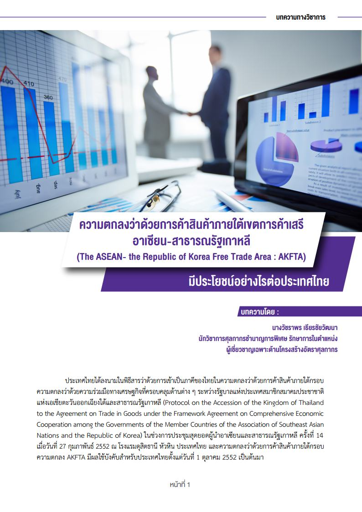
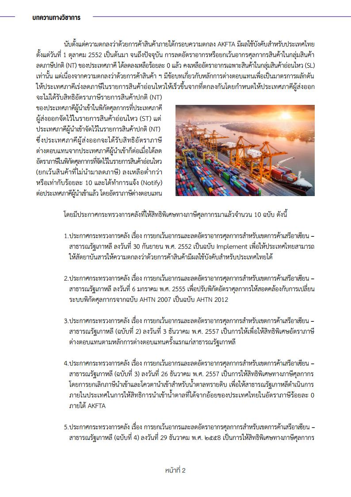
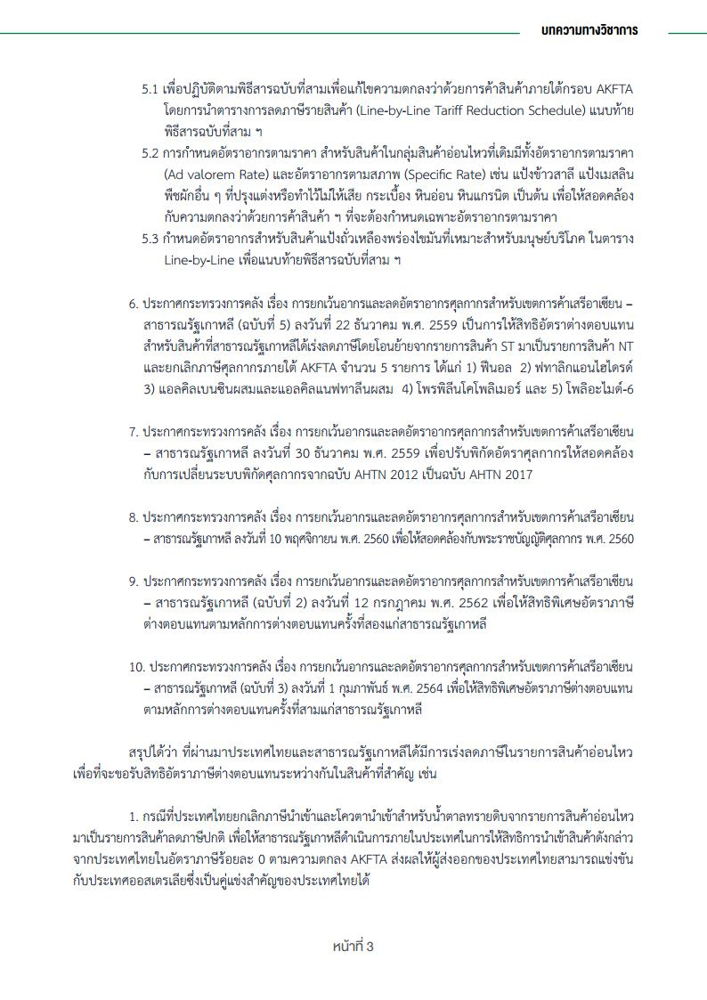
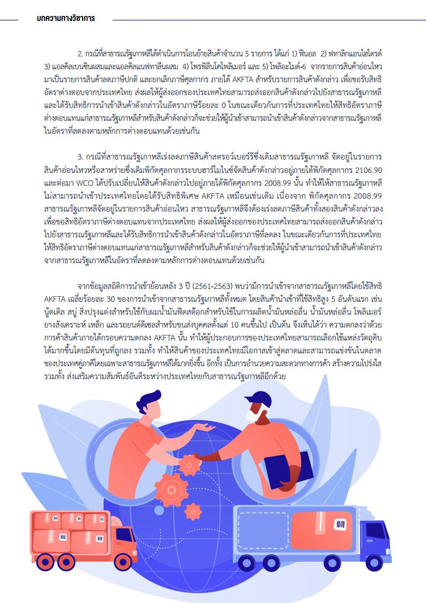

 

 

<a class="badge badge-danger" href="doc.pdf" target="_blank" id="download_files_new">Download</a>

> ที่มา : [กรมศุลกากร](http://www.customs.go.th/cont_strc_simple_with_date.php?current_id=14232832414d505f49464a4f464a4e)