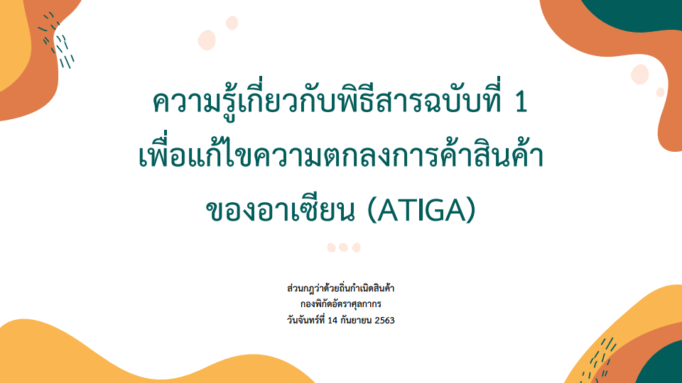

ตามที่กรมศุลกากรได้จัดสัมมนาเชิงปฏิบัติการหลักสูตร **ความรู้เกี่ยวกับพิธีสารฉบับที่ 1 เพื่อแก้ไขความตกลงการค้าสินค้าของอาเซียน** เมื่อวันจันทร์ที่ 14 กันยายน 2563 เวลา 09:00 - 12:00 น. ณ ห้องประชุมชั้น 16 อาคาร 120 ปี กรมศุลกากร ขณะนี้กรมศุลกากรได้เผยแพร่เอกสารประกอบการสัมมนาดังกล่าว (รายละเอียดตามเอกสารแนบ) เพื่อให้ผู้ที่สนใจได้เตรียมความพร้อมก่อนจะมีการบังคับใช้ในวันที่ 20 ก.ย. 2563 เป็นต้นไป

 

 

 <a href="./ATIGA_09_2020.pdf" target="_blank" id="download_files">ดาวน์โหลดประกาศ <i class=" fas fa-file-pdf" ></i>
            </a>

> ที่มาบทความ : [กรมศุลกากร](./ATIGA_09_2020.pdf)