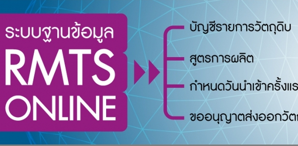

**ระบบฐานข้อมูล RMTS Online**  เป็นระบบที่พัฒนาขึ้นสำหรับเป็นช่องทาง ในการยื่นข้อมูลเพื่อขออนุมัติบัญชีรายการวัตถุดิบและปริมาณสต็อกสูงสุด และสูตรการผลิต รวมถึงการขออนุมัติปรับยอดวัตถุดิบกรณีต่าง ๆ ผ่านระบบ Online ซึ่งประกอบไปด้วย

1. งานฐานข้อมูลวัตถุดิบ คือ การให้บริการบันทึกและจัดเก็บข้อมูลของบริษัทที่ได้รับส่งเสริมการลงทุนจากสำนักงาน
คณะกรรมการส่งเสริมการลงทุน (BOI) เพื่อใช้ในการออกหนังสืออนุมัติยกเว้นภาษีอากรขาเข้าสำหรับวัตถุดิบ และใช้ในการ
ออกหนังสืออนุมัติตัดบัญชีวัตถุดิบเมื่อมีการส่งออก

2. งานสั่งปล่อยวัตถุดิบ คือ การให้บริการออกเลขที่อนุมัติเพื่อนำไปสั่งปล่อยวัตถุดิบที่กรมศุลกากรให้กับบริษัทที่ได้รับการ
ส่งเสริมการลงทุนจากสำนักงานคณะกรรมการส่งเสริมการลงทุนตามมาตรา 36 (1),(2) และมาตรา 30 ได้แก่ การอนุมัติสั่ง
ปล่อยวัตถุดิบเพื่อ ยกเว้นอากรขาเข้า, เพื่อลดหย่อนอากรขาเข้า,การใช้ธนาคารค้ำประกัน เพื่อขอคืนอากร และเพื่อขอถอน
ธนาคารค้ำประกัน

3. งานตัดบัญชีวัตถุดิบ คือ การให้บริการออกหนังสืออนุมัติตัดบัญชีวัตถุดิบให้กับบริษัทที่ได้รับการส่งเสริมการลงทุนจาก
สำนักงานคณะกรรมการส่งเสริมการลงทุนตามมาตรา 36(1),(2) โดยการออกหนังสืออนุมัติตัดบัญชีวัตถุดิบ

ทางสมาคมสโมสรนักลงทุน (IC) ได้เผยแพร่บทความเพื่อให้ผู้ใช้งาน ได้ทราบถึงขั้นตอนการใช้งานระบบ โดยแบ่งออกเป็น 5 ตอนดังนี้
 

- [Section 1](#section-1)
- [Section 2](#section-2)
- [Section 3](#section-3)
- [Section 4](#section-4)
- [Section 5](#section-5)

 

## Section 1
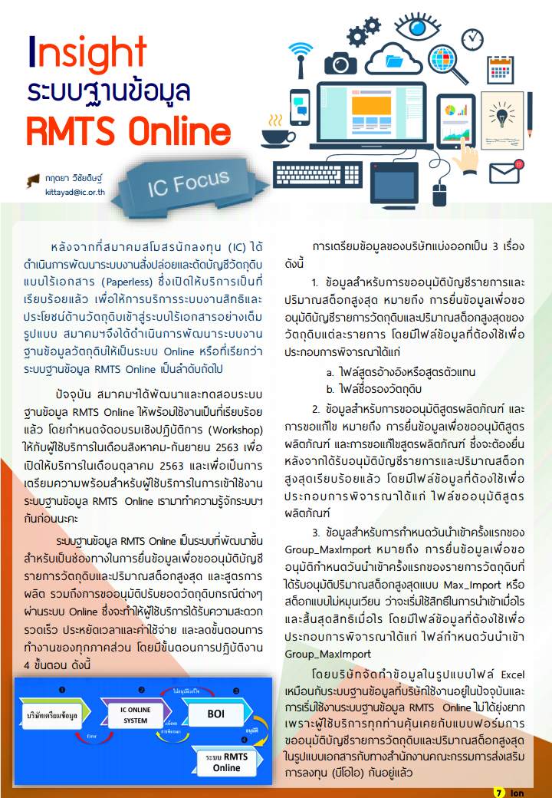
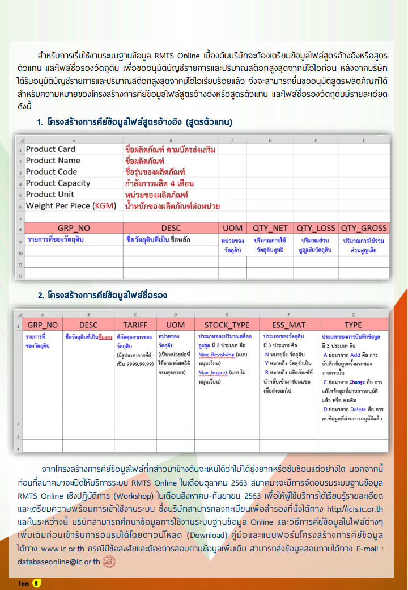

## Section 2
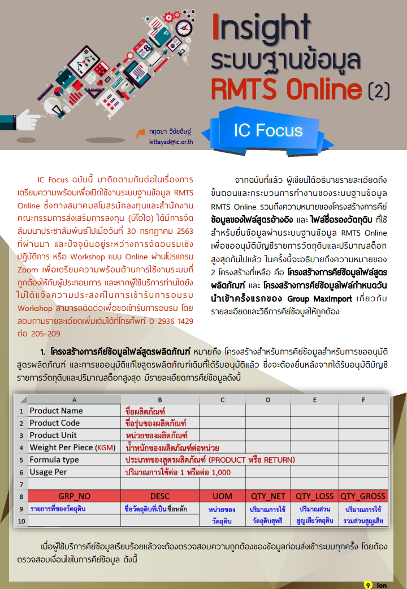
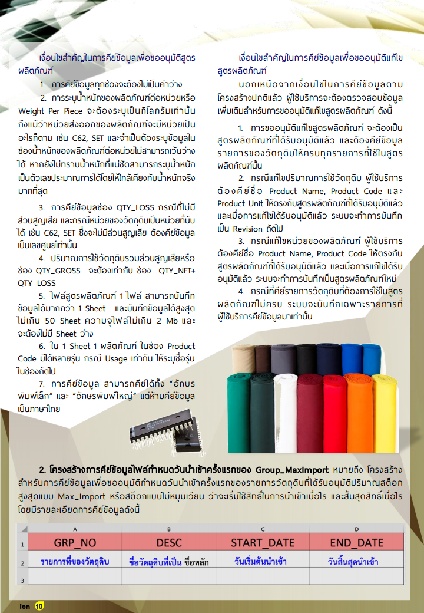
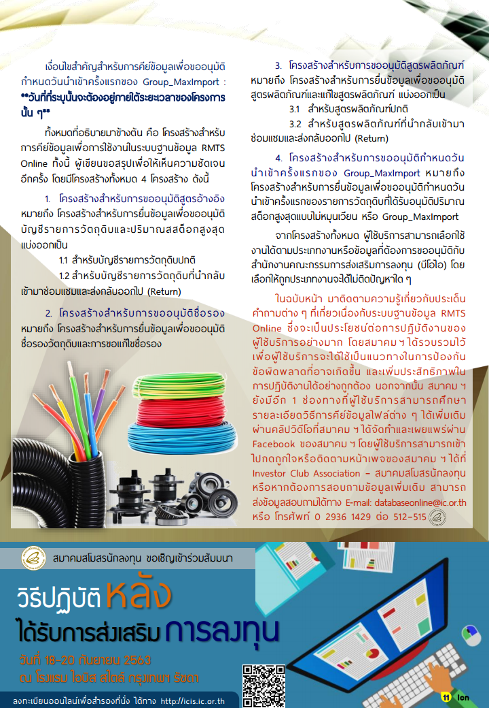

## Section 3
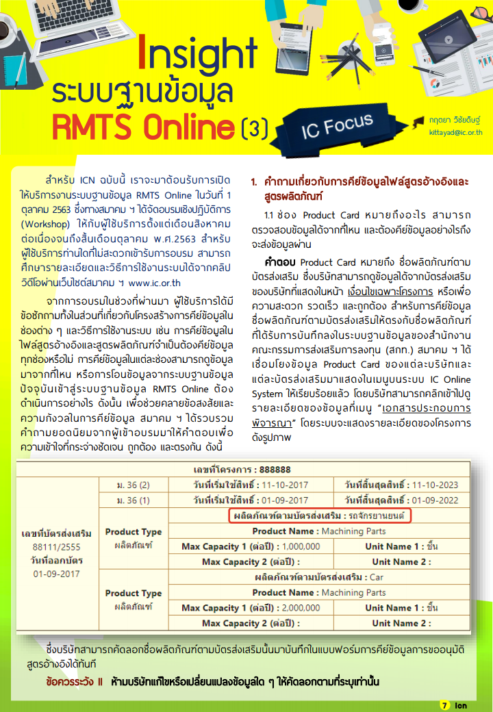
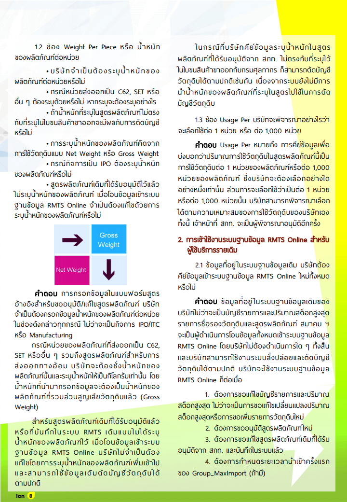
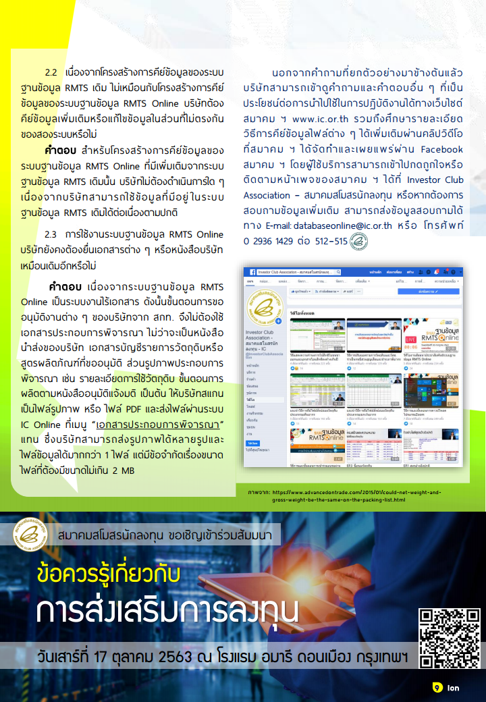

## Section 4
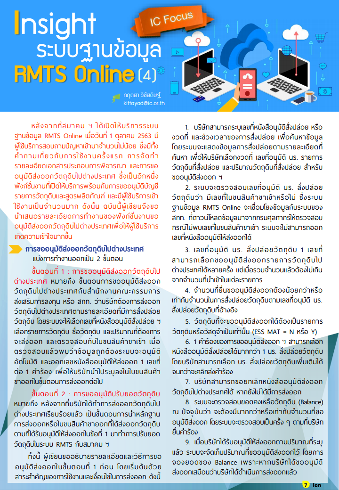
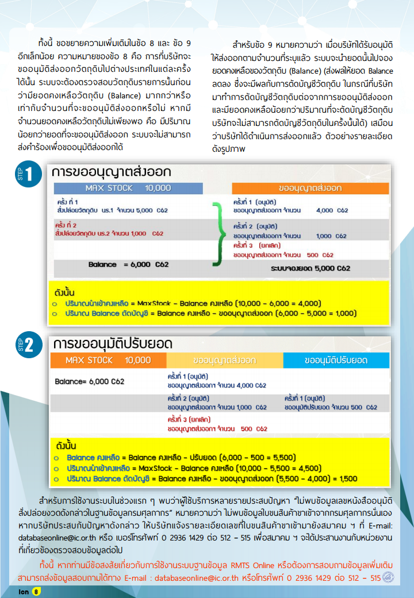

## Section 5
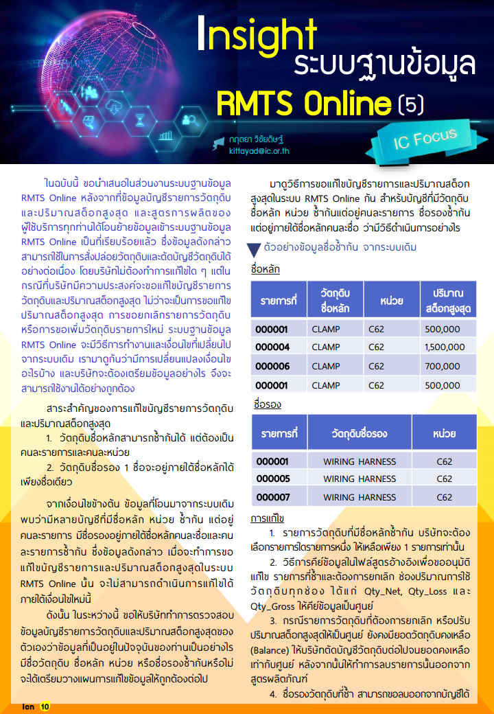
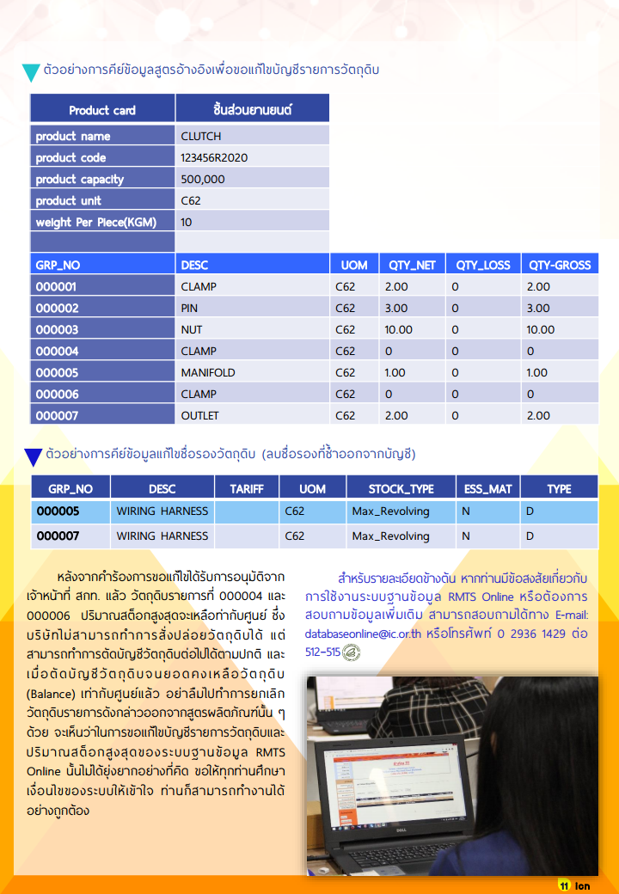

<a class="badge badge-danger" href="./RMTSOnline2020.pdf" target="_blank" id="download_files_new">Download </a> <i id="files" class=" fas fa-file-pdf"></i>

 

## ข้อมูลเพิ่มเติม

-  [คำอธิบายขั้นตอนการยื่นขออนุมัติสูตรผลิตภัณฑ์ ผ่านระบบ RMTS Online (แก้ไขครั้งที่ 2)](formula_online_v02.pdf)

> ที่มา : [สมาคมสโมสรนักลงทุน (IC)](https://ic.or.th/)