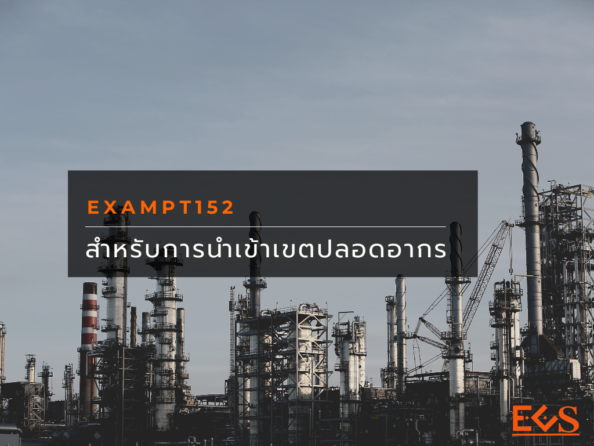

โดยทั่วไปของที่นำเข้ามาใน หรือ ส่งออกนอกราชอาณาจักร หากเป็นของที่มีกฎหมายควบคุมการนำเข้ามาในหรือส่งออกนอกราชอาณาจักร ผู้นำเข้า ผู้ส่งออกต้องดำเนินการให้ครบถ้วนตามที่กฎหมายอื่นกำหนด **เขตปลอดอากร** เป็นพื้นที่พิเศษที่มีกฎหมายศุลกากรยกเว้นหลักการดังกล่าวไว้ตามมาตรา 152 แห่ง พ.ร.บ.ศุลกากร พ.ศ.2560  ดังนี้


1. ของที่มีบทกฎหมายอื่นควบคุมเกี่ยวกับมาตรฐานหรือคุณภาพ  การประทับตรา หรือ เครื่องหมายใดๆ  หากนำของนั้นจากนอกราชอาณาจักรเข้าไปในเขตปลอดอากรทุกพื้นที่ โดยมีวัตถุประสงค์เพื่อ ผลิต ผสม ประกอบ บรรจุ หรือดำเนินการอื่นใดเพื่อการส่งออกไปนอกราชอาณาจักร
1. ของที่มีบทกฎหมายอื่นควบคุมเกี่ยวกับการนำเข้ามาในราชอาณาจักร  การส่งออกไปนอกราชอาณาจักร  การครอบครองหรือการใช้ประโยชน์ซึ่งของนั้น  หากนำของนั้นเข้าไปในเขตปลอดอากรเฉพาะพื้นที่ที่กำหนดในกฎกระทรวง  โดยมีวัตถุประสงค์เพื่อ ผลิต ผสม ประกอบ บรรจุ หรือดำเนินการอื่นใดเพื่อการส่งออกไปนอกราชอาณาจักร
 

## เขตปลอดอากรที่กำหนดในกฎกระทรวง

- เขตปลอดอากรที่ตั้งอยู่ ณ สนามบินดอนเมือง สนามบินสุวรรณภูมิ สนามบินอู่ตะเภา ระยอง พัทยา
- เขตปลอดอากรที่ตั้งอยู่ในพื้นที่เขตพัฒนาเศรษฐกิจพิเศษ
- เขตปลอดอากรที่ตั้งอยู่ในพื้นที่ระเบียงเศรษฐกิจภาคตะวันออก

## การปฏิบัติพิธีการศุลกากร

การปฏิบัติพิธีการศุลกากรในส่วนที่เกี่ยวกับใบอนุญาตสำหรับของที่นำเข้ามาจากนอกราชอาณาจักรเพื่อนำเข้าไปในเขตปลอดอากร ที่เป็นไปตามเงื่อนไขข้อ 1  หรือ  ข้อ 2   ผู้นำเข้า-ผู้ส่งออก ไม่ต้องไปขอหนังสืออนุญาตจากหน่วยงานที่เกี่ยวข้อง  การจัดทำใบขนสินค้า ในส่วนที่เกี่ยวกับข้อมูลเรื่องการอนุญาต 
 

| เลขที่ใบอนุญาต  | เลขประจำตัวผู้เสียภาษีอากร | วันที่อนุญาต |
|:--------------:|:-------------------:|:---------------:|
| **EXEMPT152**   | เลขประจำตัวผู้เสียภาษีอากรของหน่วยงานผู้ออกใบอนุญาต | วันที่ 13  พฤศจิกายน 2560  | 
 
 
กรณีที่มีการปล่อยของที่ได้รับยกเว้นตามข้อ 1 และ ข้อ 2 ออกจากเขตปลอดอากรเพื่อใช้หรือจำหน่ายในราชอาณาจักร กฎหมายศุลกากรกำหนดให้ผู้นำเข้า ต้องปฏิบัติตามกฎหมายที่เกี่ยวข้องนับแต่วันที่นำออกจากเขตปลอดอากร โดยถือเสมือนของนั้นได้นำเข้ามาในราชอาณาจักรในวันที่นำออกจากเขตปลอดอากร   ดังนั้น ผู้นำเข้าที่จะนำของออกจากเขตปลอดอากรต้องดำเนินการเรื่องการขออนุญาตจากหน่วยงานที่เกี่ยวข้องโดยวิธีการเดียวกันกับกรณีของที่นำเข้ามาในราชอาณาจักร ในการนำของดังกล่าว**ออกจากเขตปลอดอากรเพื่อใช้หรือจำหน่ายในราชอาณาจักร** ผู้นำเข้าต้องจัดทำใบขนสินค้าขาเข้าชำระอากร  ประเภท **“P”**  ในส่วนที่เกี่ยวกับการอนุญาต ให้ดำเนินการในเรื่องการส่งข้อมูลการอนุญาตในระบบ NSW ตามปกติ   

| เลขที่ใบอนุญาต |               เลขประจำตัวผู้เสียภาษีอากร                |       วันที่อนุญาต        |
|:--------------:|:-----------------------------------:|:-------------------------:|
|   **เลขที่ใบอนุญาต**   | เลขประจำตัวผู้เสียภาษีอากรของหน่วยงานผู้ออกใบอนุญาต|วันที่ได้รับอนุญาต. |

## ประกาศ/กฎหมายที่เกี่ยวข้อง

- [พระราชบัญญัติศุลกากร พ.ศ.2560](../../announcement/customs/customs-act2560/)
- [ประกาศกรมศุลกากรที่ 131/.2561 เรื่อง การปฏิบัติพิธีการศุลกากรทางอิเล็กทรอนิกส์ สำหรับการเชื่อมโยงข้อมูลตามกฎหมายอื่นที่เกี่ยวข้องกับการศุลกากร](../../announcement/customs/2561-131/) 

 

> วันที่ปรับปรุงล่าสุด : 8 สิงหาคม 2562.  
> ที่มา : [กรมศุลกากร](https://www.customs.go.th/cont_strc_faq.php?lang=th&top_menu=menu_homepage&left_menu=menu_center_004&ini_menu=&current_id=14232832404e505f4b464b4a464a4f)
