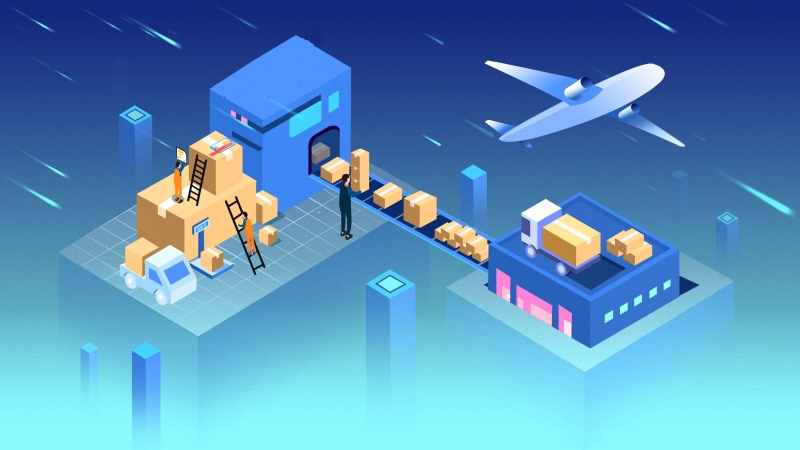

**ขั้นตอนการปฏิบัติพิธีการศุลกากรขาเข้ามี 11 ขั้นตอน** ดังนี้

**STEP 1** ทำบัตรเข้าคลังสินค้าแบบชั่วคราว ณ ที่ทำการ AOT ตรงทางเข้าประตู 1

**STEP 2** ผู้นำของเข้ารับเอกสาร Delivery Order (D/O) เพื่อใช้ในการจัดทำใบขนสินค้าขาเข้า

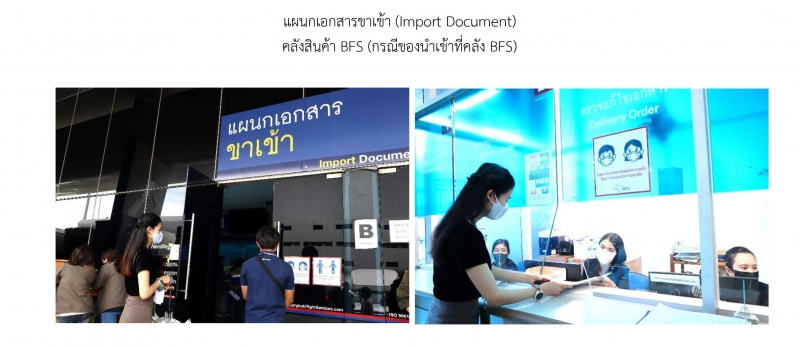

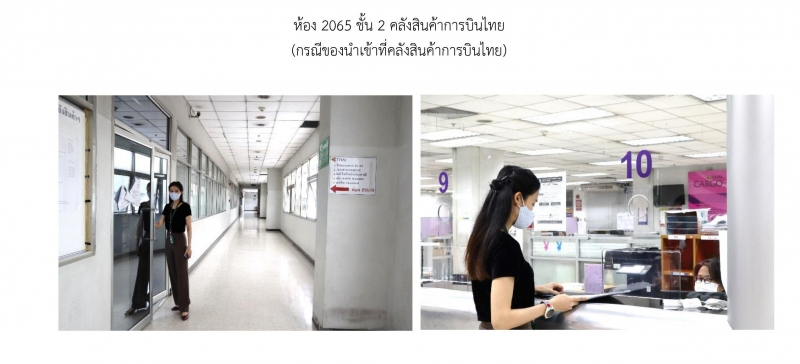

**STEP 3** ผู้นำของเข้าลงทะเบียนเป็นผู้ปฏิบัติพิธีการศุลกากร (Paperless) ณ ฝ่ายบริหารงานทั่วไป (ฝบท.) อาคารสำนักงานศุลกากรตรวจสินค้าท่าอากาศยานสุวรรณภูมิ (ตึก BC) ชั้น 2

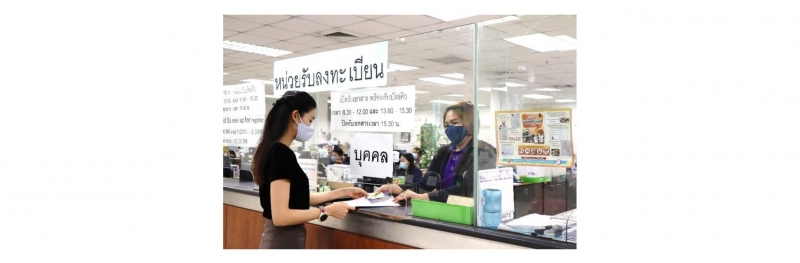

**หมายเหตุ** : ในกรณีที่ คำนำหน้าชื่อ ชื่อ หรือ นามสกุล ที่ลงทะเบียนไม่ตรงกับชื่อในใบปล่อยสินค้า (Delivery Order) ผู้นำของเข้าจำเป็นต้องแก้ไขชื่อให้ถูกต้องตรงกันก่อน โดย

- _หากยังไม่เกิน 48 ชั่วโมง_ นับแต่ของมาถึงให้ผู้นำของเข้าติดต่อคลังสินค้าฯ เพื่อให้คลังสินค้าฯ แก้ไขให้ถูกต้อง (ณ สถานที่เดียวกับที่ผู้นำของเข้ารับเอกสาร Delivery Order)

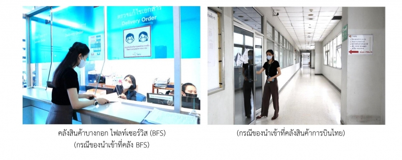

- _หากเกิน 48 ชั่วโมงแล้ว_ ให้ผู้นำของเข้าติดต่อคลังสินค้าฯ เพื่อออกเอกสารคำร้องขอแก้ไข แล้วนำมายื่นให้กับเจ้าหน้าที่ศุลกากร ณ ฝ่ายบริการศุลกากรที่ 2 ส่วนบริการศุลกากรที่ 1 (ฝบศ.2 สบศ.1) ชั้น 1 ตึก BC

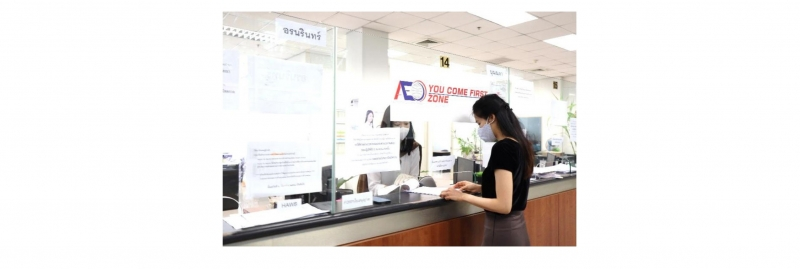

**STEP 4** ผู้นำเข้ายื่นใบขนสินค้าขาเข้าทางอิเล็กทรอนิกส์ โดยสามารถเลือกทำได้ 4 ช่องทาง ดังนี้

1. ผู้นำเข้าส่งข้อมูลใบขนสินค้าขาเข้าด้วยตนเอง
2. ผู้นำเข้ามอบหมายให้ตัวแทนออกของ (Customs Broker) เป็นผู้ส่งข้อมูลแทน
3. ผู้นำเข้าใช้เคาน์เตอร์บริการ (Service Counter) ในการส่งข้อมูล เช่น ใช้เคาน์เตอร์บริการ ที่เปิดให้บริการภายในสำนักงานศุลกากรตรวจสินค้าท่าอากาศยานสุวรรณภูมิ (สสภ.)

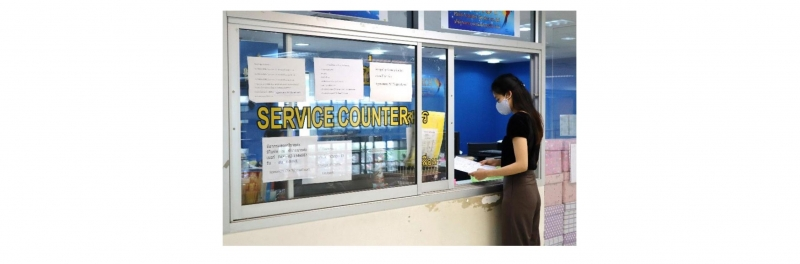

4. ผู้นำเข้ายื่นใบขนสินค้าขาเข้าพร้อมรายละเอียดข้อมูลใบขนสินค้ากับเจ้าหน้าที่ศุลกากร ณ ฝ่ายบริการศุลกากรที่ 1 ส่วนบริการศุลกากรที่ 1 (ฝบศ.1 สบศ.1) ชั้น 1 ตึก BC

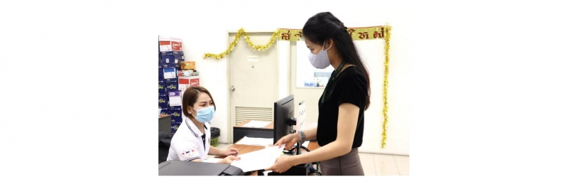

**STEP 5** ผู้นำของเข้า นำใบขนสินค้าขาเข้าฯ มาชำระค่าอากรและค่าธรรมเนียมผ่านพิธีการ ณ ส่วนบัญชีและอากร (สบอ.) ชั้น 2 ตึก BC

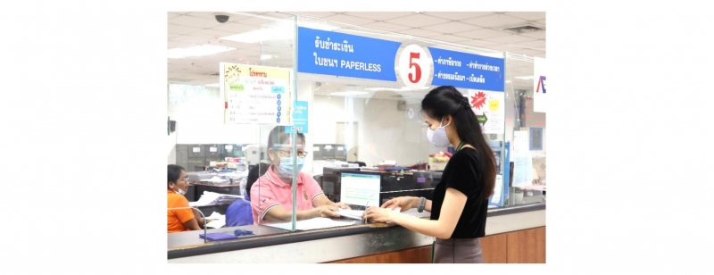

**STEP 6** หากของที่นำเข้า อยู่ในการควบคุมของหน่วยงานอื่น ผู้นำของเข้าจะต้องไปพบเจ้าหน้าที่ของหน่วยงานนั้นๆ เพื่อให้ได้รับการอนุมัติให้ผ่านด่านได้ให้เรียบร้อยก่อนมาพบเจ้าหน้าที่ศุลกากร โดย ชั้น 2 ตึก CI คลังสินค้า BFS มีหน่วยงานอื่นที่ตั้งอยู่ ดังนี้

- ด่านอาหารและยา คลังสินค้าท่าอากาศยานสุวรรณภูมิ
- ด่านตรวจพืช ท่าอากาศยานสุวรรณภูมิ
- ด่านกักกันสัตว์สุวรรณภูมิ
- ด่านตรวจสัตว์น้ำ ท่าอากาศยานสุวรรณภูมิ
- ด่านตรวจสัตว์ป่า ท่าอากาศยานสุวรรณภูมิ

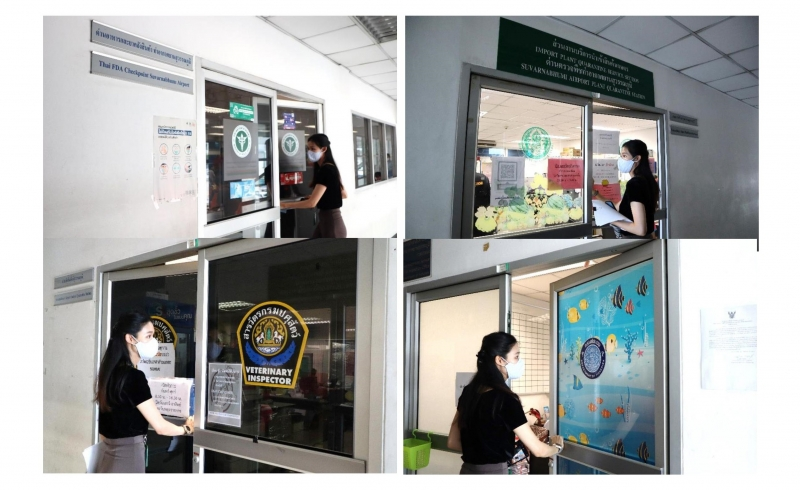

**STEP 7** ผู้นำของเข้า ติดต่อคลังสินค้าฯ เพื่อจ่ายค่าบริการคลังสินค้าฯ

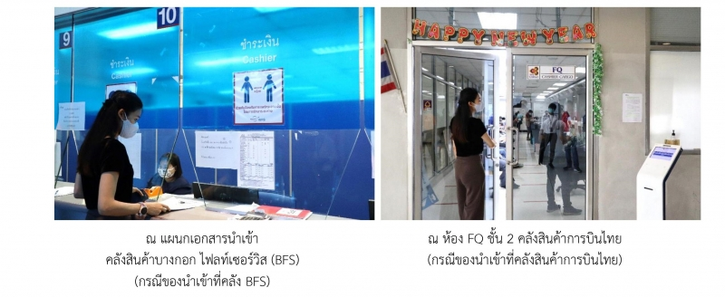

**STEP 8** ผู้นำของเข้าติดต่อคลังสินค้าฯ ให้จัดเตรียมสินค้าเพื่อให้เจ้าหน้าที่ศุลกากรตรวจสอบ โดยผู้นำของเข้าจะได้รับใบ Inspection sheet ซึ่งใช้ในการตรวจปล่อยสินค้ากับเจ้าหน้าที่ศุลกากร (กรณีเป็นใบขนสินค้าให้เปิดตรวจ หรือเรียกว่า Red Line) ถ้าเป็นใบขนสินค้ายกเว้นการตรวจ หรือเรียกว่า Green Line ข้ามไปข้อ 11 ได้ทันที

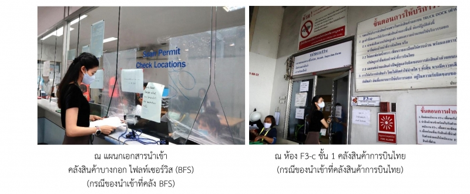

**STEP 9** ยื่นใบขนสินค้าฯ พร้อมเอกสารที่เกี่ยวข้อง ให้เจ้าหน้าที่ศุลกากร เพื่อทำการตรวจปล่อยสินค้า

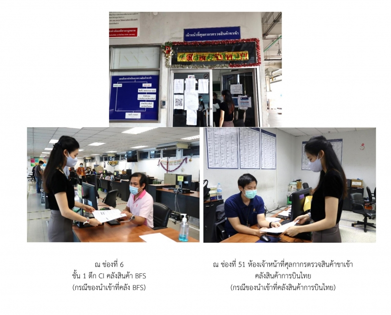

**STEP 10** นำใบ Inspection Sheet ที่มีลายเซ็นต์ของเจ้าหน้าที่ศุลกากรยื่นแก่เจ้าหน้าที่คลังสินค้าฯ เพื่อทำการตัดระบบและนำของออกจากอารักขาศุลกากร โดยผู้นำเข้าจะได้รับใบ Permit

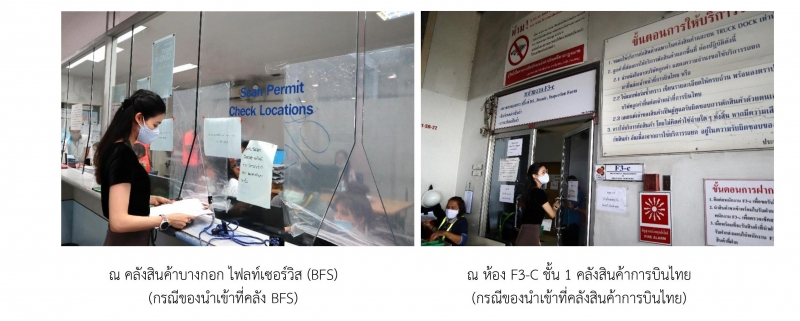

**STEP 11** ผู้นำของเข้าติดต่อเจ้าหน้าที่คลังสินค้าฯ โดยแสดงใบ Permit เพื่อนำของออกจากอารักขาศุลกากร

## กรณีเจ้าหน้าที่ศุลกากรตรวจพบความผิด

ในกรณีที่สินค้าของท่านโดนสุ่มตรวจ (Red line) เจ้าหน้าที่จะต้องบริหารเวลาในการตรวจปล่อยสินค้าภายในเวลา 30 นาที (ตามประกาศกรมศุลกากร เรื่อง การกำหนดระยะเวลาแล้วเสร็จของงาน พ.ศ. 2555) เริ่มนับตั้งแต่ผู้ประกอบการหรือตัวแทนออกของ ยื่นเอกสารให้เจ้าหน้าที่เพื่อตรวจสินค้า จนกระทั่งตรวจปล่อยแล้วเสร็จ ทั้งนี้ ไม่รวมระยะเวลาเตรียมของ และกรณีที่เจ้าหน้าที่มีข้อสงสัยเกี่ยวกับสินค้า หรือตรวจพบความผิด ไม่ว่าจะในเรื่องราคาสินค้า หรือ พิกัดอัตราอากร เจ้าหน้าที่สามารถขอเอกสารเพิ่มเติม จากผู้นำเข้าได้ และหากเจ้าหน้าที่พบว่ามีความผิดในเรื่องราคาสินค้าหรือพิกัดอัตราอากรจริง ผู้นำเข้าจะต้องชำระค่าภาษี ที่ต้องชำระเพิ่มให้ครบถ้วนรวมถึงค่าปรับ(ถ้ามี)ก่อนจึงจะสามารถนำสินค้าออกไปได้ โดย มีขั้นตอนการดำเนินการ ดังนี้

- เจ้าหน้าที่จะดำเนินการทำบันทึกข้อความว่ามีความผิดใดบ้าง และมีค่าภาษีที่ต้องชำระเพิ่มเท่าใด ให้ผู้บังคับบัญชาเป็นผู้ตรวจสอบและอนุมัติต่อไป
- หากเห็นควรอนุมัติ จึงจะส่งเรื่องไปที่ฝ่ายคดีเพื่อพิจารณาความผิด และแจ้งปรับตามเกณฑ์เปรียบเทียบงดการฟ้องร้อง ตามพระราชบัญญัติศุลกากร พ.ศ. 2560
- หลังจากที่ฝ่ายคดีพิจารณาความผิดและแจ้งค่าปรับเรียบร้อยแล้ว ผู้นำเข้าจะต้องชำระค่าภาษีอากรให้ครบถ้วน พร้อมค่าปรับให้เรียบร้อย
- บันทึกข้อความนั้นจะส่งกลับมาที่เจ้าหน้าที่ผู้ตรวจพบความผิดเพื่อตรวจสอบว่าท่านได้ชำระครบถ้วนหรือไม่
- หากครบถ้วนเรียบร้อยแล้ว เจ้าหน้าที่จะทำการปล่อยสินค้าออกจากคลังทันที


สอบถามข้อมูลเพิ่มเติมได้ที่ : **สำนักงานศุลกากรตรวจสินค้าท่าอากาศยานสุวรรณภูมิ**  
เลขที่ 999 หมู่ 7 ตำบลราชาเทวะ อำเภอบางพลี จังหวัดสมุทรปราการ 10540  
หมายเลขโทรศัพท์ : 0-2134-3636



วันที่ปรับปรุงล่าสุด : 9 กรกฎาคม 2563  เป็นต้นไป  
ที่มา : [สำนักงานศุลกากรตรวจสินค้าท่าอากาศยานสุวรรณภูมิ](http://suvarnabhumicargo.customs.go.th/cont_strc_simple.php?ini_menu=menu_customs_procedure&ini_content=customs_procedure_171006_01_200629_01&lang=th&root_left_menu=menu_customs_procedure_200526_01&left_menu=menu_customs_procedure_200526_01_200526_01)
