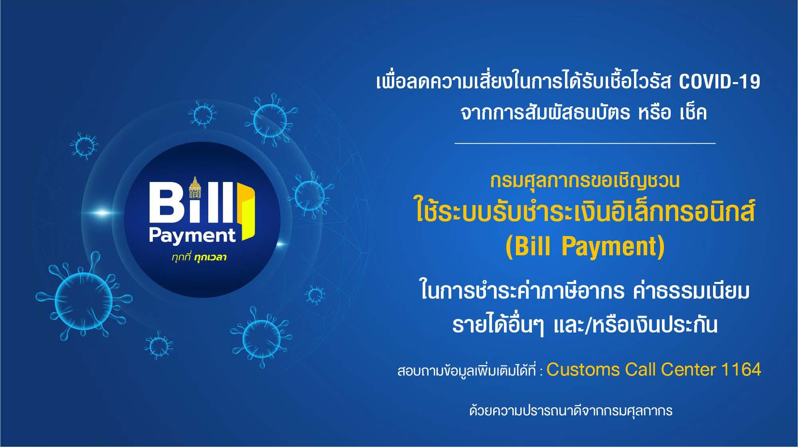
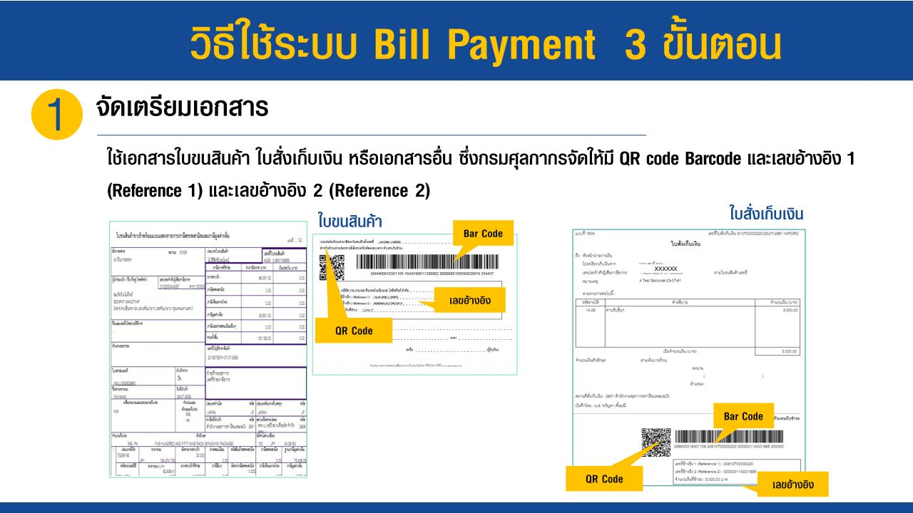
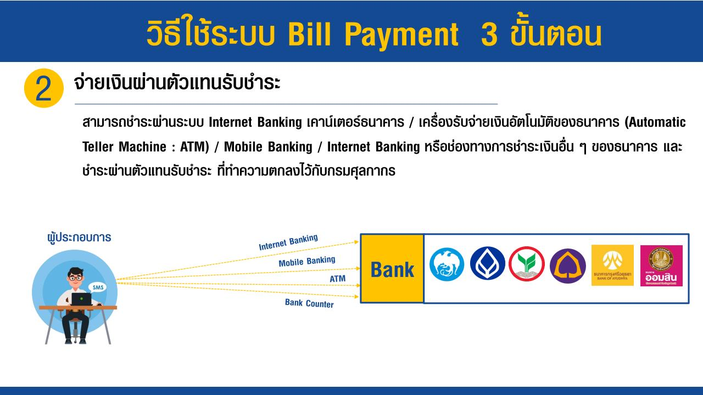
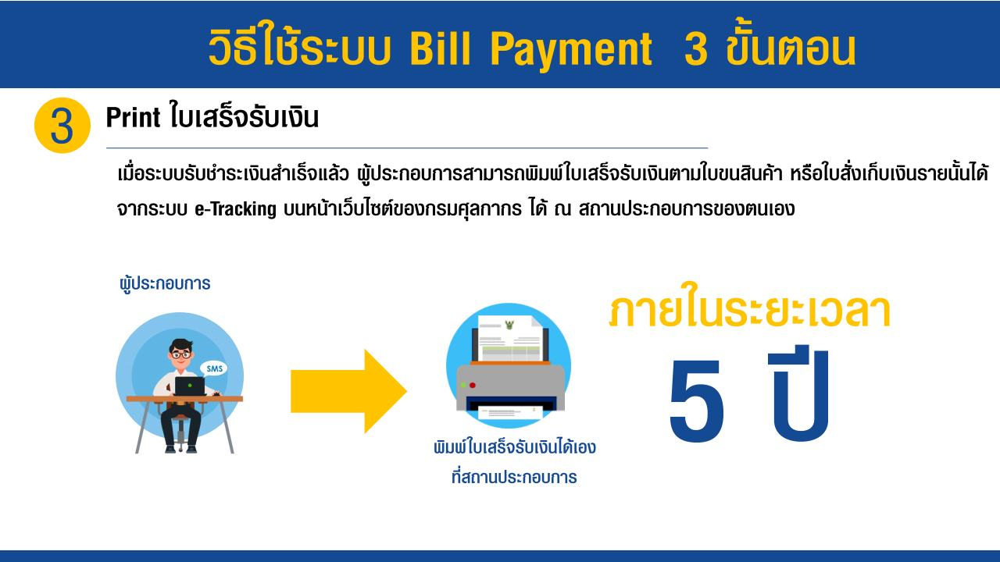
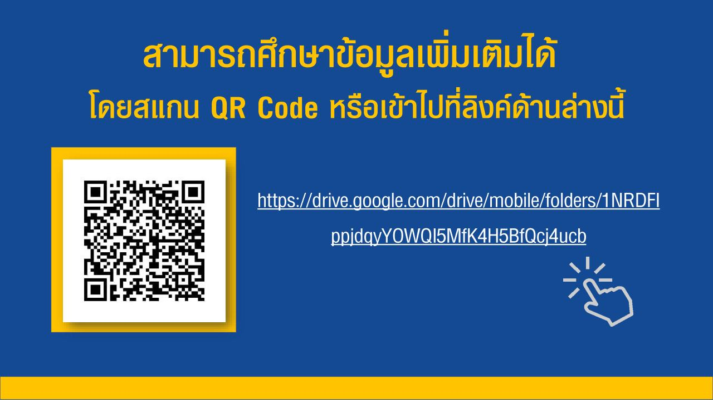

กรมศุลกากรประชาสัมพันธ์ขอเชิญชวนใช้ระบบรับชำระเงินอิเล็กทรกนิกส์ เพื่อหลี่กเลี่ยงการสัมผัสเชื้อ COVID-19 จากธนบัตรและเช็ค

 

 

<a class="badge badge-danger" href="./bill-payment.pdf" target="_blank" id="download_files_new">Download </a> <i id="files" class=" fas fa-file-pdf"></i>

 

> ที่มา : [กรมศุลกากร](http://www.customs.go.th/cont_strc_simple_with_date.php?current_id=14232832414d505e4e464b4d464b4b)