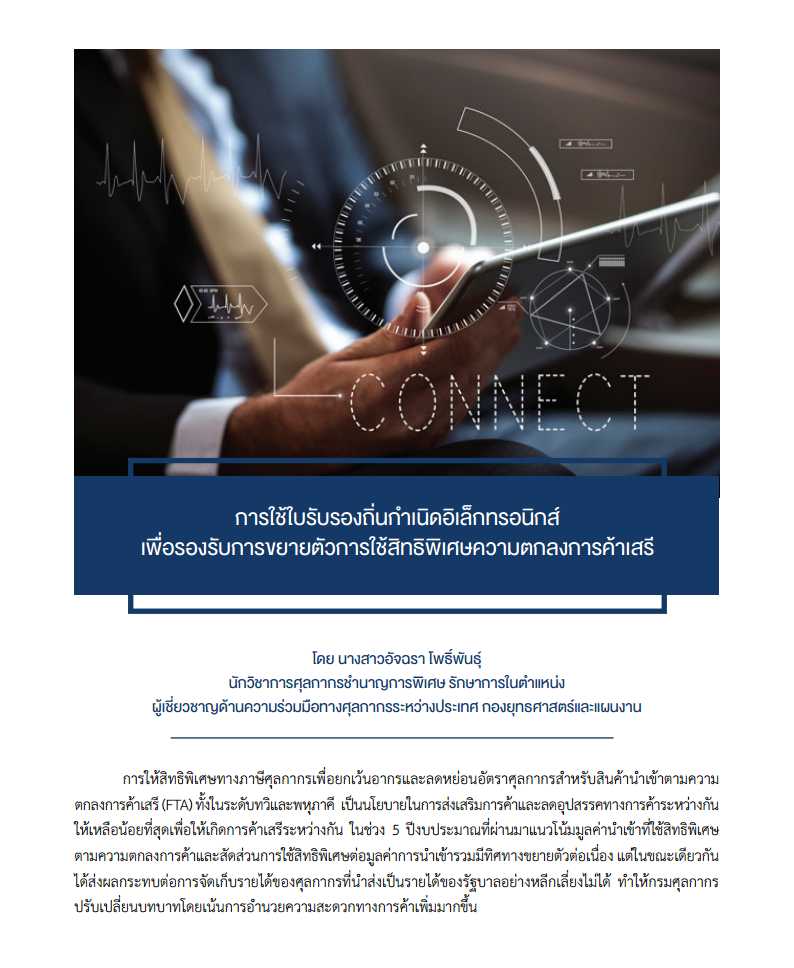
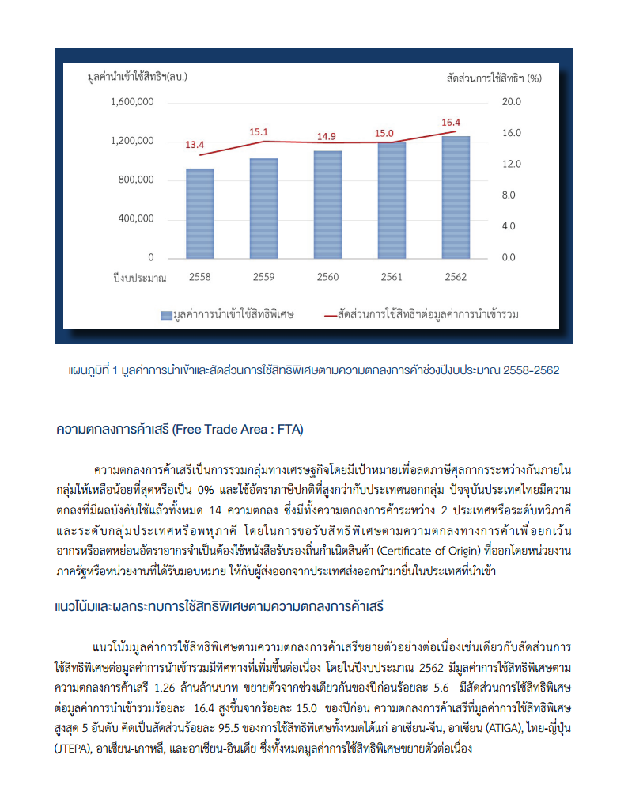
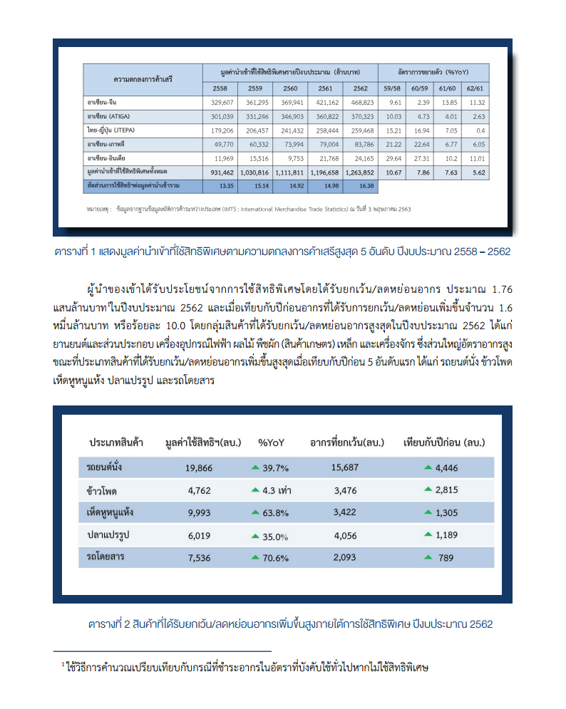
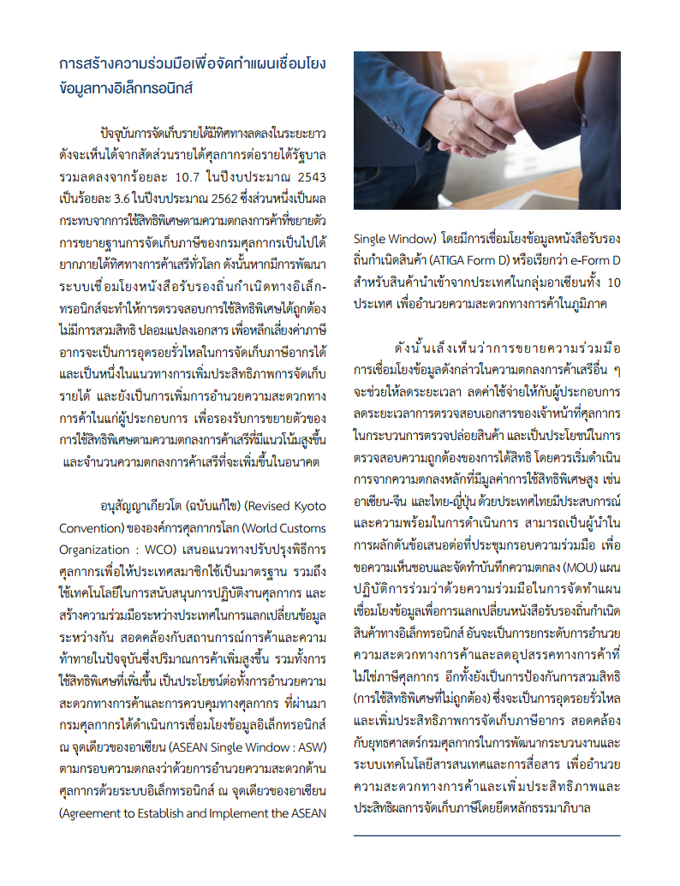

การให้สิทธิพิเศษทางภาษีศุลกากรเพื่อยกเว้นอากรและลดหย่อนอัตราศุลกากรสำหรับสินค้านำเข้าตามความตกลงการค้าเสรี (FTA)ทั้งในระดับทวิและพหุภาคี เป็นนโยบายในการส่งเสริมการค้าและลดอุปสรรคการค้าระหว่างกันให้เหลือน้อยที่สุด เพื่อให้เกิดการค้าเสรีระหว่างกัน ในช่วง 5 ปีงบประมาณผ่านมาแนวโน้มการใช้สิทธิพิเศษตามความตกลงการค้าและสัดส่วนการใช้สิทธิพิเศษต่อมูลค้าการนำเข้ารวมมีทิศทางขยายตัวต่อเนื่อง แต่ในขณะเดียวกันได้ส่งผลกระทบต่อการจัดเก็บรายได้ของศุลกากรทีนำส่งเป็นรายได้ของรัฐบาลอย่างหลีกเลี่ยงไม่ได้ ทำให้กรมศุลกากร
ปรับเปลี่ยนบทบาทโดยเน้นการอำนวยความสะดวกทางการค้ามากขึ้น

> ที่มาบทความ : [กรมศุลกากร](http://www.customs.go.th/cont_strc_simple_with_date.php?current_id=14232832414b505e4e464b4a464b4a)