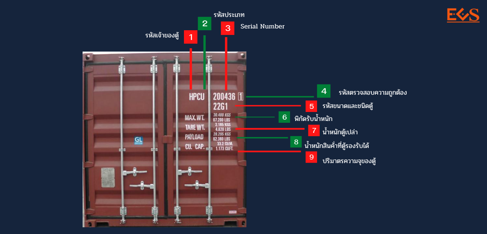

**1. รหัสเจ้าของตู้ (HPC)** เป็นอักษรแทนชื่อบริษัทเจ้าของตู้ เช่น HPC,TNY, CMA, EGS, TCL เป็นต้น

**2. รหัสระบุประเภท (U)** จะมีเพียง 1 ตัวที่อยู่ท้าย รหัสเจ้าของตู้ จากรูปภาพคือตัวอักษร **U** มีความหมายคือ ตู้คอนเทนเนอร์ มีรายละเอียดประเภทดังนี้

- U สำหรับตู้คอนเทนเนอร์สินค้าทั้งหมด
- J สำหรับอุปกรณ์ที่เกี่ยวข้องกับตู้คอนเทนเนอร์ขนส่งสินค้าแบบถอดได้
- Z สำหรับรถพ่วงและแชสซี

**3. รหัสการจดทะเบียนตู้คอนเทนเนอร์ (200436)** มีขนาด 6 หลัก จากตัวอย่างคือ **200463**

**4. รหัสตรวจสอบความถูกต้อง (1)** รหัสที่ตรวจสอบว่าเจ้าของตู้ ประเภทตู้และการจดทะเบียนตู้คอนเทนเนอร์ ถูกต้องหรือไม่ จากตัวอย่างคือเลข **1**

**5. ขนาดและชนิดของตู้ (45G1)** ขนาดและชนิดของตู้คอนเทนเนอร์จะมีอยู่ 4 ตัว จากตัวอย่างคือ **45G1**

-   หมายเลข **4** ตัวแรก คือ บอกความยาวตู้ จากตัวอย่างเท่ากับ**ยาว 40 ฟุต**
-   หมายเลข **5** ตัวถัด คือ บอกความสูงและความกว้างของตู้ จากตัวอย่างเท่ากับ **สูง 9 ฟุต 6 นิ้ว (High-cube) กว้าง 2.44 เมตร**
-   สองหลักสุดท้ายคือ **G1** จะบอกชนิดของตู้คอนเทนเนอร์ จากตัวอย่างคือ **ตู้คอนเทนเนอร์ที่บรรจุสินค้าทั่วไป**

> สามารถศึกษารายละเอียดเพิ่มเติมเกี่ยวกับ **ขนาดและชนิดของตู้คอนเทนเนอร์ (Container Size & Type Code)** ได้[**ที่นี่**](../container-size-and-type/)

**6. MAX. WT. น้ำหนักสูงสุดที่สามารถรับได้**  คือ น้ำหนักของตู้คอนเทนเนอร์เปล่าที่รวมกับน้ำหนักของสินค้า (TARE WT. + PAYLOAD) ที่ตู้คอนเทนเนอร์สามารถรับได้สูงสุด อาจจะแสดงข้อความ MAX. GROSS WGT., MX GR, MAX.GR. และ MAX.WT.

**7. TARE WT. น้ำหนักของตู้เปล่า**  ที่ยังไม่ได้บรรจุสินค้าลงไป

**8. PAYLOAD น้ำหนักสินค้าสูงสุดที่สามารถบรรจุได้** โดยอาจเขียนว่า N.W., NET WEIGHT, MAX CARGO WGT และ PAYLOAD หมายถึงน้ำหนักของสินค้าสูงสุดที่สามารถบรรจุใส่ตู้คอนเทนเนอร์นั้นได้

**9. CUBE หรือ CU CAP.** ปริมาตรสุทธิของตู้คอนเทนเนอร์