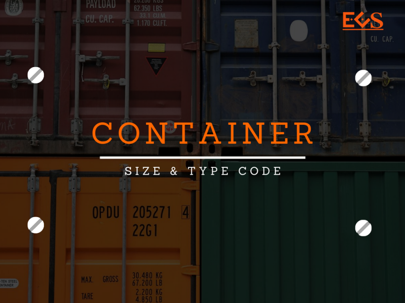
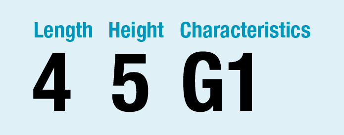

 ตู้คอนเทนเนอร์ จำเป็นต่อการการขนย้ายสินค้าเป็นอย่างมาก ได้พัฒนาขึ้นเนื่องจากความน่าจะเป็นของสภาพและค่าใช้จ่ายในการขนส่ง ข้อดีของการขนส่งสินค้าคือ จะทำให้การยกของหรือการเคลื่อนย้ายสินค้ารวดเร็วยิ่งขึ้น การเคลื่อนย้ายภายในท่าเรือ หรือ การเคลื่อนย้ายสินค้าระหว่างท่าเรือ กับผู้ส่งสินค้าหรือผู้ผลิตสินค้าเป็นไปอย่างรวดเร็ว ประหยัดเวลาและค่าใช้จ่าย

  

รหัส **45G1** (ตามภาพ) สำหรับท่านที่อยู่ในแวดวงโลจิสติกส์ คงคุ้นเคยกับรหัสดังกล่าวซึ่งได้แสดงไว้บนตู้คอนเทนเนอร์ อาจจะมีรหัสที่เหมือนกัน หรือแตกต่างกันไปบ้าง ตามขนาดและประเภทตู้สินค้า วันนี้เราจะมาทำความเข้าใจถึงความหมายของตัวเลข / ตัวอักษร แต่ละตัวของชุดรหัสดังกล่าว ว่ามีความหมายว่าอย่างไร เค้าเอาไว้ใช้ทำอะไรกัน และมีประโยชน์อย่างไร 
 
Container Size and Type Code เป็นรหัสเพื่อให้ทราบถึงขนาดและประเภทตู้สินค้า  เช่น **45G1** เป็นรหัส 4 หลัก ที่อยู่บนตู้คอนเทนเนอร์ รหัสเหล่านี้ได้ถูกกำหนดตามมาตรฐาน ISO 6346 จัดทำโดยสำนักคอนเทนเนอร์ระหว่างประเทศ (International Container Bureau) โดยมาตรฐานดังกล่าวกำหนดให้แสดงขนาดและชนิดของตู้ไว้ด้วยกัน จึงได้กำหนดให้มีอักขระ 4 ตัว โดยแบ่งเป็นกลุ่มละ 2 ตัวเพื่อแสดงถึงขนาดและประเภทสินค้า 

{}
ตัวอย่าง รหัสคือ **45G1**

-   หมายเลข **4** หลักแรก คือ ความยาวเท่ากับ 40 ฟุต หรือ 12.192 เมตร
-   หมายเลข **5** หลักต่อมา คือ ความสูงเท่ากับ 9 ฟุต 6 นิ้ว (High-cube) กว้าง 2.44 เมตร
-   **G1** คือชนิดตู้ General purpose (ตู้คอนเทนเนอร์ที่บรรจุสินค้าทั่วไป)
 {}

## 1. ขนาด (Size)
รหัสขนาดตู้คอนเทนเนอร์ประกอบด้วยข้อมูล 2 หลัก ประกอบไปด้วย

- **หลักที่ 1** บอกความยาว (Length) ตู้สินค้า
- **หลักที่ 2**  บอกความสูงและความกว้าง (Hight/Width) ตู้สินค้า
 
### 1.1 ความยาว (Length)

| m          | ft    | Character |
|:----------:|:-------:|:--------:|
| 2.991      | 10    | 1         |
| 6.068      | 20    | 2         |
| 9.125      | 30    | 3         |
| 12.192     | 40    | 4         |
| Unassigned | 5     | None      |
| Unassigned | 6     | None      |
| Unassigned | 7     | None      |
| Unassigned | 8     | None      |
| Unassigned | 9     | None      |
| 7.150      | A     | None      |
| 7.315      | 24    | B         |
| 7.430      | `24'6"` | C         |
| 7.450      | D     | None      |
| 7.820      | E     | None      |
| 8.100      | F     | None      |
| 12.500     | 41    | G         |
| 13.106     | 43    | H         |
| 13.600     | K     | None      |
| 13.716     | 45    | L         |
| 14.630     | 48    | M         |
| 14.935     | 49    | N         |
| 16.154     | P     | None      |
| Unassigned | R     | None      |

 
### 1.2 ความสูงและความกว้าง (Hight/Width)

<table class="tg">
<thead>
  <tr>
    <th class="tg-51vx" colspan="2">Height</th>
    <th class="tg-51vx" colspan="3">Width   (m)</th>
  </tr>
</thead>
<tbody>
  <tr>
    <td class="tg-51vx" rowspan="2">m</td>
    <td class="tg-51vx" rowspan="2">ft</td>
    <td class="tg-hwrp">2.44</td>
    <td class="tg-hwrp">&gt; 2.438 and &lt;=   2.5</td>
    <td class="tg-hwrp">&gt; 2.5m</td>
  </tr>
  <tr>
    <td class="tg-51vx" colspan="3">Character</td>
  </tr>
  <tr>
    <td class="tg-c3ow">2.438</td>
    <td class="tg-c3ow">8</td>
    <td class="tg-c3ow">0</td>
    <td class="tg-c3ow"> </td>
    <td class="tg-c3ow"> </td>
  </tr>
  <tr>
    <td class="tg-c3ow">2.591</td>
    <td class="tg-c3ow">`8'6"`</td>
    <td class="tg-c3ow">2</td>
    <td class="tg-c3ow">C</td>
    <td class="tg-c3ow">L</td>
  </tr>
  <tr>
    <td class="tg-c3ow">2.743</td>
    <td class="tg-c3ow">9</td>
    <td class="tg-c3ow">4</td>
    <td class="tg-c3ow">D</td>
    <td class="tg-c3ow">M</td>
  </tr>
  <tr>
    <td class="tg-c3ow">2.895</td>
    <td class="tg-c3ow">`9'6"`</td>
    <td class="tg-c3ow">5</td>
    <td class="tg-c3ow">E</td>
    <td class="tg-c3ow">N</td>
  </tr>
  <tr>
    <td class="tg-c3ow">&gt;&nbsp;&nbsp;&nbsp;2.895</td>
    <td class="tg-c3ow">&gt;&nbsp;&nbsp;&nbsp;`9'6"`</td>
    <td class="tg-c3ow">6</td>
    <td class="tg-c3ow">F</td>
    <td class="tg-c3ow">P</td>
  </tr>
  <tr>
    <td class="tg-c3ow">1.295</td>
    <td class="tg-c3ow">`4'3"`</td>
    <td class="tg-c3ow">8</td>
    <td class="tg-c3ow"> </td>
    <td class="tg-c3ow"> </td>
  </tr>
  <tr>
    <td class="tg-c3ow">&lt;=&nbsp;&nbsp;&nbsp;1.219</td>
    <td class="tg-c3ow">&lt;=&nbsp;&nbsp;&nbsp;4</td>
    <td class="tg-c3ow">9</td>
    <td class="tg-c3ow"> </td>
    <td class="tg-c3ow"> </td>
  </tr>
</tbody>
</table>

 
### 3-4 ประเภท (Type)

หลักที่ 3-4 ใช้บอกประเภทตู้สินค้า
 

| Group code | Group name                                                            | Detailed codes         |
|:------------:|-----------------------------------------------------------------------|------------------------|
| GP         | General purpose                                                       | G0, G1, G2, G3         |
| VH         | General purpose with ventilation                                      | V0, V2, V4             |
| BU         | Dry bulk container - nonpressurized                                   | B0, B1                 |
| BK         | Dry bulk container - pressurized                                      | B3, B4, B5, B6         |
| SN         | Named cargo                                                           | S0, S1, S2             |
| RE         | Thermal container refrigerated                                        | R0                     |
| RT         | Thermal container refrigerated and heated                             | R1                     |
| RS         | Thermal container self-powered refrigerated/heated                    | R2, R3                 |
| HR         | Thermal container refrigerated and/or heated with removable equipment | H0, H1, H2             |
| HI         | Thermal container insulated                                           | H5, H6                 |
| UT         | Open-top container                                                    | U0, U1, U2, U3, U4, U5 |
| PL         | Platform-based container with incomplete superstructure               | P0                     |
| PF         | Platform container - fixed                                            | P1, P2                 |
| PC         | Platform container - folding (collapsible)                            | P3, P4                 |
| PS         | Platform-based container with complete superstructure                 | P5                     |
| TN         | Tank container for nondangerous liquids                               | T0, T1, T2             |
| TD         | Tank container for dangerous liquids                                  | T3, T4, T5, T6         |
| TG         | Tank container for gases                                              | T7, T8, T9             |
| AS         | Air/surface container                                                 | A0                     |

 

**Reference :**  

- [http://containertracking.how/](http://containertracking.how/Iso6346/SizeTypeCode)
- [https://www.bic-code.org/](https://www.bic-code.org/marking-of-containers/)

