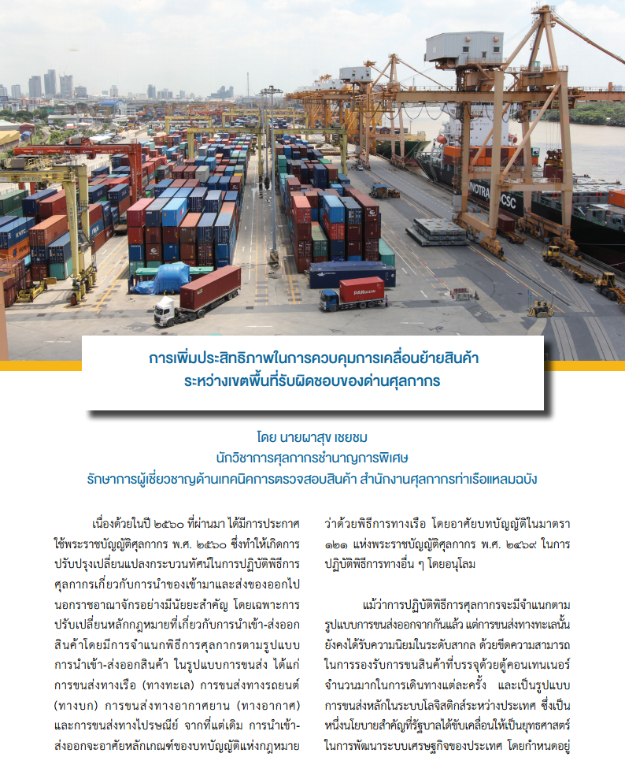
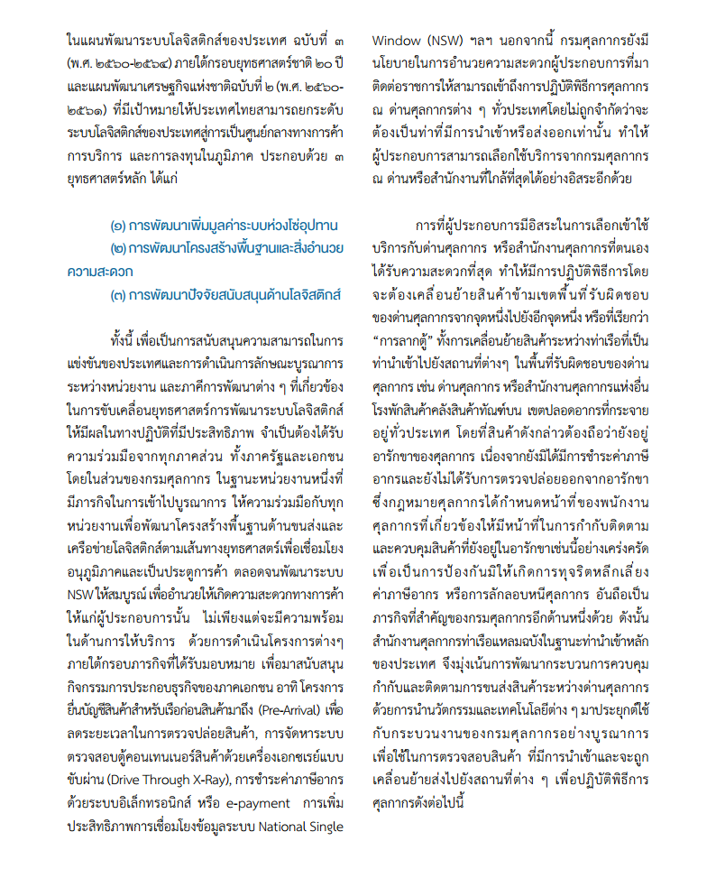
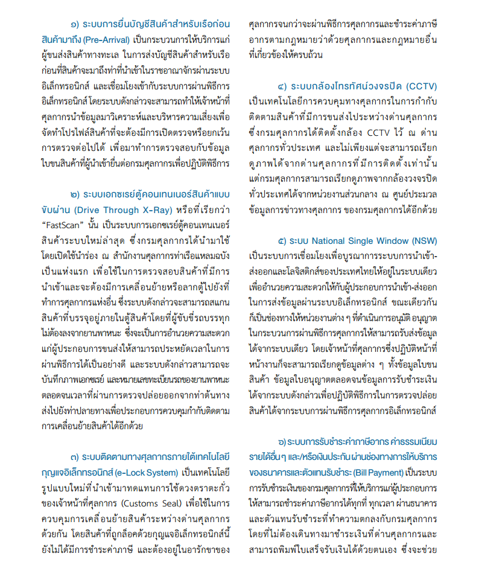
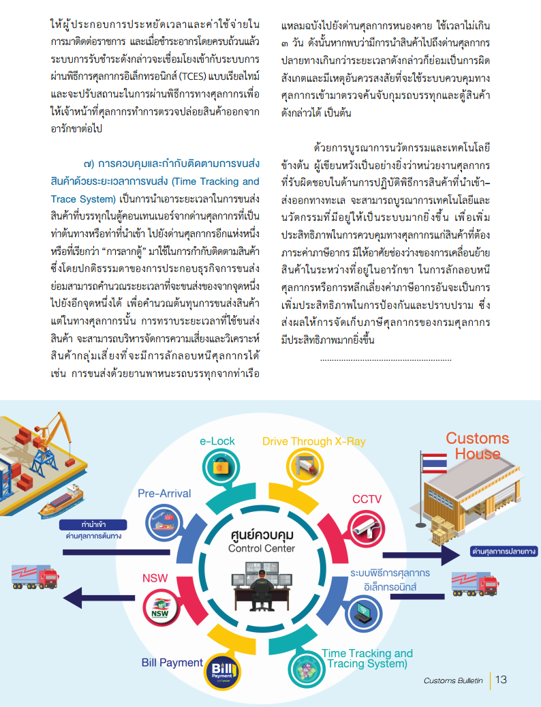

บทความจากจุลสารศุลกากร ปีที่ 28 ฉบับที่ 06 เดือน มีนาคม 2563 เรื่อง **"การเพิ่มประสิทธิภาพในการควบคุมการเคลื่อนย้ายสินค้าระหว่างเขตพื้นที่รับผิดชอบของด่านศุลกากร"** 

> ที่มา : จุลสารศุลกากร ปีที่ 28 ฉบับที่ 06 เดือน มีนาคม 2563
 
