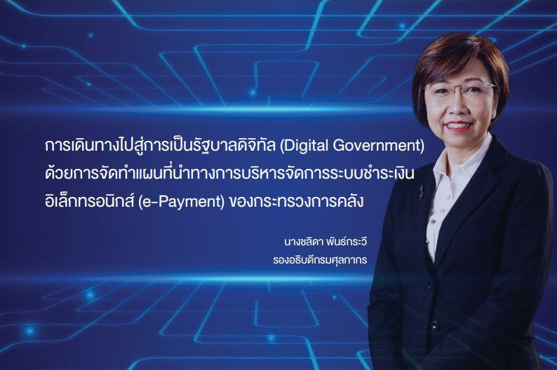
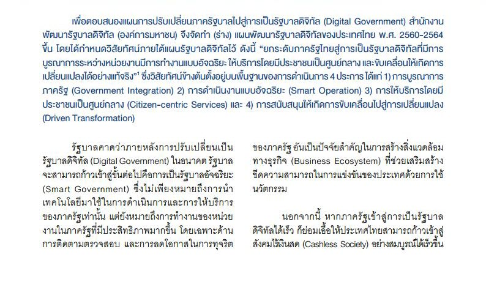
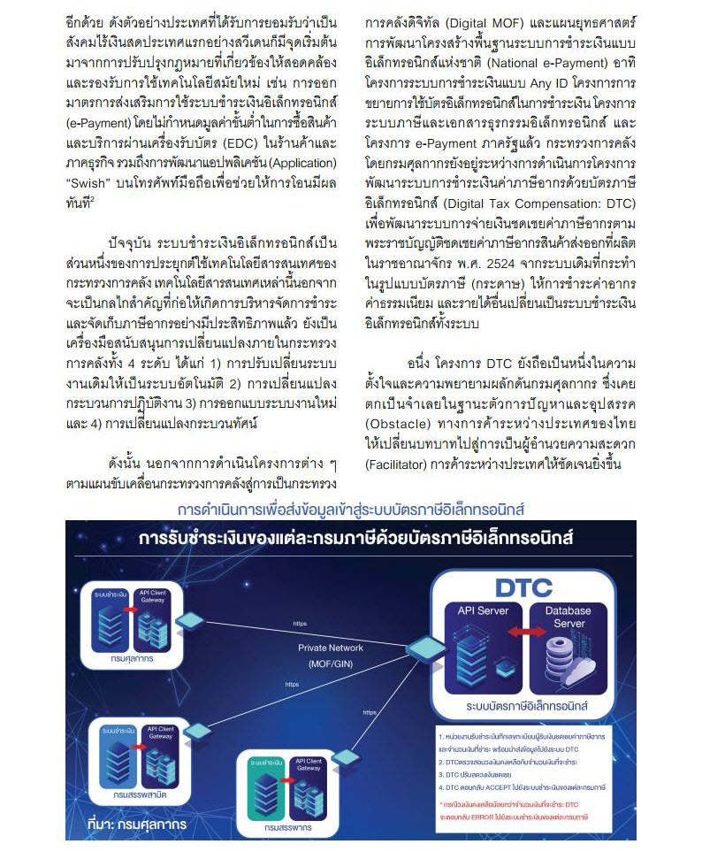
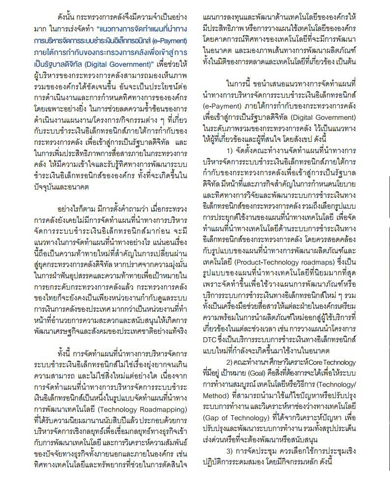
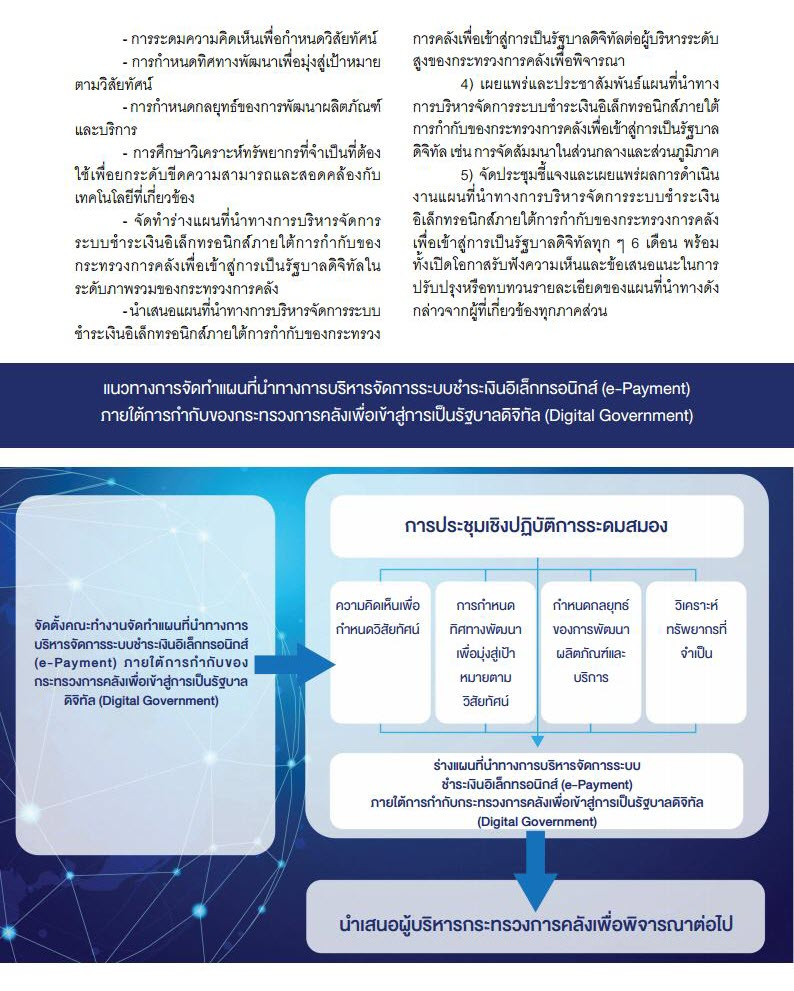
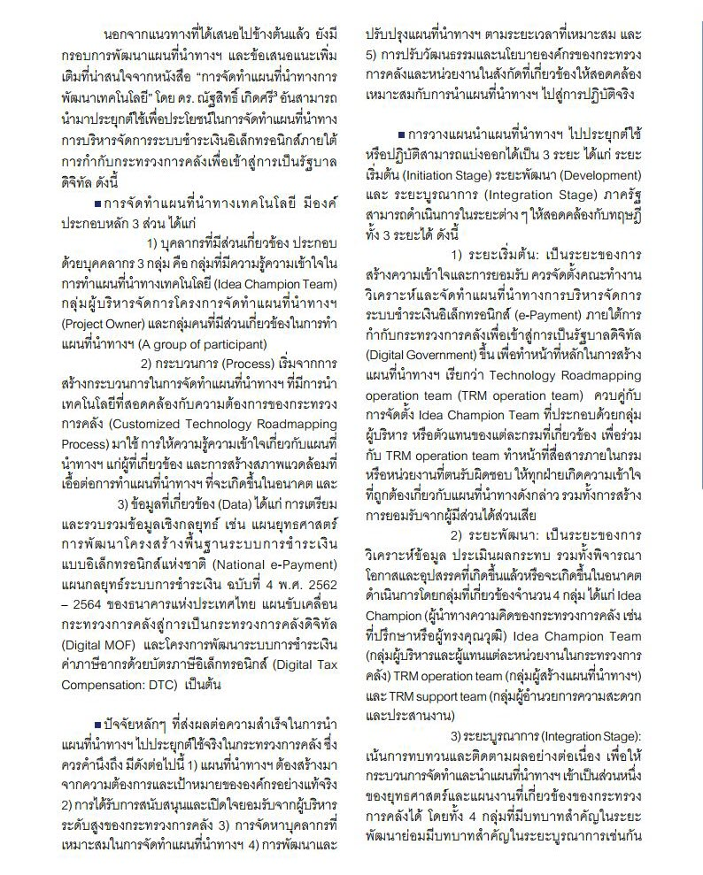
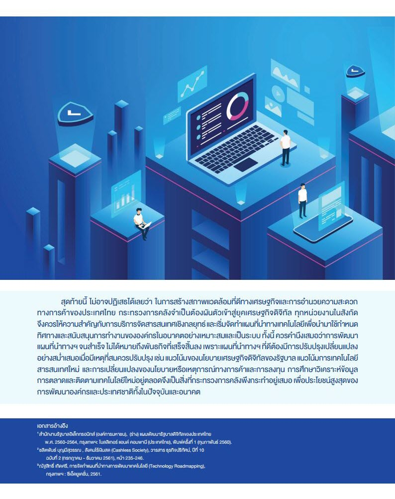

เพื่อตอบสนองแผนการปรับเปลี่ยนภาครัฐบาลไปสู่การเป็นรัฐบาลดิจิทัล (Digital Government) สำนักงานพัฒนารัฐบาลดิจิทัล (องค์การมหาชน) จึงจัดทำ (ร่าง) แผนพัฒนารัฐบาลดิจิทัลของประเทศไทย พ.ศ. 2560-2564 ขึ้น โดยได้กำหนดวิสัยทัศน์ภายใต้แผนรัฐบาลดิจิทัลไว้ ดังนี้ **“ยกระดับภาครัฐไทยสู่การเป็นรัฐบาลดิจิทัลที่มีการบูรณาการระหว่างหน่วยงานมีการทำงานแบบอัจฉริยะ ให้บริการโดยมีประชาชนเป็นศูนย์กลาง และขับเคลื่อนให้เกิดการเปลี่ยนแปลงได้อย่างแท้จริง”**  ซึ่งวิสัยทัศน์ข้างต้นตั้งอยู่บนพื้นฐานของการดำเนินการ 4 ประการ ได้แก่  

1. การบูรณาการภาครัฐ (Government Integration)  
2. การดำเนินงานแบบอัจฉริยะ (Smart Operation) 
3. การให้บริการโดยมีประชาชนเป็นศูนย์กลาง (Citizen-centric Services) และ 
4. การสนับสนุนให้เกิดการขับเคลื่อนไปสู่การเปลี่ยนแปลง (Driven Transformation)


 

 

<a class="badge badge-danger" href="./docs.pdf" target="_blank" id="download_files_new">Download</a> 

 


  
ที่มา : [กรมศุลกากร](http://www.customs.go.th/data_files/f49ded3a01d535178fbd40142c3bea21.pdf)   
สอบถามข้อมูลเพิ่มเติมได้ที่ : ส่วนชดเชยค่าภาษีอากร กองสิทธิประโยชน์ทางภาษีอากร (กสอ.)  
หมายเลขโทรศัพท์ : 02-667-7000 ต่อ 5799 หรือ 7661  
อีเมล์ : 82000100@customs.go.th  


