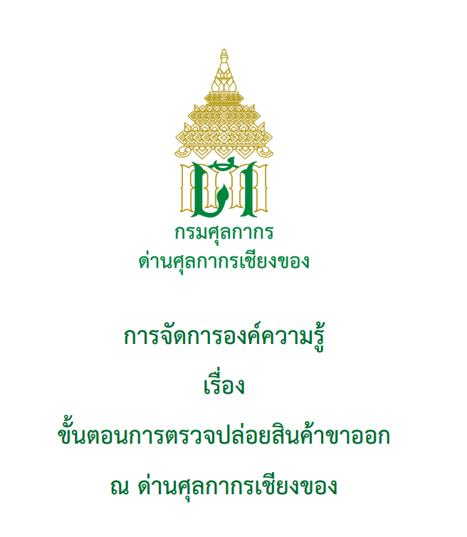

การจัดการองค์ความรู้ เรื่อง **ขั้นตอนการตรวจปล่อยสินค้าขาออก ณ ด่านศุลกากรเชียงของ** ครอบคลุมขั้นตอนการตรวจปล่อยสินค้าขาออก และการปฏิบัติงานตั้งแต่ขั้นตอนการรับเอกสารขอปฏิบัติการพิธีการศุลกากรขาออกจากผู้ส่งของออกหรือตัวแทน จนถึงการรับบรรทุกสินค้า เมื่อรถขนส่งสินค้าผ่านออกไปนอกราชอาณาจักร ณ ด่านพรมแดน

 



 

 <a href="./export_release.pdf" target="_blank" id="download_files">Download <i class=" fas fa-file-pdf" ></i>
            </a>

ที่มา : [กรมศุลกากร](http://www.customs.go.th/)