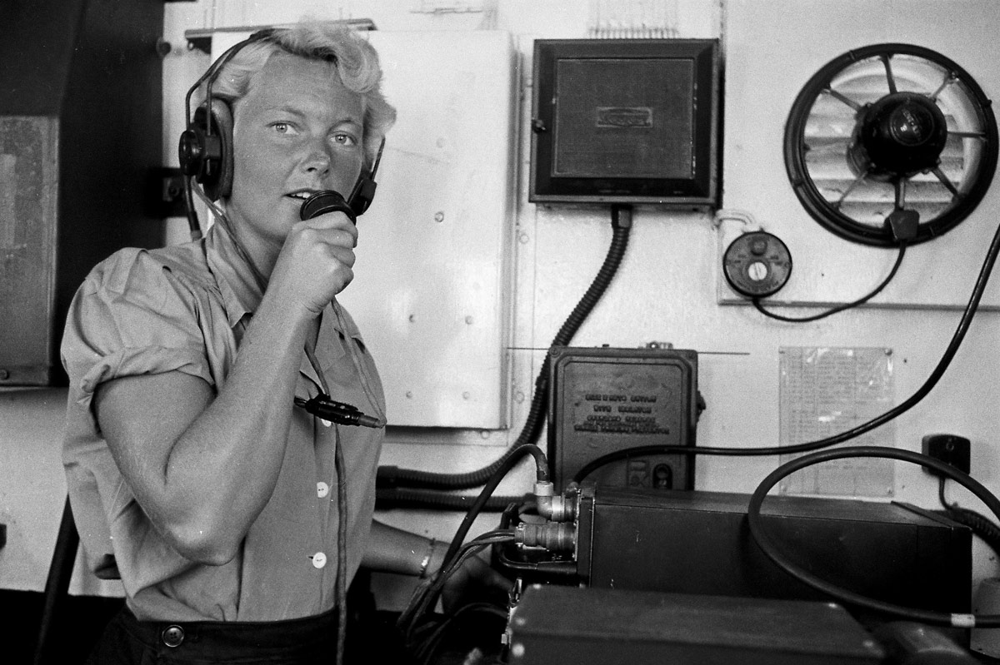
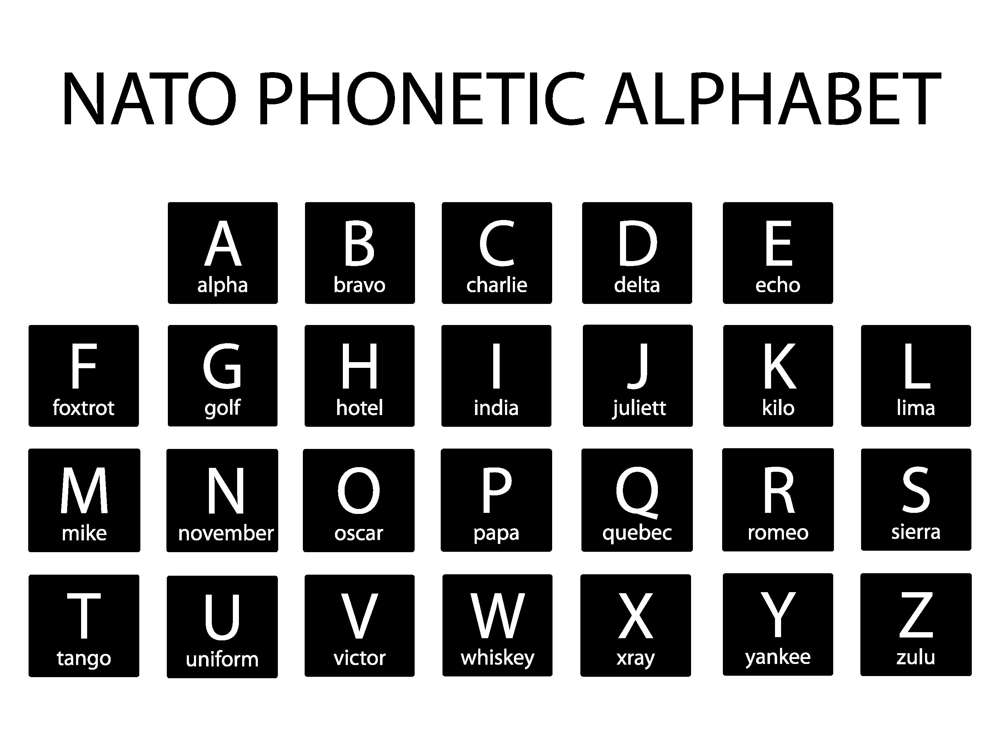

เคยรู้สึกบ้างไหมว่า เวลาจะสะกดชื่อ-นามสกุล หรืออีเมล์ของเราเป็นภาษาอังกฤษให้ใครฟังผ่านทางโทรศัพท์ แต่ละครั้งมันช่างเป็นเรื่องที่แสนยากเย็นเสียเหลือเกิน เพราะตัวอักษรแต่ละตัวออกเสียงคล้ายๆ กันไปเสียหมด โดยเฉพาะกลุ่มตัว “B” ตัว “D” ตัว “E” ตัว “G” ตัว “P” และตัว “T”, ตัว “M” กับตัว “N”, ตัว “H” กับตัว “S” เป็นต้น และยิ่งมาเจอประเทศไทยที่สัญญาณโทรศัพท์ไม่ชัดเจน ขาดๆ หายๆ ยิ่งทำให้เกิดปัญหาในการสื่อสารจนบางครั้งคนบอกกับคนฟังแทบจะทะเลาะกันก็ยังมี 

  
**ถ้าเช่นนั้นในทางสากลทั่วโลกเขาแก้ปัญหานี้กันด้วยวิธีใด**  

วิธีแก้ปัญหาที่นิยมใช้กันมากที่สุดคือ ใช้คำเป็นตัวกำกับ ซึ่งเรียกคำที่นำมากำกับนี้ว่า  **Spelling Alphabet**  หรือ phonetic alphabets หรือ radio alphabet หรือ telephone alphabet โดยหลักการใช้คือ ตัวอักษรใดที่เราสะกดจะถูกตามหลังด้วยคำเฉพาะคำหนึ่งที่มีตัวอักษรนั้นเป็นตัวแรกของคำ เช่น A-ant, B-boy, C-cat, D-dog เป็นต้น ตัวอย่างของการสนทนาก็เช่น  
{}
Customer Service : Thanks for calling, Can you please say your last name ?  

Mr.Sridhar : That’s Venkatraghavan  

Customer Service : Sir, please help me spell that.  

Mr.Sridhar : Sure. “V” for victory, “E” for elephant, “N” for north .....  
 {}
แต่ใช่ว่าปัญหาจะหมดลงเสียทีเดียว เพราะ **spelling alphabet** ที่เรากำหนดขึ้นตามหลังตัวอักษรแต่ละตัวนั้น มักจะกำหนดกันเอง ตามแต่ความคุ้นเคยหรือตามแต่ที่นึกขึ้นได้ในขณะนั้น จึงทำให้เกิดความหลากหลายมาก เช่น ตัว “S” เพียงตัวเดียว มี spelling alphabet ตั้งมากมาย อาทิ S-superman, S-Singapore, S-song, S-sugar เป็นต้น  
  
ในวงการทหารและวิทยุสื่อสารซึ่งต้องใช้การสะกดชื่อ-สกุล หรือพิกัดที่ตั้งอยู่เป็นประจำ กองทัพของแต่ละประเทศจึงได้กำหนด spelling alphabet ขึ้นใช้ โดยเฉพาะในช่วงสงครามโลกได้มีการใช้กันอย่างแพร่หลาย เช่นเดียวกับในวงการบินก็มีการกำหนดขึ้นใช้ด้วยเช่นกัน จนกระทั่ง  **องค์การสนธิสัญญาป้องกันแอตแลนติกเหนือ**  (The North Atlantic Treaty Organization : NATO) ซึ่งเป็นองค์กรระหว่างประเทศเพื่อความร่วมมือในการรักษาความสงบของประเทศในยุโรปและอเมริกา ได้ร่วมกันกำหนดใช้ spelling alphabet อย่างเป็นทางการขึ้น และเป็น spelling alphabet ที่ใช้กันอย่างแพร่หลายที่สุดในปัจจุบัน รวมถึงในวงการบินด้วย

| ตัวอักษร |คำอ่าน |การออกเสียง |การออกเสียงภาษาไทย |
|:----------:|----------|----------|:----------:|
| A |Alpha |AL FAH |อัล ฟ่า |
| B |Bravo |BRAH VOE |บรา โว่ |
| C |Charlie |CHAR LEE |ชาร์ ลี |
| D |Delta |DELL TAH |เดล ท่า |
| E |Echo |ECK OH |เอ โค่ |
| F |Foxtrot |FOKS TROT |ฟ็อก ทร็อท |
| G |Golf |GOLF |กอล์ฟ |
| H |Hotel |HO TELL |โฮ เทล |
| I |India |IN DEE AH |อิน เดีย |
| J |Juliett |JEW LEE ETT |จูเลียต |
| K |Kilo |KEY LOH |คิ โล |
| L |Lima |LEE MAH |ลิ ม่า |
| M |Mike |MIKE |ไมค์ |
| N |November |NO VEM BER |โน เว็ม เบอร์ |
| O |Oscar |OSS CAH |ออส การ์ |
| P |Papa |PAH PAH |ปา ป้า |
| Q |Quebec |KEH BECK |เค เบ็ค |
| R |Romeo |ROW ME OH |โร มี โอ |
| S |Sierra |SEE AIR RAH |ซี เอีย ร่า |
| T |Tango |TANG GO |แทง โก้ |
| U |Uniform |YOU NEE FORM |ยู นิ ฟอร์ม |
| V |Victor |VIK TOR |วิค เท่อร์ |
| W |Whiskey |WISS KEY |วิส กี้ |
| X |X-ray |ECKS RAY |เอ็กสเรย์ |
| Y |Yankee |YANG KEY |แยง คี่ |
| Z |Zulu |ZOO LOO |ซู ลู |

> Reference :   
> - https://www.moe.go.th/moe/upload/hotnews/htmlfiles/10506-4842.html .  
> - https://th.wikipedia.org  