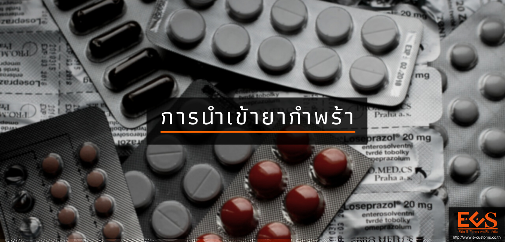

  
ภาพโดย <a href="https://pixabay.com/th/users/katicaj-3178159/?utm_source=link-attribution&amp;utm_medium=referral&amp;utm_campaign=image&amp;utm_content=1728381">katicaj</a> จาก <a href="https://pixabay.com/th/?utm_source=link-attribution&amp;utm_medium=referral&amp;utm_campaign=image&amp;utm_content=1728381">Pixabay</a>

**ยากำพร้า**ในประเทศไทยหมายถึง ยาที่มีความจำเป็นต้องใช้เพื่อวินิจฉัย บรรเทา บำบัด ป้องกัน หรือรักษาโรคที่พบได้น้อย หรือโรคที่เป็นอันตรายร้ายแรง หรือโรคที่ก่อให้เกิดความทุพพลภาพอย่างต่อเนื่อง หรือยาที่มีอัตราการใช้ต่ำ โดยไม่มียาอื่นมาใช้ทดแทนได้ และมีปัญหาการขาดแคลน

สถานการณ์การขาดแคลนยาจำเป็น หรือ ยากำพร้า ทำให้ ครม. ได้อนุมัติยกเว้นภาษีนำเข้ายาประเภทนี้ เพื่อส่งเสริมให้ผู้ประกอบการจัดหายา และสร้างความมั่นคงให้ระบบยาของประเทศ โดยออก **ประกาศกระทรวงการคลัง เรื่อง การลดอัตราอากรและยกเว้นอากรศุลกากร ตามมาตรา 12 แห่งพระราชกำหนดพิกัดอัตราศุลกากร พ.ศ. 2530 (ฉบับที่ 2)** [[ดาวน์โหลดประกาศ]](http://www.customs.go.th/cont_strc_download_with_docno_date.php?lang=th&top_menu=menu_homepage&current_id=142328324149505f49464a4f464b46) กำหนดให้เพิ่มข้อความ (51) ในข้อ 3 ของ ประกาศกระทรวงการคลัง เรื่อง การลดอัตราอากรและยกเว้นอากรศุลกากร ตามมาตรา 12 แห่งพระราชกำหนดพิกัดอัตราศุลกากร พ.ศ. 2530 โดยมีใจความว่า ให้*ยกเว้นอากรสำหรับผลิตภัณฑ์ยารักษาหรือป้องกันโรคในตอนที่ 30* เฉพาะที่ได้รับการขึ้นทะเบียนตำรับยาจากสำนักงานคณะกรรมการอาหารและยา กระทรวงสาธารณสุข และ*ระบุ (P) ต่อท้ายในเลขทะเบียนตำรับยา* *เว้นแต่ยากำพร้าที่สามารถผลิตและหาได้ในประเทศไทย 11 รายการ* ดังต่อไปนี้ *ที่ไม่ได้รับยกเว้นอากร*

1. เบนซาโทรพีนเมซิเลต Benzatropine mesilate

2. ไฮโดรคอร์ทิโซน Hydrocortisone

3. ไอเวอร์เม็กทิน Ivermectin

4. เมทิลีนบลู Methylene blue

5. เพอร์เมทริน Permethrin

6. โซเดียมแคลเซียมเอดีเตท Sodium calcium edetate

7. โซเดียมไนไตรท์ Sodium nitrite

8. โซเดียมไทโอซัลเฟต ร้อยละ 25 Sodium thiosulfate 25%

9. เซรุ่มแก้พิษงู Antivenom sera
    - เซรุ่มแก้พิษงูกะปะ  Malayan Pit Viper antivenin
    - เซรุ่มแก้พิษงูสามเหลี่ยม Banded Krait antivenin
    - เซรุ่มแก้พิษงูเห่า Cobra antivenin
    - เซรุ่มแก้พิษงูจงอาง King Cobra antivenin
    - เซรุ่มแก้พิษงูแมวเซา Russell's Viper antivenin
    - เซรุ่มแก้พิษงูเขียวหางไหม้ Green Pit Viper antivenin
    - เซรุ่มแก้พิษงูทับสมิงคลา Malayan Krait antivenin

10. เซรุ่มแก้พิษงูระบบโลหิตPolyvalent antivenom for hemato

11. เซรุ่มแก้พิษงูระบบประสาท Polyvalent antivenom for neurotoxin


ตาม **ประกาศกรมศุลกากรที่ 27/ 2563 เรื่อง  แก้ไขเพิ่มเติมประกาศกรมศุลกากร ที่ 144/ 2560 เรื่อง หลักเกณฑ์และพิธีการสำหรับการลดอัตราอากร และยกเว้นอากรศุลกากรตามมาตรา 12** แห่งพระราชกำหนดพิกัดอัตราศุลกากร พ.ศ. 2530 [[ดาวน์โหลดประกาศ]](http://www.customs.go.th/cont_strc_download_with_docno_date.php?lang=th&top_menu=menu_homepage&current_id=142328324149505f4a464b4c464b4b) กำหนดให้  

- ผู้นำของเข้าต้องแสดง **ใบสำคัญการขึ้นทะเบียนตำรับยา หรือใบแทนใบสำคัญการขึ้นทะเบียนตำรับยา** ต่อพนักงานศุลกากรในขณะที่ผ่านพิธีการศุลกากร

- ให้ผู้่นำของเข้าจัดทำข้อมูลใบขนสินค้าขาเข้า โดยบันทึกใน**ช่องสิทธิพิเศษ** ของแต่ละรายการระบุเป็น **_"379"_**


ดังนั้น หากมีการนำเข้ายารักษาหรือป้องกันโรคในตอนที่ 30 เฉพาะที่ขึ้นทะเบียนตำรับยาจากสำนักงานคณะกรรมการอาหารและยา สาธารณสุข และระบุ (P) ต่อท้ายในเลขทะเบียนตำรับยา ก็จะได้รับยกเว้นอากรศุลกากร ยกเว้นยา 11 รายการที่ระบุไม่ให้ได้รับสิทธิยกเว้นอากร ทั้งนี้แม้จะได้รับยกเว้นอากรศุลกากร แต่ยังมี**ค่าภาษีมูลค่าเพิ่ม (VAT)** และต้อง**ขอใบอนุญาตนำเข้าก่อนการนำเข้าจากสำนักงานคณะกรรมการอาหารและยา** ด้วย

> - ที่มา : [กรมศุลกากร](http://www.customs.go.th/cont_strc_faq.php?lang=th&top_menu=menu_homepage&left_menu=menu_center_004&ini_menu=&current_id=142328324149505f4b464b4b464a4f)  
- วันที่ปรับปรุงล่าสุด : 20 กุมภาพันธ์ 2563 