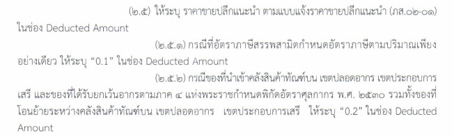
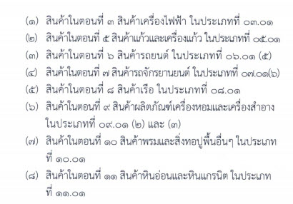
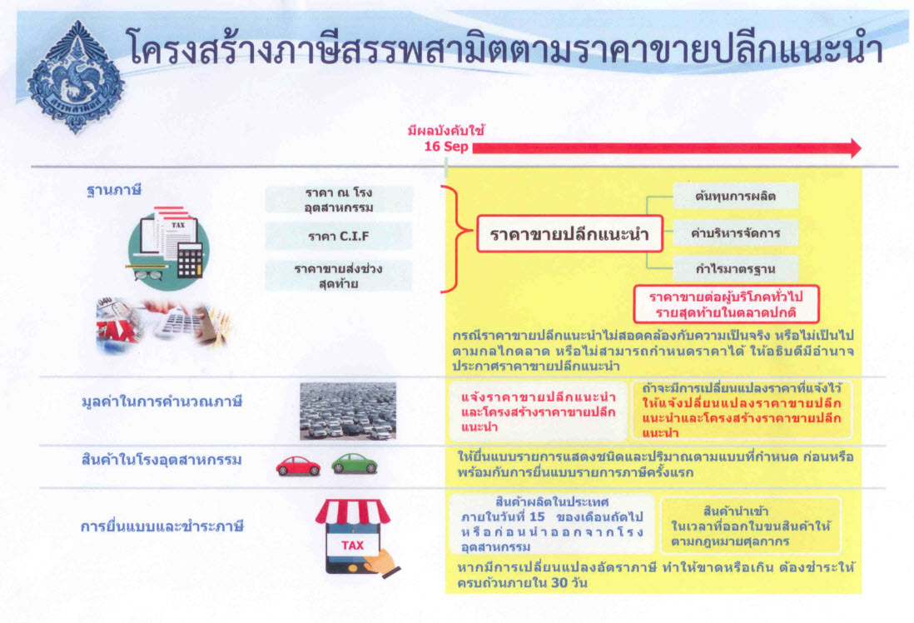
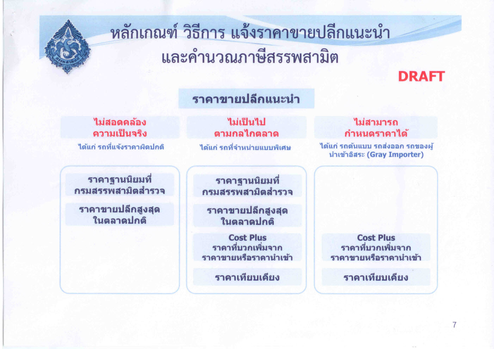

ราคาขายปลีกแนะนำ คือ ราคาขายที่ผู้ประกอบอุตสาหกรรมหรือผู้นำเข้าประสงค์ จะกำหนดเป็นราคาขายปลีกแนะนำให้ผู้ขายปลีกขาย สินค้าของตนให้แก่ผู้บริโภครายสุดท้ายในตลาดปกติ โดยราคาดังกล่าวเป็นราคาที่กรมสรรพสามิตใช้เป็นฐานภาษีในการคำนวณภาษีในกรณีภาษีตามมูลค่า สำหรับสินค้าที่เสียภาษีสรรพสามิต

## การบันทึกข้อมูลราคาขายปลีกแนะนำ

แบ่งได้เป็น 3 ประเภทคือ

1.  ให้ระบุราคาขายปลีกแนะนำตามที่ได้แจ้งไว้กับกรมสรรพสามิตที่ช่อง Deducted Amount 
1.  กรณีสินค้าที่มี**อัตราภาษีตามปริมาณเพียงอย่างเดียว เช่น น้ำมัน และผลิตภัณฑ์น้ำมัน (น้ำมันหล่อลื่นอัตราภาษี 5 บาทต่อลิตร)** ให้ระบุ **“0.1”**
1.  กรณีสินค้าที่นำเข้า**คลังทัณฑ์บน เขตปลอดอากร เขตประกอบการเสรี และของที่ได้รับยกเว้นอากรตามภาค 4 และสินค้าที่กำหนดอัตราภาษีสรรพสามิตตามมูลค่าร้อยละศูนย์** ให้ระบุ **“0.2”**

## โครงสร้างราคาขายปลีกแนะนำ

1. **ต้นทุนการผลิต**
 	- ในกรณีสินค้าที่ผลิตในราชอาณาจักร หมายถึง ต้นทุนทั้งหมดที่มีอยู่ในการผลิตสินค้า ซึ่งได้แก่ ค่าวัตถุดิบ ค่าแรงงาน และค่าใช้จ่ายอื่นที่ใช้ในกระบวนการผลิต
	- ในกรณีสินค้านำเข้า หมายถึง ราคาของสินค้าและค่าใช้จ่ายที่ใช้ในการนำเข้าสินค้ามาในราชอาณาจักร ซึ่งได้แก่ ราคา ซี.ไอ.เอฟ. อากรศุลกากร และค่าใช้จ่ายอื่นที่ใช้ในการดำเนินพิธีการศุลกากร.  
  
2. **ค่าบริหารจัดการ** หมายถึง ค่าใช้จ่ายในสำนักงาน ซึ่งได้แก่ ค่าโฆษณา ค่าขนส่ง ค่าประกันภัย ค่าภาษีสรรพสามิต ค่าภาษีอื่น ที่จัดเก็บจากการขายสินค้านั้น ค่าธรรมเนียม (ในการรับฝากของในอารักขาศุลกากร) เงินบำรุงกองทุนหรือองค์การตามที่กฎหมาย กำหนดให้เรียกเก็บจากผู้มีหน้าที่เสียภาษีสำหรับสินค้านั้น และค่าใช้จ่ายอื่นที่เกี่ยวข้องกับการการบริหารการขายสินค้าผู้ประกอบอุตสาหกรรมหรือผู้นำเข้า
 
3. **กำไรมาตรฐาน** หมายถึง ให้พิจารณาจากราคาขายปลีกแนะนำหักต้นทุนการผลิตและค่าบริหารจัดการ

## หลักเกณฑ์ วิธีการ แจ้งราคาขายปลีกแนะนำ

## ประกาศที่เกี่ยวข้อง

**ประกาศกรมศุลกากรที่ 114/.2560 เรื่อง การปฏิบัติพิธีการศุลกากรนำเข้าทางอิเล็กทรอนิกส์สำหรับสินค้านำเข้าตามกฎหมายว่าด้วยภาษีสรรพสามิต**

 


 
 <a href="./114-2560.pdf" target="_blank" id="download_files">ดาวน์โหลดประกาศ
                <i class=" fas fa-file-pdf" ></i>
            </a>
 
 

**ประกาศกรมศุลกากรที่ 127/.2560 เรื่อง การปฏิบัติพิธีการศุลกากรนำเข้าทางอิเล็กทรอนิกส์ สำหรับสินค้านำเข้า ที่กรมสรรพสามิตประกาศขยายกำหนดเวลาการปฏิบัติตามพระราชบัญญัติภาษีสรรพสามิต พ.ศ.2560**

 


 

 
 <a href="./127-2560.pdf" target="_blank" id="download_files">ดาวน์โหลดประกาศ
                <i class=" fas fa-file-pdf" ></i>
            </a>
 

> ที่มา : กรมสรรพสามิต