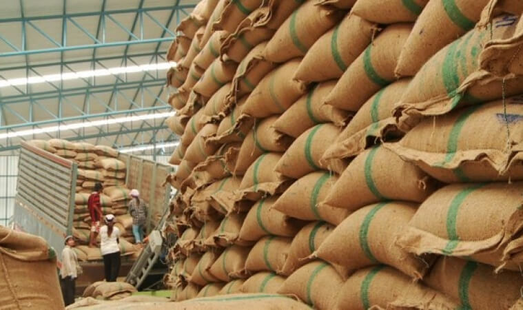

การกำหนดให้ข้าวเป็นสินค้าที่ต้องขออนุญาตในการส่งออก ในระยะแรกเป็นไปโดยอาศัยอำนาจตามพระราชบัญญัติ(พ.ร.บ.) ควบคุมการส่งออกไปนอกและการนำเข้ามาในราชอาณาจักร ซึ่งสินค้าบางอย่าง พ.ศ.2482 โดยตราเป็นพระราชกฤษฎีกาควบคุมการส่งออกไปนอกราชอาณาจักรซึ่งสินค้าบางอย่าง (ฉบับ 13)พ.ศ.2490 ซึ่งมีรายการสินค้าอยู่หลายข้อหลายรายการ มีข้าวชนิดต่างๆ และผลิตภัณฑ์เป็นสินค้าในรายการที่ต้องขออนุญาตในการส่งออกด้วย ต่อมากระทรวงพาณิชย์ออกประกาศเรื่องการส่งสินค้าออกไปนอกราชอาณาจักร(ฉบับที่ 7) พ.ศ.2509 อนุญาตให้ส่งสินค้าตามพระราชกฤษฎีกาดังกล่าวออกไปได้เป็นการทั่วไป เว้นแต่สินค้าตามรายการท้ายประกาศกระทรวงพาณิชย์ดังกล่าว ซึ่งมีรายการข้าวเปลือก ข้าวกล้อง ข้าวสาร ข้าวเหนียว ปลายข้าว รำข้าว และสิ่งใดฯที่แปรสภาพสภาพจากข้าวทุกชนิด

ในปี 2522 มีการตรา พ.ร.บ.การส่งออกฯ พ.ศ. 2522 ออกใช้บังคับแทนฉบับเดิม โดยมีบทเฉพาะกาล ตามมาตรา 25 ให้บรรดา พระราชกฤษฎีกา กฎกระทรวง ประกาศ และระเบียบ ที่ออกตาม พ.ร.บ.ควบคุมการส่งออกไปนอกและการนำเข้ามาในราชอาณาจักร ซึ่งสินค้าบางอย่าง พ.ศ.2482 ยังมีผลใช้บังคับต่อไป จนกว่าจะมีกฎกระทรวง ประกาศ ระเบียบตามกฎหมายฉบับนี้ออกใช้บังคับ ดังนั้น ข้าวเปลือก ข้าวกล้อง ข้าวสาร ข้าวเหนียว ปลายข้าว รำข้าว และสิ่งใดฯที่แปรสภาพสภาพจากข้าวทุกชนิด จึงยังเป็นสินค้าที่ต้องขออนุญาตส่งออก แต่ตอมามีประกาศกระทรวงพาณิชย์ว่าด้วยการส่งสินค้าออกไปนอกราชอาณาจักร(ฉบับที่ 66) พ.ศ.ยกเลิกการกำหนดให้ผลิตภัณฑ์ที่ทำจากข้าวทุกชนิดและสิ่งใดฯที่แปรสภาพจากข้าวทุกชนิด เป็นสินค้าที่ต้องขออนุญาตในการส่งออก

ต่อมาในปี 2555 กระทรวงพาณิชย์ได้ออกประกาศกระทรวงพาณิชย์ เรื่องการกำหนดให้ข้าวเป็นสินค้าที่ต้องขออนุญาตในการส่งออก พ.ศ. 2555 ออกตาม พ.ร.บ.การส่งออกฯ พ.ศ.2522 กำหนดให้ข้าวซึ่งหมายถึง ข้าวเจ้าหรือข้าวเหนียว ทั้งที่เป็นข้าวเปลือก ข้าวกล้อง ข้าวสาร ปลายข้าว ข้าวนึ่งและรำ แต่ไม่รวมถึงผลิตภัณฑ์ที่ทำจากข้าว เป็นสินค้าที่ต้องขออนุญาตในการส่งออกไปนอกราชอาณาจักร ดังนั้นการกำหนดให้ข้าวต่างฯ เป็นสินค้าที่ต้องขออนุญาตในการส่งออกตามประกาศ พระราชกฤษฎีกาฉบับเดิม จึงถูกยกเลิกไป

2. ระเบียบกระทรวงพาณิชย์ว่าด้วยการส่งข้าวออกไปนอกราชอาณาจักร

อันเนื่องมาจากข้าวเป็นสินค้าที่ต้องขออนุญาตในการส่งออก กระทรวงพาณิชย์ จึงออกระเบียบการส่งออกข้าวไปนอกราชอาณาจักร เพื่อกำหนดรายละเอียด คุณสมบัติ ของผู้ขอรับใบอนุญาต ขั้นตอน และเงื่อนไขที่ต้องปฏิบัติไว้ ดังนี้ คือ

ฉบับที่ 1 คือ ระเบียบกระทรวงพาณิชย์ว่าด้วยการส่งออกข้าวฯ (ฉบับที่1) พ.ศ.2534 ต่อมามีการออกระเบียบกระทรวงพาณิชย์ เพื่อปรับปรุงแก้ไขระเบียบ(ฉบับที่1) ให้เหมาะสมกับสถานการณ์การค้าการส่งออกข้าว อีก 16ฉบับ

ล่าสุด กระทรวงพาณิชย์ได้ออกระเบียบกระทรวงพาณิชย์ว่าด้วยการส่งข้าวออกไปนอกราชอาณาจักร พ.ศ. 2562 แก้ไขปรับปรุงระเบียบเดิมให้เหมาะสม โดยยกเลิกระเบียบเดิมทุกฉบับ เหลือเพียงระเบียบใหม่ฉบับเดียว เพื่อความสะดวกในการค้นหาอ้างอิง

ซึ่งมีสาระสำคัญ โดยสรุปคือ

ในระเบียบนี้มีการแยกการส่งออกข้าว เป็นข้าวเอกชน และข้าวรัฐบาล

**“ข้าวเอกชน”** คือข้าวที่ผู้ส่งออกที่เป็นผู้ประกอบการค้าข้าว ทำสัญญาขายให้ผู้ซื้อ เพื่อส่งออก (ซึ่งผู้ซื้ออาจเป็นผู้นำเข้า ตัวแทนนายหน้า หรือหน่วยงาน ของรัฐบาลต่างประเทศ องค์การระหว่างประเทศก็ได้ )

“ ข้าวรัฐบาล” โดยให้คำหมายไว้คือ ข้าวที่รัฐบาลไทยตกลงทำซื้อขายกับรัฐบาลต่างประเทศหรือองค์การระหว่างประเทศหรือหน่วยงานหรือภาคเอกชนในต่างประเทศที่ได้รับมอบหมายหรือมอบอำนาจจากรัฐบาลต่างประเทศและส่งออกในนามกลุ่มลูกค้าต่างประเทศและให้ หมายความรวมถึงข้าวที่รัฐบาลไทยได้บริจาคให้แก่รัฐบาลต่างประเทศหรือองค์การระหว่างประเทศเพื่อการกุศลหรือเพื่อการอื่นใดตามที่รัฐบาลกำหนด

  ( ข้าวรัฐบาล ซึ่งก็คือข้าวที่ขายแบบจีทูจี เมื่อกำหนดความหมายไว้ชัดเจน เช่นนี้ ต่อไปผู้ทุจริต ไม่สามารถขายข้าวให้พวกพ้องหาประโยชน์โดยมิชอบ โดยอ้างว่าเป็นการขายแบบจีทูจี แบบมั่วฯได้อีกต่อไป)

มีการกำหนดคุณสมบัติของผู้มีสิทธิเป็นผู้ส่งออกข้าวไว้สี่ประการประการหนึ่งคือต้องเป็นผู้ที่ได้ขึ้นทะเบียนเป็นผู้ส่งข้าวออกไปนอกราชอาณาจักรไว้กับกรมการค้าต่างประเทศ

  (การกำหนดให้ผู้มีสิทธิเป็นผู้ส่งออกข้าวต้องขึ้นทะเบียนเป็นผู้ส่งข้าวออก เคยมีผู้โต้แย้งในศาลว่า กรมการค้าต่างประเทศอาศัยอำนาจตามกฎหมายใดที่กำหนดให้ผู้มีสิทธิส่งข้าวออกต้องขึ้นทะเบียนเป็นผู้ส่งข้าวออกไว้กับกรมการค้าต่างประเทศ ในประเด็นนี้มีการชี้แจงว่า เนื่องจากผู้ประกอบการส่งออกข้าวจะต้องเป็นผู้ได้รับใบอนุญาตให้เป็นผู้ค้าข้าวตามกฎหมายการค้าข้าว หรือเอกสารอื่นตามที่กฎหมายกำหนด เมื่อนำหลักฐานดังกล่าวมาแสดงตอนขึ้นทะเบียนครั้งเดียวและได้รับการขึ้นทะเบียนไว้ เมื่อมาขอรับใบอนุญาตในการส่งออกแต่ละครั้ง ก็จะเป็นการสะดวก ไม่ต้องแสดงหลักฐานดังกล่าวอีกเมื่อมายื่นขอรับใบอนุญาตแต่ละครั้ง และสามารถแสดงเลขทะเบียนผู้ส่งออกที่กระสอบ ถุงหรือภาชนะอื่นใด ที่บรรจุข้าวแทนการแสดงชื่อเต็มของผู้ส่งออกก็ได้ เป็นการอำนวยความสะดวกให้ผู้ส่งออก)

การขอรับใบอนุญาต  การส่งออกข้าวออกไปนอกราชอาณาจักร ให้ยื่นคำขอให้ส่งสินค้าออกไปนอกราชอาณาจักรแบบ อ1 มิใช่เพื่อการค้า หรือแบบอ2 เพื่อการค้าแล้วแต่กรณี

  ข้อที่ผู้ส่งออกข้าวต้องปฏิบัติ  ในการส่งออกข้าว ผู้ส่งออกต้องปฏิบัติดังนี้คือ ต้องส่งข้าวที่ได้มาตรฐานตามที่กระทรวงพาณิชย์กำหนด และต้องผ่านการตรวจสอบ คื หากเป็นสินค้ามาตรฐาน(คือข้าวหอมมะลิไทย)ต้องผ่านการตรวจสอบโดยสำนักงานมาตรฐานสินค้า หรือผู้ประกอบธุรกิจที่ได้รับอนุญาตให้ตรวจสอบมาตรฐานสินค้าสำหรับข้าวหอมมะลิไทย ถ้าไม่ใช่ข้าวที่เป็นสินค้ามาตรฐาน(ข้าวทุกชนิดที่ไม่ใช่ข้าวหอมมะลิไทย)ต้องผ่านการตรวจสอบโดยสภาหอการค้าแห่งประเทศไทย (สำนักงานคณะกรรมการตรวจข้าว)  ยกเว้นการส่งออกที่เป็นการค้าชายแดน โดยข้าวที่ส่งออกต้องเป็นข้าว ประเภทและชนิดข้าวตรงตามที่ขอรับ ใบอนุญาต

  ปริมาณข้าวที่จะอนุญาตให้ส่งออกเพื่อมิใช่การค้า มีปริมาณระหว่าง 100 กิโลกรัม ถึง200 กิโลกรัม แล้วแต่ประเภทหรือชนิดข้าว

การขาดคุณสมบัติเป็นผู้ส่งออกข้าว ในกรณีที่ผู้ส่งออกแสดงเอกสารเท็จในการขออนุญาตส่งออก หรือฝ่าฝืนเงื่อนไขหรือข้อกำหนดตามระเบียบนี้ หรือส่งออกสินค้าที่มีการปลอมปน หรือคุณภาพต่ำกว่าที่กำหนด จะถือว่าเป็นผู้กระทำความเสียหายต่อการค้าระหว่างประเทศ ขาดคุณสมบัติเป็นผู้มีสิทธิส่งออกข้าว

> ที่มาบทความ : [กรุงเทพธุรกิจ](https://www.bangkokbiznews.com/blog/detail/646778)
