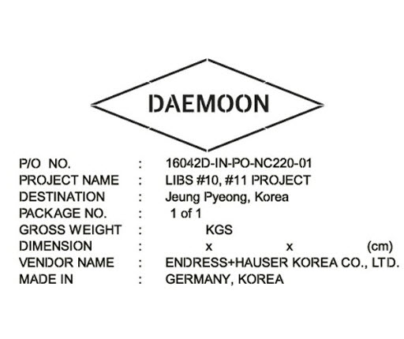

การขนส่งระหว่างประเทศเป็นการขนส่งของหลายเจ้าของ (หลายใบตราส่ง)  กฎการขนส่ง จึงกำหนดให้ของที่จะขนส่ง ต้องจัดทำเครื่องหมายเลขหมายและนำไปแสดงไว้ในใบตราส่งด้วย

เครื่องหมายและเลขหมายหีบห่อ (Shipping Mark) คือ ข้อความ สัญลักษณ์ หรือตัวเลข ที่ระบุไว้บนแต่ละหีบห่อของสินค้า เพื่อแสดงว่าสินค้านั้นเป็นของตามใบตราส่งใด และเพื่อให้กระบวนการขนส่งในทุก ๆ ขั้นตอนเป็นไปด้วยความสะดวก รวดเร็ว เรียบร้อย ปลอดภัย ไม่มีความสับสน ล่าช้า เกิดขึ้นระหว่างต้นทางและปลายทาง รวมไปถึงความปลอดภัยของสินค้าระหว่างขนส่ง ดังนั้น แต่ละหีบห่อของสินค้าจึงควรมีเครื่องหมายและเลขหมายหีบห่อ (Shipping Mark) อย่างถูกต้องและครบถ้วน และนำไประบุไว้ในเอกสารนำเข้า-ส่งออกทั้งหมด ไม่ว่าจะเป็น commercial invoice, B/L และ packing list 

พระราชบัญญัติศุลกากร พ.ศ. 2560 มาตรา 211 บัญญัติว่า 

{}
**“ผู้นำของเข้าหรือผู้ส่งของออกผู้ใดไม่จัดให้มีเครื่องหมายหรือเลขหมายกำกับหีบห่อหรือภาชนะบรรจุของ หรือไม่แสดงเครื่องหมายหรือเลขหมายไว้ในเอกสารที่เกี่ยวกับของนั้น ต้องระวางโทษปรับไม่เกินห้าหมื่นบาท”**
{}

{}
**เกณฑ์การเปรียบเทียบงดการฟ้องร้องตามพระราชบัญญัติศุลกากร พ.ศ. 2560 กำหนดโทษปรับ 1,000 บาท และจัดทำเครื่องหมายเลขหมายให้ถูกต้อง**
{}

ประกาศกรมศุลกากรที่ 132/.2561 เรื่อง คู่มือการผ่านพิธีการทางอิเล็กทรอนิกส์ว่าด้วยกระบวนการทางศุลกากรสำหรับการนำเข้า (e-Import) หน้า 59 ได้ระบุถึง เครื่องหมายและเลขหมายหีบห่อ (Shipping Marks) ดังนี้  

1. เครื่องหมายและเลขหมายหีบห่อ (Shipping Marks) ต้องสำแดงเครื่องหมายและเลขหมายหีบห่อ ให้ตรงกับความเป็นจริง ซึ่งจะต้องตรงกับใบตราส่งสินค้า โดยให้สำแดง ดังนี้     
    - ถ้าเครื่องหมายและเลขหมายหีบห่อเป็นข้อความให้บันทึกเป็นข้อความตามจริง หากเครื่องหมายและเลขหมายหีบห่อมีความยาวเกิน 512 ตัวอักษร *ให้บันทึกเพียง 512 ตัวอักษรได้*
    - ถ้าเครื่องหมายและเลขหมายหีบห่อเป็นข้อความที่เป็นภาษาต่างประเทศ ซึ่งไม่สามารถบันทึกข้อความนั้นได้ เช่น ภาษาจีน ให้ระบุคำว่า **“PICTURE”**
    - ถ้าเครื่องหมายและเลขหมายหีบห่อเป็นรูปภาพให้ระบุคำว่า **“PICTURE”**	

2. กรณีผ่อนผันไม่ต้องสำแดงเครื่องหมายและเลขหมายหีบห่อ (Shipping Marks) ในการจัดทำข้อมูลใบขนสินค้าขาเข้าให้ระบุคำว่า *“NO SHIPPING MARK”* แทนได้ สำหรับกรณี ดังต่อไปนี้
    - กรณีหีบห่อของใช้ส่วนตัวตาม ประเภทที่ 5 ภาค 4 แห่งพระราชกำหนดพิกัดอัตราศุลกากร พ.ศ. 2530
    - กรณีหีบห่อของที่ได้รับเอกสิทธิ์ ตามข้อผูกพันที่ประเทศไทยมีต่อองค์การสหประชาชาติตามกฎหมายระหว่างประเทศหรือตามสัญญากับนานาประเทศ
    - ของที่มิได้บรรจุหีบห่อ เช่น รถยนต์ ยางรถยนต์ รางรถไฟ ลวด โลหะเป็นแท่งหรือก้อนกระดาษพิมพ์หนังสือเป็นม้วน กระเบื้อง
    - ของเหลวบรรจุในขวดใหญ่และมีวัตถุถักหุ้มขวด เช่น น้ำกรด 
    - ของที่มาเป็นกอง เช่น ถ่านหิน
    - ของที่บรรจุหีบห่อเดียว
    - ของที่บรรจุในหีบห่อที่เป็นมาตรฐานเดียว (Standard Packing) เช่น ลังไม้ หรือลังกระดาษที่มีขนาดกว้างยาวเท่ากัน ของที่บรรจุมีจำนวนเท่ากัน เช่น นมสด สุรา เบียร์ อาหารปนแป้ง วิทยุ
    - ของที่มาเป็นถังเหล็กหรือถังไฟเบอร์ (Drum or Fiber Drum) ที่มีลักษณะขนาด น้ำหนัก และจำนวนของที่บรรจุเท่ากัน เช่น จุกขวด น้ำยาดับกลิ่น น้ำมันเครื่อง สีทา
    - ของที่บรรจุมาในถุงกระดาษหรือกระสอบ ที่มีลักษณะขนาด น้ำหนัก และจำนวนของที่บรรจุเท่ากัน เช่น ปุ๋ย แอมโมเนีย แป้ ง ข้าวสาลี หิน กากเพชร น้ำตาล
    - ของที่บรรจุมาในหีบโปร่ง (Crate) เช่น เครื่องยนต์

> ที่มาบทความ : [กรมศุลกากร](http://www.customs.go.th/cont_strc_faq.php?lang=th&top_menu=menu_homepage&left_menu=menu_center_004&ini_menu=&current_id=142328324146505f48464b47464b4b).  
> วันที่ปรับปรุงล่าสุด : 8 สิงหาคม 2562