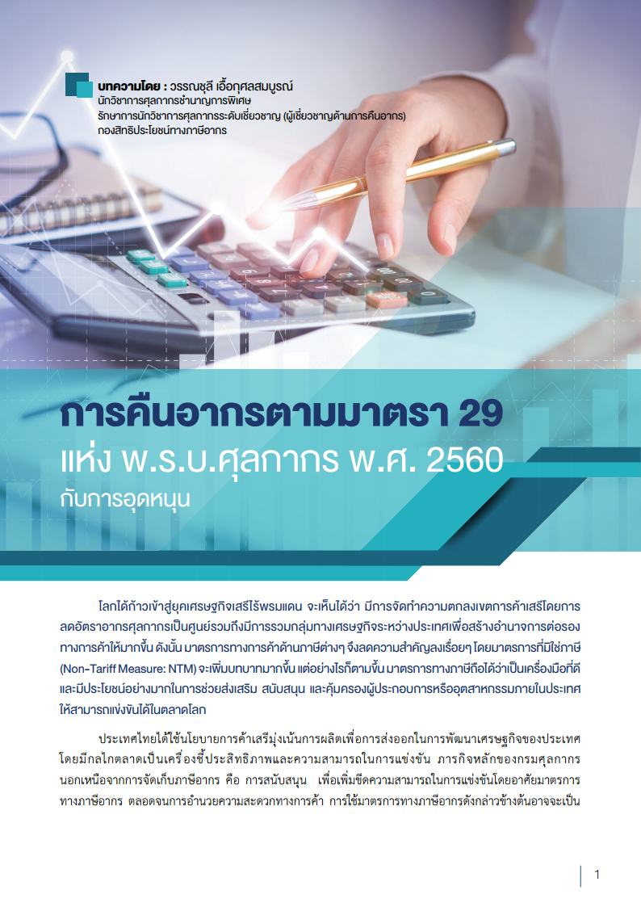
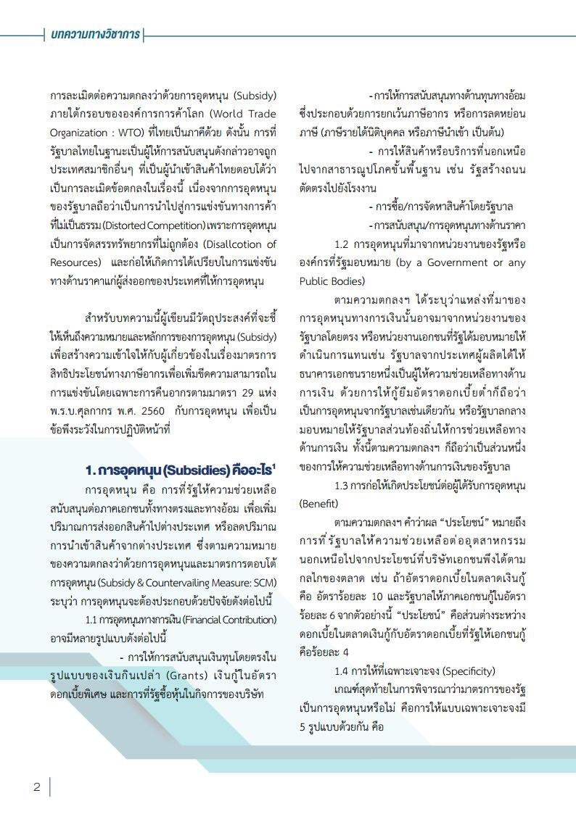
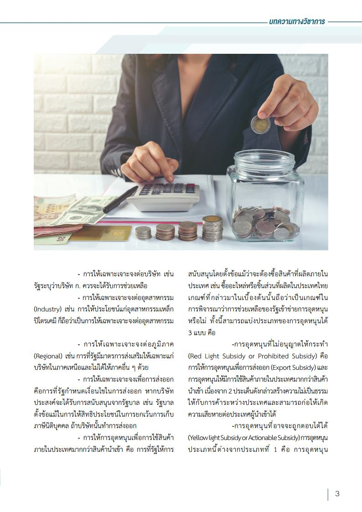
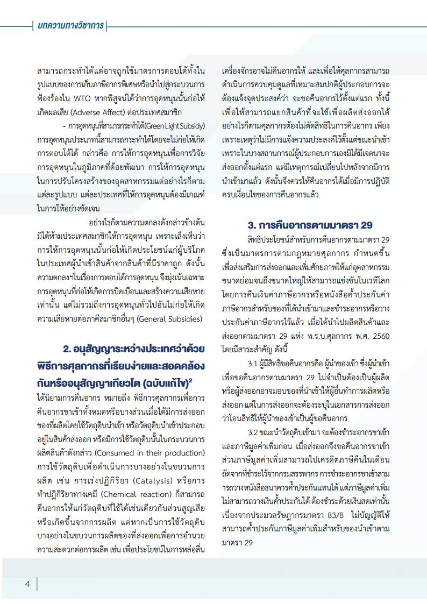
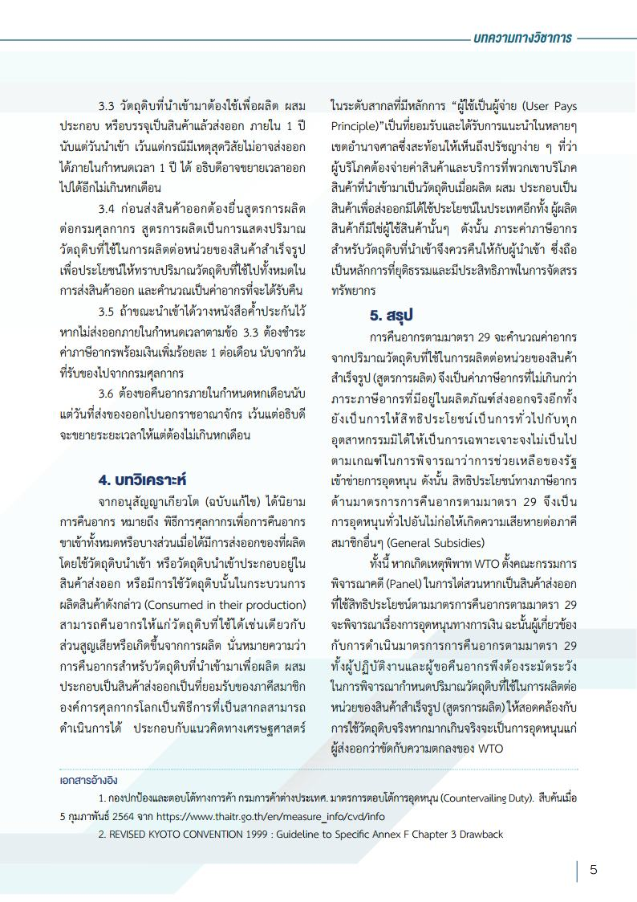

โลกได้ก้าวเข้าสู่ยุคเศรษฐกิจเสรีไร้พรมแดน  จะเห็นได้ว่า  มีการจัดทำความตกลงเขตการค้าเสรีโดยการลดอัตราอากรศุลกากรเป็นศูนย์ รวมถึงมีการรวมกลุ่มทางเศรษฐกิจระหว่างประเทศเพื่อสร้างอำนาจการต่อรองทางการค้าให้มากขึ้น ดังนั้นมาตรการทางการค้าด้านภาษีต่าง ๆ จึงลดความสำคัญลงเรื่อย ๆ โดยมาตรการที่ไม่ใช่ภาษี (Non-Tariff Measure: NTM) จะเพิ่มบทบาทมากขึ้น แต่อย่างไรก็ตาม มาตรการทางภาษีถือได้ว่าเป็นเครื่องมือที่ดีและมีประโยชน์อย่างมากในการช่วยส่งเสริม  สนับสนุน  และคุ้มครองผู้ประกอบการ หรืออุตสาหกรรมภายในประเทศ ให้สามารถแข่งขันได้ในตลาดโลก 

ประเทศไทยได้ใช้นโยบายการค้าเสรี มุ่งเน้นการผลิตเพื่อการส่งออกในการพัฒนาเศรษฐกิจของประเทศ โดยมีกลไกตลาดเป็นเครื่องชี้ประสิทธิภาพและความสามารถในการแข่งขัน  ภารกิจหลักของกรมศุลกากร  นอกเหนือจากการจัดเก็บภาษีอากร  คือ  การสนับสนุน   เพื่อเพิ่มขีดความสามารถในการแข่งขันโดยอาศัยมาตรการ ทางภาษีอากร  ตลอดจนการอำนวยความสะดวกทางการค้า  การใช้มาตรการทางภาษีอากรดังกล่าวข้างต้นอาจจะเป็นการละเมิดต่อความตกลงว่าด้วยการอุดหนุน  (Subsidy)  ภายใต้กรอบขององค์การการค้าโลก  (World  Trade  Organization : WTO) ที่ไทยเป็นภาคีด้วย ดังนั้น การที่รัฐบาลไทยในฐานะเป็นผู้ให้การสนับสนุนดังกล่าว อาจถูกประเทศสมาชิกอื่น ๆ  ที่เป็นผ้้นำเข้าสินค้าไทยตอบโต้ว่า เป็นการละเมิดข้อตกลงในเรื่องนี้ เนื่องจากการอุดหนุนของรัฐบาลถือว่าเป็นการนำไปสู่การแข่งขันทางการค้า ที่ไม่เป็นธรรม (Distorted Competition) เพราะการอุดหนุน เป็นการจัดสรรทรัพยากรที่ไม่ถูกต้อง  (Disallcotion  of  Resources)    และก่อให้เกิดการได้เปรียบในการแข่งขัน ทางด้านราคาแก่ผู้ส่งออกของประเทศที่ให้การอุดหนุน  

 

 

<a class="badge badge-danger" href="doc.pdf" target="_blank" id="download_files_new">Download</a>

> ที่มา : [กรมศุลกากร](http://www.customs.go.th/cont_strc_simple_with_date.php?current_id=14232832414d505f49464b4a464b4c)