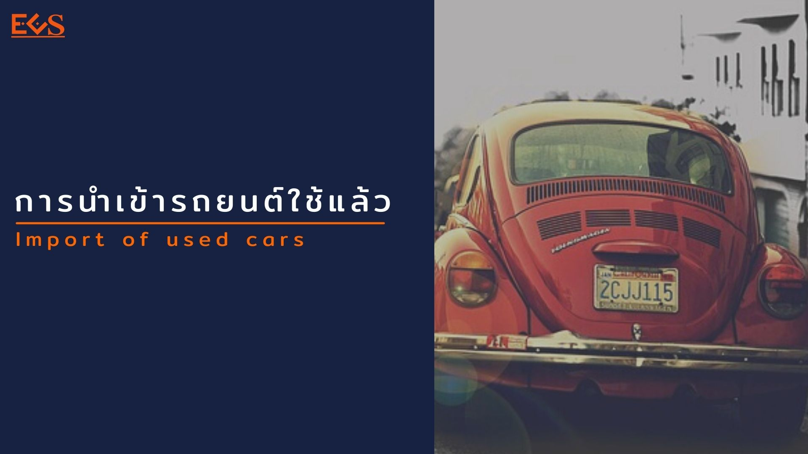
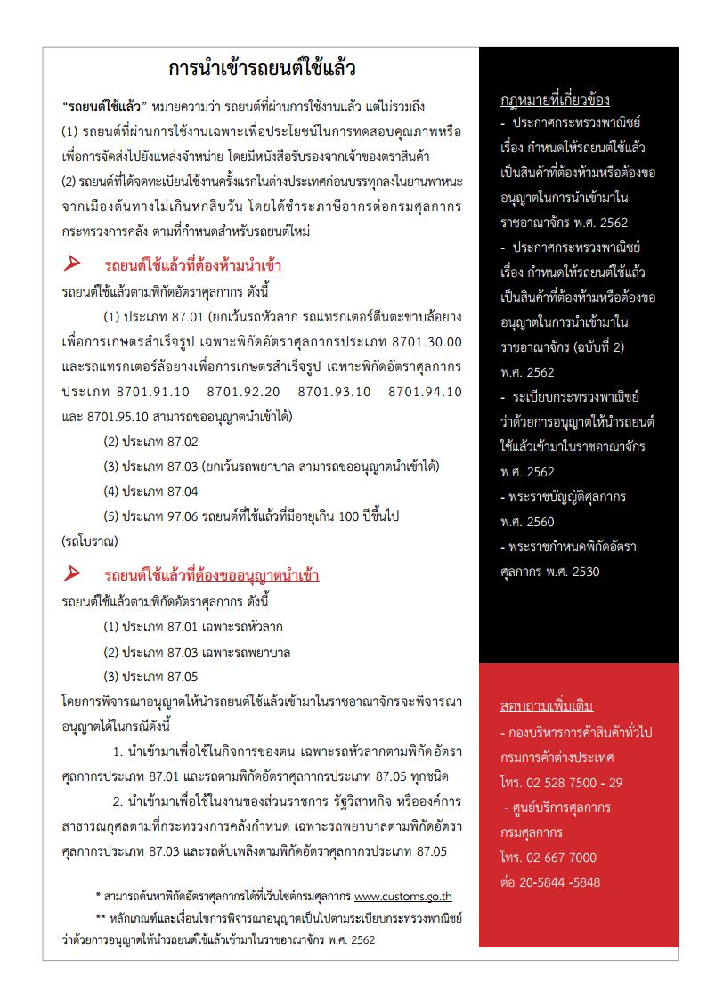
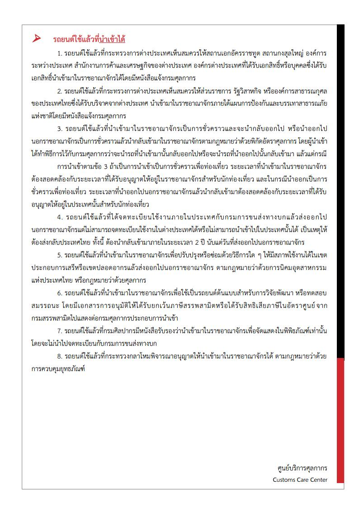

 

 

<a class="badge badge-danger" href="./used_car.pdf" target="_blank" id="download_files_new">Download </a>

> ที่มา : [กรมศุลกากร](http://ccc.customs.go.th/cont_strc_faq.php?current_id=14232a32414b505f49&left_menu=interesting_article)