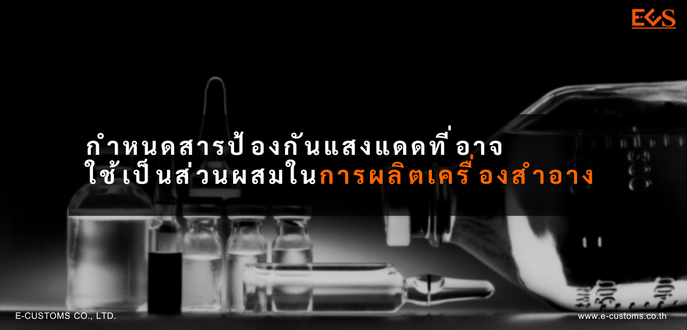
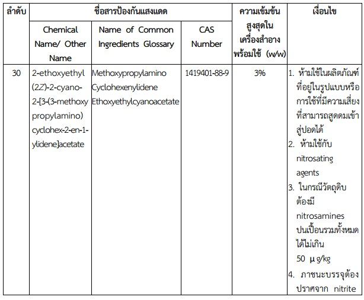

 

ประกาศกระทรวงสาธารณสุข เรื่อง กำหนดสารป้องกันแสงแดดที่อาจใช้เป็นส่วนผสมในการผลิตเครื่องสําอาง (ฉบับที่ 4) พ.ศ. 2565 อาศัยอำนาจตามความในมาตรา 5 วรรคหนึ่ง และมาตรา 6 (2) และ (3) แห่งพระราชบัญญัติเครื่องสําอาง พ.ศ. 2558 รัฐมนตรีว่าการกระทรวงสาธารณสุข โดยคำแนะนําของคณะกรรมการเครื่องสําอางออกประกาศไว้ดังต่อไปนี้

ข้อให้เพิ่มความต่อไปนี้เป็นช่องลำดับที่ 30 แห่งบัญชีแนบท้ายประกาศกระทรวงสาธารณสุข เรื่อง กำหนดสารป้องกันแสงแดดที่อาจใช้เป็นส่วนผสมในการผลิตเครื่องสําอาง พ.ศ. 2562 ลงวันที่ 18 กุมภาพันธ์ พ.ศ. 2562



  





 

 

<a class="badge badge-danger" href="./docs.pdf" target="_blank" id="download_files_new">Download</a>

 



