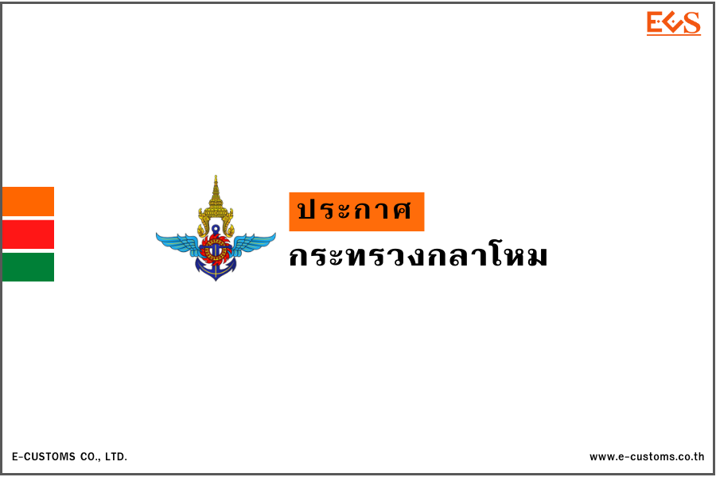



**ประกาศกระทรวงกลาโหม เรื่อง กำหนดแบบคําขอรับใบอนุญาต คําขอต่ออายุใบอนุญาต คําขอรับใบแทนใบอนุญาต คําขอเปลี่ยนแปลงรายการ และแบบใบอนุญาตสั่งเข้ามา นําเข้ามา ผลิต หรือมีซึ่งยุทธภัณฑ์** 

โดยที่เป็นการสมควรกำหนดแบบคําขอรับใบอนุญาต คําขอต่ออายุใบอนุญาต คําขอรับใบแทน ใบอนุญาต คําขอเปลี่ยนแปลงรายการ และแบบใบอนุญาตสั่งเข้ามา นําเข้ามา ผลิต หรือมีซึ่งยุทธภัณฑ์ อาศัยอำนาจตามความในข้อ 5 ข้อ 9 ข้อ 10 วรรคสาม ข้อ 11 วรรคสาม และข้อ 12 วรรคสาม แห่งกฎกระทรวงการขออนุญาต การขอต่ออายุใบอนุญาต และการอนุญาตและการขอรับใบแทน ใบอนุญาต และการออกใบแทนใบอนุญาตสั่งเข้ามา นําเข้ามา ผลิต หรือมีซึ่งยุทธภัณฑ์ พ.ศ. 2564 รัฐมนตรีว่าการกระทรวงกลาโหม จึงออกประกาศไว้ ดังต่อไปนี้

ให้กำหนดแบบคําขอรับใบอนุญาต คําขอต่ออายุใบอนุญาต คําขอรับใบแทนใบอนุญาต คําขอเปลี่ยนแปลงรายการ และแบบใบอนุญาตสั่งเข้ามา นําเข้ามา ผลิต หรือมีซึ่งยุทธภัณฑ์ ตามแบบ ท้ายประกาศนี้ ดังต่อไปนี้

1.	คําขอรับใบอนุญาตสั่งเข้ามา นําเข้ามา ผลิต หรือมีซึ่งยุทธภัณฑ์ ให้ใช้แบบ ย.ภ.1
2.	ใบอนุญาตสั่งเข้ามาซึ่งยุทธภัณฑ์ ให้ใช้แบบ ย.ภ.2
3.	ใบอนุญาตนําเข้ามาซึ่งยุทธภัณฑ์ ให้ใช้แบบ ย.ภ.3 
4.	ใบอนุญาตผลิตซึ่งยุทธภัณฑ์ ให้ใช้แบบ ย.ภ.4 
5.	ใบอนุญาตมีซึ่งยุทธภัณฑ์ ให้ใช้แบบ ย.ภ.5 
6.	คําขอต่ออายุใบอนุญาตสั่งเข้ามา นําเข้ามา ผลิต หรือมีซึ่งยุทธภัณฑ์ ให้ใช้แบบ ย.ภ.6 
7.	คําขอรับใบแทนใบอนุญาตสั่งเข้ามา นําเข้ามา ผลิต หรือมีซึ่งยุทธภัณฑ์ ให้ใช้แบบ ย.ภ.7 
8.	คําขอเปลี่ยนแปลงรายการในใบอนุญาตสั่งเข้ามา นําเข้ามา ผลิต หรือมีซึ่งยุทธภัณฑ์ ให้ใช้แบบ ย.ภ.11

คําขอรับใบอนุญาต คําขอต่ออายุใบอนุญาต คําขอรับใบแทนใบอนุญาตที่ได้ยื่นไว้ ก่อนวันที่ประกาศนี้มีผลใช้บังคับและยังอยู่ระหว่างพิจารณา ให้ถือว่าเป็นคําขอตามประกาศนี้ และในกรณี เอกสารหรือหลักฐานที่ยื่นพร้อมคําขอดังกล่าวแตกต่างไปจากที่กำหนดในประกาศกระทรวงกลาโหมนี้ ให้พนักงานเจ้าหน้าที่มีอำนาจสั่งให้ดำเนินการแก้ไขเพิ่มเติมคําขอหรือจัดส่งเอกสารหรือหลักฐานเพิ่มเติมได้ตามความจําเป็น เพื่อให้เป็นไปตามประกาศกระทรวงกลาโหมนี้

ให้ใช้บังคับตั้งแต่วันถัดจากวันประกาศในราชกิจจานุเบกษา (*18 เมษายน 2566*) เป็นต้นไป





Download

