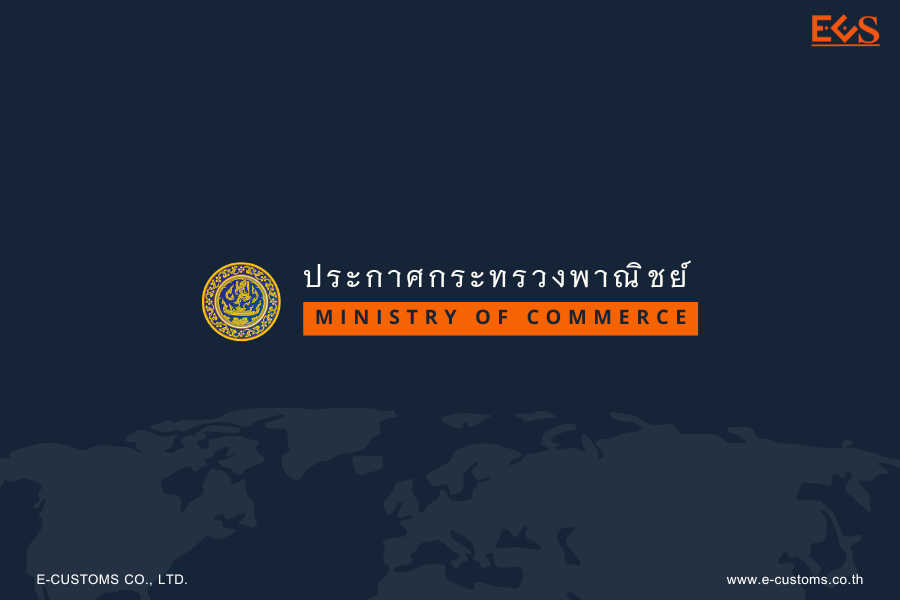



## ประกาศกระทรวงพาณิชย์ เรื่อง กําหนดให้ทรายเป็นสินค้าที่ต้องห้ามในการส่งออกไปนอกราชอาณาจักร พ.ศ. 2566

โดยที่เป็นการสมควรปรับปรุงมาตรการควบคุมการส่งออกทรายและยกเลิกมาตรการควบคุม การส่งออกแร่ที่มีทรายเป็นส่วนประกอบ เพื่อให้เหมาะสมสอดคล้องกับสถานการณ์ปัจจุบัน อาศัยอํานาจตามความในมาตรา 5 วรรคหนึ่ง (1) และวรรคสอง แห่งพระราชบัญญัติ การส่งออกไปนอกและการนําเข้ามาในราชอาณาจักรซึ่งสินค้า พ.ศ. 2522 รัฐมนตรีว่าการกระทรวงพาณิชย์ โดยอนุมัติของคณะรัฐมนตรีออกประกาศไว้ดังต่อไปนี้

**ข้อ 1** ประกาศนี้เรียกว่า **“ประกาศกระทรวงพาณิชย์ เรื่อง กําหนดให้ทรายเป็นสินค้า ที่ต้องห้ามในการส่งออกไปนอกราชอาณาจักร พ.ศ. 2566”**

**ข้อ 2** ประกาศนี้ให้ใช้บังคับ*เมื่อพ้นกําหนดหนึ่งร้อยแปดสิบวัน*นับแต่วันประกาศในราชกิจจานุเบกษาเป็นต้นไป (*ราชกิจจานุเบกษา 15 พฤษภาคม 2566*)

ข้อ 3 ให้ยกเลิก
1.	ประกาศกระทรวงพาณิชย์ ว่าด้วยการส่งสินค้าออกไปนอกราชอาณาจักร (ฉบับที่ 69) พ.ศ. 2537 ลงวันที่ 19 พฤษภาคม พ.ศ. 2537
2.	ประกาศกระทรวงพาณิชย์ ว่าด้วยการส่งสินค้าออกไปนอกราชอาณาจักร (ฉบับที่ 87) พ.ศ. 2541 ลงวันที่ 24 กันยายน พ.ศ. 2541

**ข้อ 4** ให้*ทรายตามพิกัดศุลกากรประเภท 25.05* เป็นสินค้าที่ต้อง*ห้ามในการส่งออกไปนอกราชอาณาจักร*

**ข้อ 5** ความในข้อ 4 มิให้ใช้บังคับแก่กรณีที่ส่งออกไปเพื่อใช้เป็นตัวอย่างหรือศึกษาวิจัย หรือนําติดตัวออกไปเพื่อใช้เฉพาะตัว ทั้งนี้ใน*ปริมาณไม่เกิน 2 กิโลกรัม* หรือกรณีที่ยานพาหนะ นําออกไปเพื่อใช้ในยานพาหนะนั้น ๆ ให้ปริมาณเป็นไปตามพันธกรณีระหว่างประเทศที่เกี่ยวข้อง





Download

> **ที่มา :** ราชกิจจานุเบกษา

