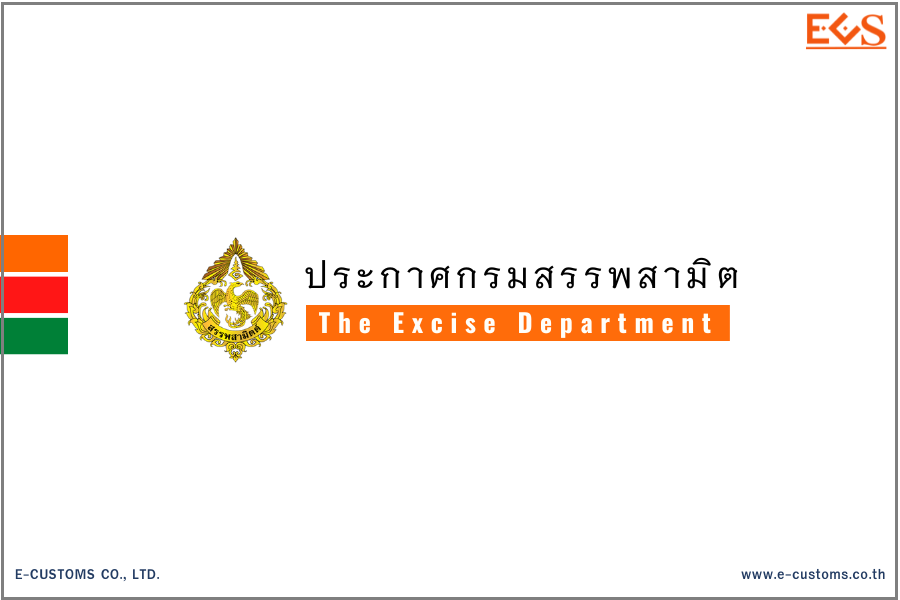



**ประกาศกรมสรรพสามิต เรื่อง กำหนดรหัสสินค้าสรรพสามิตสำหรับระบบแลกเปลี่ยนข้อมูลอิเล็กทรอนิกส์ (ELECTRONIC DATA INTERCHANGE) (ฉบับที่ 32) (น้ำมันดีเซล)**

เพื่อให้รหัสสินค้าสรรพสามิตและอัตราภาษีสรรพสามิต สำหรับระบบแลกเปลี่ยนข้อมูลอิเล็กทรอนิกส์ (ELECTRONIC DATA INTERCHANGE : EDI) ถูกต้องและเป็นปัจจุบัน อธิบดีกรมสรรพสามิตจึงกำหนดรหัสสินค้าสรรพสามิต รายการภาษีสรรพสามิต และอัตราภาษีสรรพสามิต เฉพาะในส่วนของ*น้ำมันดีเซลที่มีปริมาณกำมะถัน และน้ำมันดีเซลที่มีไบโอดีเซลประเภทเมทิลเอสเตอร์ของกรดไขมันผสมอยู่* ใน (1) (2) (5) (5/1) (5/2) (5/3) (5/4) และ (5/5) ของประเภทที่ 01.05 ไว้ (รายละเอียดตามเอกสารแนบ) โดยระบบจะทำการอัพเดทอัตราภาษีสรรพสามิตดังกล่าวให้ถูกต้องและเป็นปัจจุบันโดยอัตโนมัติ

ประกาศนี้ให้ใช้บังคับตั้งแต่*วันที่ 20 กันยายน 2566 เป็นต้นไป*





ดาวน์โหลดประกาศ

> **ที่มา :** [กรมสรรพสามิต](https://edi.excise.go.th/system/upload/0033.pdf)

