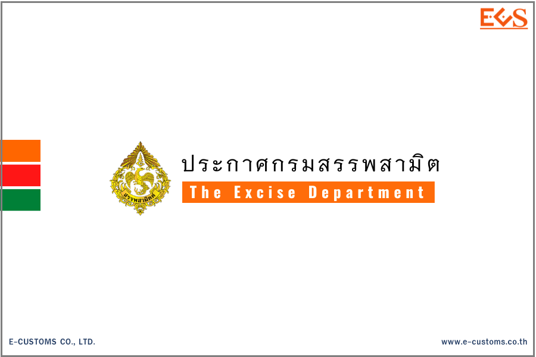
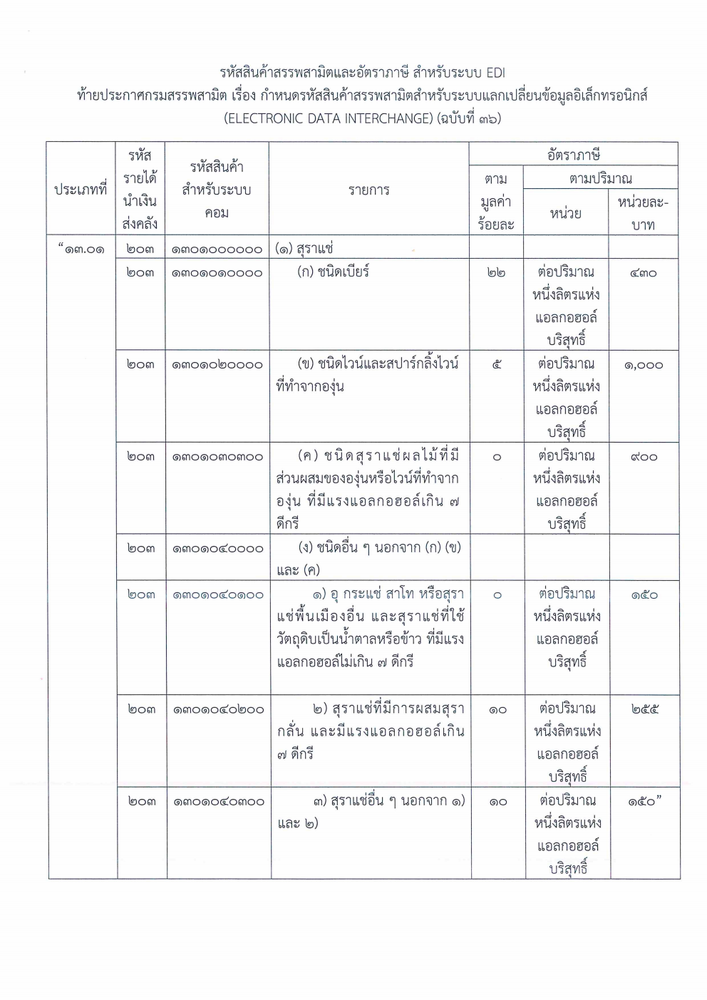



กรมสรรพสามิตเผยแพร่ ประกาศกรมสรรพสามิต เรื่อง **กำหนดรหัสสินค้าสรรพสามิตสำหรับระบบแลกเปลี่ยนข้อมูลอิเล็กทรอนิกส์ (สุราแช่) (ฉบับที่ 36)** 

เพื่อให้รหัสสินค้าสรรพสามิตและอัตราภาษีสรรพสามิต สำหรับระบบแลกเปลี่ยนข้อมูลอิเล็กทรอนิกส์ (ELECTRONIC DATA INTERCHANGE : EDI) ถูกต้องและเป็นปัจจุบัน อธิบดีกรมสรรพสามิตจึงกำหนดรหัสสินค้าสรรพสามิต รายการสินค้าสรรพสามิต และอัตราภาษีสรรพสามิต *เฉพาะในส่วนของสุราแช่ ใน (1) ของประเภทที่ 13.01* ไว้ ดังต่อไปนี้

ข้อ 1 ให้ยกเลิกข้อความในช่องรหัสรายได้นำเงินส่งคลัง รหัสสินค้าสำหรับระบบคอม รายการและอัตราภาษี ใน (1) ของประเภทที่ 13.01 ตามบัญชีท้ายประกาศกรมสรรพสามิต เรื่อง กำหนดรหัสสินค้าสรรพสามิตสำหรับระบบแลกเปลี่ยนข้อมูลอิเล็กทรอนิกส์ (ELECTRONIC DATA INTERCHANGE) ลงวันที่ 16 กันยายน พ.ศ. 2560 และให้ใช้ความในช่องรหัสรายได้นำเงินส่งคลัง รหัสสินค้าสำหรับระบบคอม รายการและอัตราภาษี ใน (1) ของประเภทที่ 13.01 ตามบัญชีท้ายประกาศนี้แทน

ข้อ 2 ประกาศนี้ให้ใช้บังคับ*ตั้งแต่วันที่ 23 กุมภาพันธ์ พ.ศ. 2567 เป็นต้นไป*






ดาวน์โหลดประกาศ

> **ที่มา :** [กรมสรรพสามิต](https://edi.excise.go.th/system/upload/0037.pdf)

