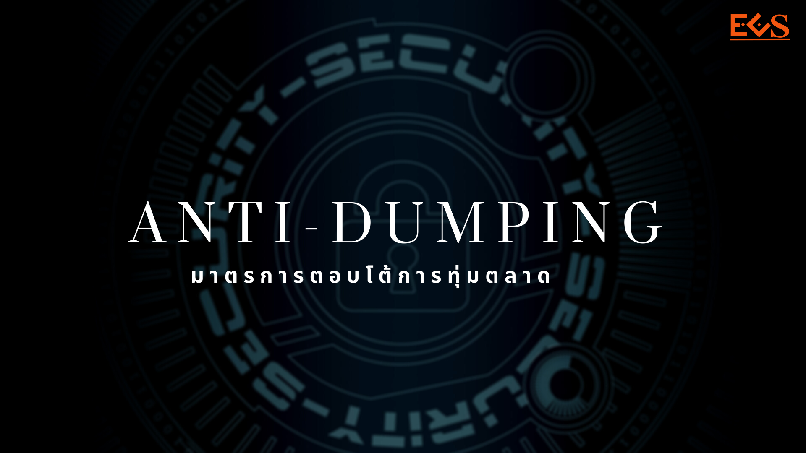

## ให้เรียกเก็บหลักประกันการชำระอากรตอบโต้การทุ่มตลาดสินค้าเหล็กกล้าไร้สนิมรีดเย็น ชนิดม้วน แผ่น และแผ่นแถบ ที่มีแหล่งกำเนิดจากประเทศญี่ปุ่น ไต้หวัน และสาธารณรัฐเกาหลี

มาตรการ : **ตอบโต้การทุ่มตลาด (Anti-dumping)**.  
ชื่อสินค้า : **เหล็กกล้าไร้สนิมรีดเย็นชนิดม้วน แผ่น และแผ่นแถบ**.  
ประเทศ : **ญี่ปุ่น สาธารณรัฐเกาหลี สหภาพยุโรป ไต้หวัน**.

**พิกัดศุลกากร** : 7219.32.00.032 7219.32.00.037 7219.32.00.054 7219.33.00.032 7219.33.00.033 7219.33.00.037 7219.33.00.038 7219.33.00.054 7219.33.00.055 7219.34.00.032 7219.34.00.033 7219.34.00.037 7219.34.00.038 7219.34.00.054 7219.34.00.055 7219.35.00.032 7219.35.00.033 7219.35.00.037 7219.35.00.038 7219.35.00.054 7219.35.00.055 7220.20.10.032 7220.20.10.033 7220.20.10.037 7220.20.10.038 7220.20.10.054 7220.20.10.055 7220.20.90.032 7220.20.90.033 7220.20.90.037 7220.20.90.038 7220.20.90.054 7220.20.90.055.  

**รายละเอียดข้อยกเว้นพิกัดอัตราศุลกากร** : รายละเอียดการยกเว้นตามบัญชีท้ายประกาศคณะกรรมการพิจารณาการทุ่มตลาดและการอุดหนุน เรื่อง ให้เรียกเก็บหลักประกันการชำระอากรตอบโต้การทุ่มตลาดสินค้าเหล็กกล้าไร้สนิมรีดเย็น ชนิดม้วน แผ่น และแผ่นแถบ ที่มีแหล่งกำเนิดจากประเทศญี่ปุ่น ไต้หวัน และสาธารณรัฐเกาหลี พ.ศ. 2563 
<a  href="./AD1004.pdf" target="_blank" >
 <i id="files" class=" fas fa-file-pdf"></i>
</a>

**อากรที่เรียกเก็บ** *(กรุณาศึกษาข้อมูลโดยละเอียดในประกาศ)*
 
1. **ประเทศญี่ปุ่น** 
  - Sumitomo Metal Industries, Ltd. และ Sumitomo Metal (Naoetsu), Ltd.  เรียกเก็บในอัตราร้อยละ 14.88 ของราคา ซี ไอ เอฟ 
  - JFE Steel Corporation เรียกเก็บในอัตราร้อยละ 19.82 ของราคา ซี ไอ เอฟ 
  - Nisshin Steel Co.,Ltd. เรียกเก็บในอัตราร้อยละ 37.04 ของราคา ซี ไอ เอฟ 
  - Nippon Kinzoku Co.,Ltd. เรียกเก็บในอัตราร้อยละ 0.00 ของราคา ซี ไอ เอฟ 
  - Nippon Steel and Sumikin Stainless Steel Corporation เรียกเก็บในอัตราร้อยละ 11.56 ของราคา ซี ไอ เอฟ 
  - รายอื่น ๆ  เรียกเก็บในอัตราร้อยละ 50.92 ของราคา ซี ไอ เอฟ
 
2. **ไต้หวัน** 
  - Chia Far Industrial Factory เรียกเก็บในอัตราร้อยละ 0.00 ของราคา ซี ไอ เอฟ 
  - รายอื่น ๆ เรียกเก็บในอัตราร้อยละ 33.99 ของราคา ซี ไอ เอฟ
 
3. **สาธารณรัฐเกาหลี** เรียกเก็บในอัตราร้อยละ 50.99 ของราคา ซี ไอ เอฟ.  

วันที่เริ่มต้นเรียกเก็บอากร : **18 ก.พ. 2564**.  
วันที่สิ้นสุดเรียกเก็บอากร : **17 ก.พ. 2569**

 


 

<a class="badge badge-danger" href="./AD1004.pdf" target="_blank" id="download_files_new">Download </a> 

 

> ที่มา : [กองปกป้องและตอบโต้ทางการค้า](https://www.thaitr.go.th/th/search/AD1004)   
กรมการค้าต่างประเทศ กระทรวงพาณิชย์
