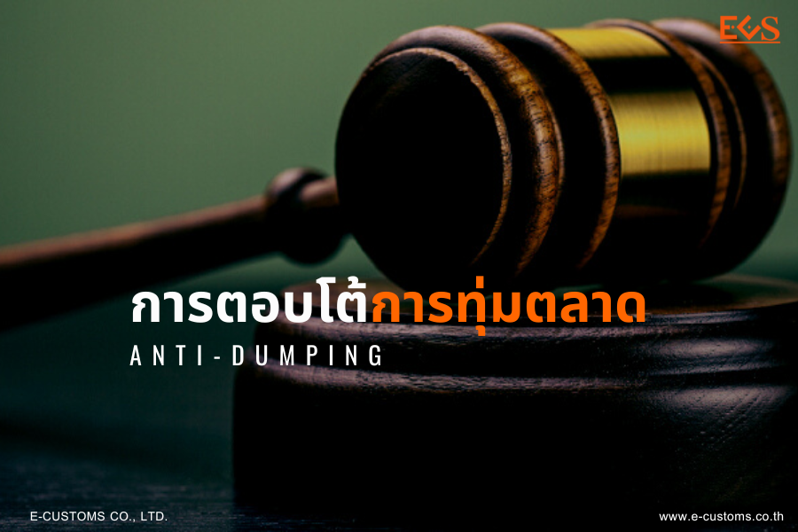

ประกาศคณะกรรมการพิจารณาการทุ่มตลาดและการอุดหนุน เรื่อง ผลการพิจารณาทบทวนความจำเป็นในการใช้บังคับอากรตอบโต้การทุ่มตลาดต่อไป ตามมาตรา 57 กรณี **สินค้าเหล็กแผ่นรีดร้อนชนิดเป็นม้วนและไม่เป็นม้วน** *ที่มีแหล่งกำเนิดจากสาธารณรัฐประชาชนจีนและมาเลเซีย* พ.ศ. 2566 

มาตรการ : **ตอบโต้การทุ่มตลาด (Anti-dumping)**.  
ชื่อสินค้า : **เหล็กแผ่นรีดร้อนชนิดเป็นม้วนและไม่เป็นม้วน**.  
ประเทศ : **สาธารณรัฐประชาชนจีนและมาเลเซีย**.

**พิกัดศุลกากร** : 72081000020 72081000030 72081000040 72081000090 72082500021 72082500022 72082500023 72082500031 72082500032 72082500033 72082500090 72082600011 72082600012 72082600013 72082600021 72082600022 72082600023 72082600090 72082719011 72082719012 72082719013 72082719090 72082799011 72082799012 72082799013 72082799090 72083600011 72083600012 72083600013 72083600021 72083600022 72083600023 72083600031 72083600032 72083600033 72083600041 72083600042 72083600043 72083600090 72083700022 72083700023 72083700024 72083700025 72083700041 72083700042 72083700043 72083700051 72083700052 72083700053 72083700071 72083700072 72083700073 72083700090 72083800022 72083800023 72083800024 72083800025 72083800032 72083800033 72083800034 72083800035 72083800041 72083800042 72083800043 72083800051 72083800052 72083800053 72083800071 72083800072 72083800073 72083800090 72083920032 72083920033 72083920034 72083920035 72083920041 72083920042 72083920043 72083920071 72083920072 72083920073 72083920081 72083920082 72083920083 72083920090 72083990022 72083990023 72083990024 72083990025 72083990032 72083990033 72083990034 72083990035 72083990041 72083990042 72083990043 72083990051 72083990052 72083990053 72083990071 72083990072 72083990073 72083990090 72084000020 72084000030 72084000040 72084000090 72085100031 72085100032 72085100033 72085100051 72085100052 72085100053 72085200021 72085200022 72085200023 72085200031 72085200032 72085200033 72085300011 72085300012 72085300013 72085300021 72085300022 72085300023 72085300090 72085490011 72085490012 72085490013 72085490021 72085490022 72085490023 72085490041 72085490042 72085490043 72085490051 72085490052 72085490053 72085490090 72089090010 72089090090 72111313000 72111319000 72111415010 72111415090 72111416010 72111416020 72111416030 72111416090 72111419010 72111419020 7211141903072111419090 72111913010 72111913020 72111913030 72111913090 72111919010 72111919020 72111919030 72111919040 72111919090 

**อากรที่เรียกเก็บ** *(กรุณาศึกษาข้อมูลโดยละเอียดในประกาศ)*
 
**สาธารณรัฐประชาชนจีน** ร้อยละ *30.91* ของราคา CIF
**มาเลเซีย** ร้อยละ *23.57 - 42.51* ของราคา CIF
 
**อากรร้อยละ 0 :**
1. การนำเข้ามาผลิตเพื่อการส่งออกภายใต้กฎหมายว่าด้วยการนิคมอุตสาหกรรมแห่งประเทศไทย กฎหมายว่าด้วยการส่งเสริมการลงทุน และกฎหมายว่าด้วยศุลกากร 
2. การนำเข้าเพื่อใช้ในอุตสาหกรรมต่อเรือและซ่อมเรือกับอุตสาหกรรมแม่พิมพ์ ในปริมาณการนำเข้าไม่เกิน 1,000 ตันต่อปีต่ออุตสาหกรรม

วันที่เริ่มต้นเรียกเก็บอากร :    **11 ก.ค 2566**.  
วันที่สิ้นสุดเรียกเก็บอากร :     **10 ก.ค 2571**





ดาวน์โหลดประกาศ  

> ที่มา : [กองปกป้องและตอบโต้ทางการค้า](https://www.thaitr.go.th/th/search/AD1018)   
กรมการค้าต่างประเทศ กระทรวงพาณิชย์
