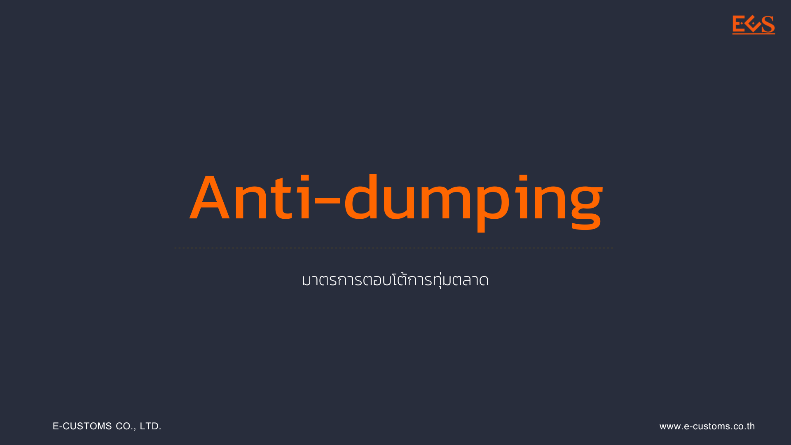

# การตอบโต้ การทุ่มตลาดสินค้าเหล็กแผ่นชุบหรือเคลือบด้วยโครเมียมทั้งชนิดเป็นม้วนและไม่เป็นม้วน ที่มีแหล่งกำเนิดจาก สาธารณรัฐประชาชนจีน สาธารณรัฐเกาหลี สหภาพยุโรป 



## รายละเอียดการใช้มาตรการของสินค้า

**มาตรการ :** มาตรการตอบโต้การทุ่มตลาด (Anti-dumping)    
**ชื่อสินค้า :** สินค้าเหล็กแผ่นชุบหรือเคลือบด้วยโครเมียมทั้งชนิดเป็นม้วนและไม่เป็นม้วน  
**ประเทศ :** สาธารณรัฐประชาชนจีน สาธารณรัฐเกาหลี สหภาพยุโรป   
**พิกัดศุลกากร :** 7210.50.00.021, 7210.50.00.022, 7210.50.00.023, 7210.50.00.024, 7210.50.00.025, 7210.50.00.026, 7210.50.00.029, 7210.50.00.090  

## สรุปการใช้มาตรการรายการสินค้าในปัจจุบัน

### อากรที่เรียกเก็บ : 
_(กรุณาศึกษาข้อมูลโดยละเอียดในประกาศ)_

- สาธารณรัฐประชาชนจีน ร้อยละ 0 - 24.73 ของราคา ซี ไอ เอฟ
- สาธารณรัฐเกาหลี ร้อยละ 0 - 17.06 ของราคา ซี ไอ เอฟ
- สหภาพยุโรป ร้อยละ 18.52 ของราคา ซี ไอ เอฟ
- รายละเอียดตามประกาศคณะกรรมการ ทตอ. เรื่องการตอบโต้การทุ่มตลาดสินค้าเหล็กแผ่นชุบหรือเคลือบด้วยโครเมียม ที่มีแหล่งกำเนิดจากสาธารณรัฐประชาชนจีน สาธารณรัฐเกาหลี และสหภาพยุโรป

### อากรร้อยละ 0 :

รายละเอียดตามประกาศคณะกรรมการ ทตอ. เรื่องการตอบโต้การทุ่มตลาดสินค้าเหล็กแผ่นชุบหรือเคลือบด้วยโครเมียม ที่มีแหล่งกำเนิดจากสาธารณรัฐประชาชนจีน สาธารณรัฐเกาหลี และสหภาพยุโรป	

### วันที่เริ่มต้นเรียกเก็บอากร :   
13 พ.ย. 2564

## วันที่สิ้นสุดเรียกเก็บอากร :    
12 พ.ย. 2569

---------------



## ประกาศผลการไต่สวนชั้นที่สุด




 

 

<a class="badge badge-danger" href="./docs.pdf" target="_blank" id="download_files_new">Download</a>

 



## ประกาศอื่น ๆ ที่เกี่ยวข้อง

- ประกาศคณะกรรมการพิจารณาการทุ่มตลาดและการอุดหนุน เรื่อง การตอบโต้การทุ่มตลาดสินค้าเหล็กแผ่นชุบหรือเคลือบด้วยโครเมียมทั้งชนิดเป็นม้วนและไม่เป็นม้วนที่มีแหล่งกำเนิดจากสาธารณรัฐประชาชนจีน สาธารณรัฐเกาหลี และสหภาพยุโรป พ.ศ. 2564 ([ดาวน์โหลด](https://www.thaitr.go.th/storage/announcements/Mz2gMyP1pFozDXCEpn3Fwr6AxQbyzY7NEm71VCyF.pdf))
- ประกาศกรมการค้าต่างประเทศ เรื่อง รายละเอียดข้อเท็จจริงและข้อกฎหมายอันเป็นสาระสำคัญที่ใช้เป็นพื้นฐานในการพิจารณาผลการไต่สวนการทุ่มตลาดสินค้าเหล็กแผ่นชุบหรือเคลือบด้วยโครเมียมทั้งชนิดเป็นม้วนและไม่เป็นม้วนที่มีแหล่งกำเนิดจากสาธารณรัฐประชาชนจีน สาธารณรัฐเกาหลี และสหภาพยุโรป พ.ศ. 2564 ([ดาวน์โหลด](https://www.thaitr.go.th/storage/announcements/ucGA4cHLMG4jnaTYfzPnpXPaHYASeforcaOBDCSQ.pdf))
- ประกาศคณะกรรมการพิจารณาการทุ่มตลาดและการอุดหนุน เรื่อง การตอบโต้การทุ่มตลาดสินค้าเหล็กแผ่นชุบหรือเคลือบด้วยโครเมียมทั้งชนิดเป็นม้วนและไม่เป็นม้วนที่มีแหล่งกำเนิดจากสาธารณรัฐประชาชนจีน สาธารณรัฐเกาหลี และสหภาพยุโรป (ฉบับที่ 2) พ.ศ. 2565 ([ดาวน์โหลด](https://www.thaitr.go.th/storage/announcements/4BKgzmocAhiLlaxnPfkl1RGpLTaHCJXMK1FLRBFq.pdf))

> ที่มา : [กองปกป้องและตอบโต้ทางการค้า](https://www.thaitr.go.th/th/search/AD1047)   
กรมการค้าต่างประเทศ กระทรวงพาณิชย์