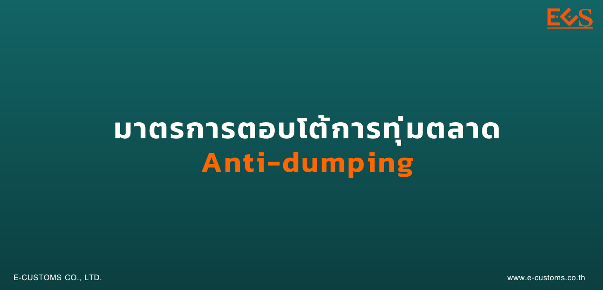

# การตอบโต้ การทุ่มตลาดสินค้าเหล็กกล้าไร้สนิมรีดเย็นชนิดม้วน แผ่น และแผ่นแถบ ที่มีแหล่งกำเนิดจาก สาธารณรัฐอินโดนีเซียและมาเลเซีย



## รายละเอียดการใช้มาตรการของสินค้า

**มาตรการ :** มาตรการตอบโต้การทุ่มตลาด (Anti-dumping)  
**ชื่อสินค้า :** เหล็กกล้าไร้สนิมรีดเย็น ชนิดม้วน แผ่น และแผ่นแถบ  
**ประเทศ :** สาธารณรัฐอินโดนีเซีย มาเลเซีย  
**พิกัดศุลกากร :**   
สินค้าเหล็กกล้าไร้สนิมรีดเย็นชนิดม้วน แผ่น และแผ่นแถบที่มีความหนา 0.3 - 3.0 มิลลิเมตร และมีความกว้างไม่เกิน1,320 มิลลิเมตร ภายใต้พิกัดศุลกากรปี 2560 ประเภทที่ 72193200020, 72193200030, 72193200040, 72193200080, 72193200090, 72193300020, 72193300030, 72193300040, 72193300080, 72193300090, 72193400020, 72193400030, 72193400040, 72193400080, 72193400090, 72193500020, 72193500030, 72193500040, 72193500080, 72193500090, 72199000000, 72202010020, 72202010030, 72202010040, 72202010080, 72202010090, 72202090020, 72202090030, 72202090040, 72202090080, 72202090090, 72209010000, 7220909000 รวมทั้งสิ้น 33 พิกัด ที่มีแหล่งกำเนิดจากสาธารณรัฐอินโดนีเซีย และสหพันธรัฐมาเลเซีย

## สรุปการใช้มาตรการรายการสินค้าในปัจจุบัน

### อากรที่เรียกเก็บ : 
_(กรุณาศึกษาข้อมูลโดยละเอียดในประกาศ)_

1. สินค้าที่มีแหล่งกำเนิดจากสาธารณรัฐอินโดนีเซีย ดังนี้
  - สินค้าที่ผลิตจาก PT. IMR ARC STEEL ร้อยละ 6.28 ของราคา ซี ไอ เอฟ
  - สินค้าที่ผลิตจาก PT. Indonesia Ruipu Nickel and Chrome Alloy ร้อยละ 7.02 ของราคา ซี ไอ เอฟ
  - สินค้าที่ผลิตจากผู้ผลิตรายอื่น ร้อยละ 51.69 ของราคา ซี ไอ เอฟ       

2. สินค้าที่มีแหล่งกำเนิดจากมาเลเซีย ดังนี้
  - สินค้าที่ผลิตจาก Bahru Stainless SDN. BHD ร้อยละ 15.23 ของราคา ซี ไอ เอฟ
  - สินค้าที่ผลิตจากผู้ผลิตรายอื่น ร้อยละ 35.25 ของราคา ซี ไอ เอฟ

### อากรร้อยละ 0 :
ให้เรียกเก็บอากรตอบโต้การทุ่มตลาดในอัตราร้อยละ 0 ของราคา ซี ไอ เอฟ สำหรับการนำเข้าสินค้าดังต่อไปนี้ 
1. สินค้าชนิดผิว BA ที่มีค่าความหนามากกว่า 1.6 มิลลิเมตร 
2. สินค้าชนิดผิว No.8 (Mirror Finish) ผิวลวดลาย (Pattern Finish) ผิวกระแทก (Bead Blast) ผิวกัดกรด (Etching Finish) และผิวสีสำเร็จ (Coloring Finish) 
3. สินค้าที่มีค่าความแข็ง (Hardness) มากกว่า 100 HRB หรือ 250 HV และสำหรับกรณีการนำสินค้า เข้ามาผลิตเพื่อการส่งออกภายใต้กฎหมาย ว่าด้วยการนิคมอุตสาหกรรมแห่งประเทศไทย กฎหมายว่าด้วยการส่งเสริมการลงทุน และกฎหมายว่าด้วยศุลกากร

### วันที่เริ่มต้นเรียกเก็บอากร :   
30 พ.ย. 2565  

## วันที่สิ้นสุดเรียกเก็บอากร :    
29 พ.ย. 2570

---------------



## ประกาศผลการไต่สวนชั้นที่สุด




 

 

<a class="badge badge-danger" href="./docs.pdf" target="_blank" id="download_files_new">Download</a>

 



> ที่มา : [กองปกป้องและตอบโต้ทางการค้า](https://www.thaitr.go.th/th/search/AD1047)   
กรมการค้าต่างประเทศ กระทรวงพาณิชย์