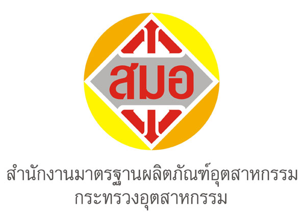


 
 


**กฎกระทรวง กำหนดให้ผลิตภัณฑ์อุตสาหกรรมภาชนะและเครื่องใช้พลาสติกสำหรับอาหาร ต้องเป็นไปตามมาตรฐาน พ.ศ. 2565**

เนื่องจากผลิตภัณฑ์อุตสาหกรรมภาชนะและเครื่องใช้พลาสติกสำหรับอาหาร ที่วางจำหน่ายในท้องตลาดมีปริมาณสารตกค้างที่เป็นอันตรายต่อผู้บริโภค จึงจำเป็นต้องควบคุมผลิตภัณฑ์อุตสาหกรรมดังกล่าว เพื่อความปลอดภัยและป้องกันความเสียหายอันอาจจะเกิดแก่ประชาชน กิจการอุตสาหกรรม และเศรษฐกิจของประเทศ สมควรกำหนดให้ผลิตภัณฑ์อุตสาหกรรมภาชนะและเครื่องใช้พลาสติกสำหรับอาหาร ต้องเป็นไปตามมาตรฐานจึงจำเป็นต้องออก กฎกระทรวง กำหนดให้ผลิตภัณฑ์อุตสาหกรรม*ภาชนะและเครื่องใช้พลาสติกสำหรับอาหาร* ต้องเป็นไปตามมาตรฐาน พ.ศ. 2565 กฎกระทรวงนี้ให้ใช้บังคับเมื่อพ้นกำหนด*สองร้อยเจ็ดสิบวัน* นับแต่วันประกาศในราชกิจจานุเบกษาเป็นต้นไป


 






 

 

<a class="badge badge-danger" href="./docs.pdf" target="_blank" id="download_files_new">Download</a>

 



