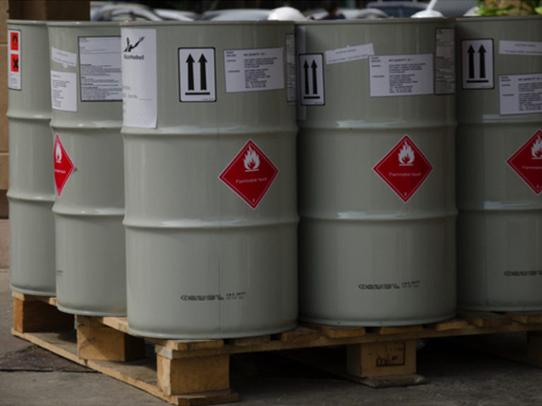

เว็บไซต์ราชกิจานุเบกษา เผยแพร่ประกาศ ลงนามโดย นายสุริยะ จึงรุ่งเรืองกิจ รัฐมนตรีว่าการกระทรวงอุตสาหกรรม “ประกาศกระทรวงอุตสาหกรรม” เรื่อง บัญชีรายชื่อวัตถุอันตราย (ฉบับที่ 6) พ.ศ.2563 อาศัยอำนาจตามความในมาตรา 5 วรรคสอง และมาตรา 18 วรรคสอง แห่งพระราชบัญญัติวัตถุอันตราย พ.ศ. 2535 รัฐมนตรีว่าการกระทรวงอุตสาหกรรม โดยความเห็นชอบของคณะกรรมการวัตถุอันตราย ออกประกาศไว้
 
ข้อ 1 ให้ยกเลิกรายการเกี่ยวกับวัตถุอันตราย ในบัญชีรายชื่อวัตถุอันตรายแนบท้ายประกาศกระทรวงอุตสาหกรรม เรื่อง บัญชีรายชื่อวัตถุอันตราย พ.ศ. 2556 ลงวันที่ 28 สิงหาคม พ.ศ.2556 ดังต่อไปนี้ โดยให้รายการตามบัญชีรายชื่อวัตถุอันตรายแนบท้ายประกาศฉบับนี้แทนบัญชีที่ 1 ที่กรมวิชาการเกษตรรับผิดชอบ บัญชี 1.1 *รายชื่อสารควบคุม ลำดับที่ 53 คลอร์ไพริฟอส ลำดับที่ 54 คลอร์ไพริฟอส-เมทิล ลำดับที่ 352 พาราควอต ลำดับที่ 353 พาราควอตไดคลอไรด์ และลำดับที่ 354 พาราควอตไดคลอไรด์*
 
ข้อ 2 ให้ผู้ผลิต ผู้นำเข้า ผู้ส่งออก หรือผู้มีไว้ครอบครองซึ่งวัตถุอันตรายชนิดที่ 4 ตามประกาศฉบับนี้ ที่ได้ดำเนินการอยู่ก่อนวันที่ประกาศฉบับนี้มีผลใช้บังคับ ปฎิบัติตามคำสั่งของพนักงานเจ้าหน้าที่ในระยะเวลาที่พนักงานเจ้าหน้าที่กำหนด

ข้อ 3 ประกาศนี้ ให้มีผลใช้บังคับ ตั้งแต่**วันที่ 1 มิถุนายน 2563 เป็นต้นไป**



