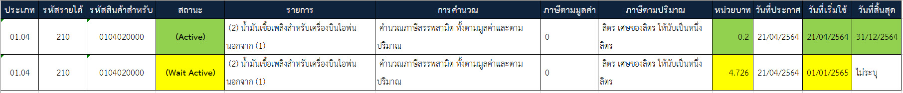

  

  
  

## ประกาศกรมสรรพสามิต เรื่อง กำหนดรหัสสินค้าสรรพสามิตสำหรับระบบแลกเปลี่ยนข้อมูลอิเล็กทรอนิกส์ (ELECTRONIC DATA INTERCHANGE) (ฉบับที่ 13)

  

เพื่อให้รหัสสินค้าสรรพสามิตและอัตราภาษีสรรพสามิต สำหรับระบบแลกเปลี่ยนข้อมูลอิเล็กทรอนิกส์ (ELECTRONIC DATA INTERCHANGE : EDI) ถูกต้องและเป็นปัจจุบัน อธิบดีกรมสรรพสามิตจึงกำหนดรหัสสินค้าสรรพสามิต รายการภาษีสรรพสามิต และอัตราภาษีสรรพสามิต *ใน (2) ของประเภทที่ 01.04 น้ำมันเชื้อเพลิงสำหรับเครื่องบินไอพ่น ตอนที่ 1 สินค้าน้ำมันและผลิตภัณฑ์น้ำมัน* ตามบัญชีแนบท้าย กฎกระทรวงกำหนดพิกัดอัตราภาษีสรรพสามิต พ.ศ.2560 ซึ่งแก้ไขเพิ่มเติมโดยกฎกระทรวงกำหนดพิกัดอัตราภาษีสรรพสามิต (ฉบับที่ 14) พ.ศ.2564 ลงวันที่ 20 เมษายน พ.ศ.2564 มีผลบังคับใช้ตั้งแต่*วันที่ 21 เมษายน พ.ศ. 2564 เป็นต้นไป*

  
## เพิ่มเติม

0104010000 (1) น้ำมันเชื้อเพลิงสำหรับเครื่องบินไอพ่นที่นำไปใช้เป็นเชื้อเพลิงสำหรับอากาศยานไปต่างประเทศ ตามหลักเกณฑ์และเงื่อนไขที่อธิบดีประกาศกำหนด


  
 


 

<a class="badge badge-danger" href="./edi-13.pdf" target="_blank" id="download_files_new">Download</a> 

 
  

> ที่มา : [กรมสรรพสามิต](http://edi.excise.go.th/)