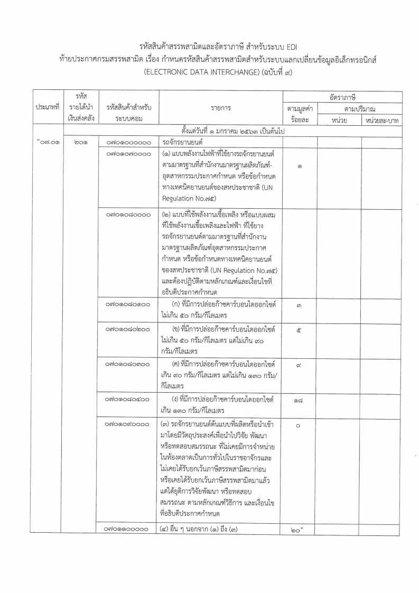

## ประกาศกรมสรรพสามิต เรื่อง กำหนดรหัสสินค้าสรรพสามิตสำหรับระบบแลกเปลี่ยนข้อมูลอิเล็กทรอนิกส์ (ELECTRONIC DATA INTERCHANGE) (ฉบับที่ 9)

เพื่อให้รหัสสินค้าสรรพสามิตและอัตราภาษีสรรพสามิต สำหรับระบบแลกเปลี่ยนข้อมูลอิเล็กทรอนิกส์ (ELECTRONIC DATA INTERCHANGE : EDI) ถูกต้องและเป็นปัจจุบัน อธิบดีกรมสรรพสามิตจึงกำหนดรหัสสินค้าสรรพสามิต รายการสินค้าสรรพสามิต และอัตราภาษีสรรพสามิต เฉพาะในส่วนของสินค้า*รถจักรยานยนต์ ในประเภทที่ 07.01* ไว้ มีผลบังคับใช้ **_ตั้งแต่วันที่ 1 มกราคม 2563 เป็นต้นไป_**

### ประกาศฉบับเต็ม
 


 

> ที่มา : [กรมสรรพสามิต](http://edi.excise.go.th/)
