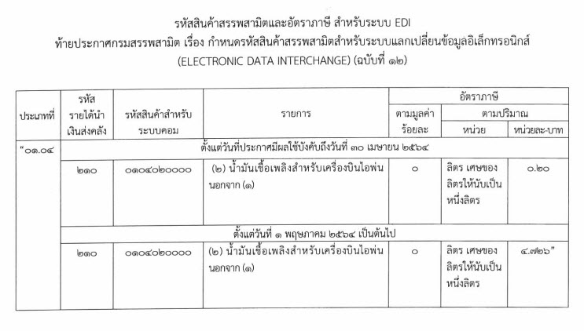

## ประกาศกรมสรรพสามิต เรื่อง กำหนดรหัสสินค้าสรรพสามิตสำหรับระบบแลกเปลี่ยนข้อมูลอิเล็กทรอนิกส์ (ELECTRONIC DATA INTERCHANGE) (ฉบับที่ 12)

เพื่อให้รหัสสินค้าสรรพสามิตและอัตราภาษีสรรพสามิต สำหรับระบบแลกเปลี่ยนข้อมูลอิเล็กทรอนิกส์ (ELECTRONIC DATA INTERCHANGE : EDI) ถูกต้องและเป็นปัจจุบัน อธิบดีกรมสรรพสามิตจึงกำหนดรหัสสินค้าสรรพสามิต รายการภาษีสรรพสามิต และอัตราภาษีสรรพสามิต ใน (2) ของประเภทที่ *01.04* *น้ำมันเชื้อเพลิงสำหรับเครื่องบินไอพ่น* ตอนที่ 1 สินค้าน้ำมันและผลิตภัณฑ์น้ำมัน ตามบัญชีแนบท้าย กฎกระทรวงกำหนดพิกัดอัตราภาษีสรรพสามิต พ.ศ.2560 ซึ่งแก้ไขเพิ่มเติมโดยกฎกระทรวงกำหนดพิกัดอัตราภาษีสรรพสามิต (ฉบับที่ 13) พ.ศ.2563 ลง*วันที่ 3 พฤศจิกายน พ.ศ.2563* ไว้ ดังต่อไปนี้

 


 

<a class="badge badge-danger" href="./excise-12.pdf" target="_blank" id="download_files_new">Download </a> <i id="files" class=" fas fa-file-pdf"></i>

 

> ที่มา : [กรมสรรพสามิต](http://edi.excise.go.th/system/upload/0013.pdf)

