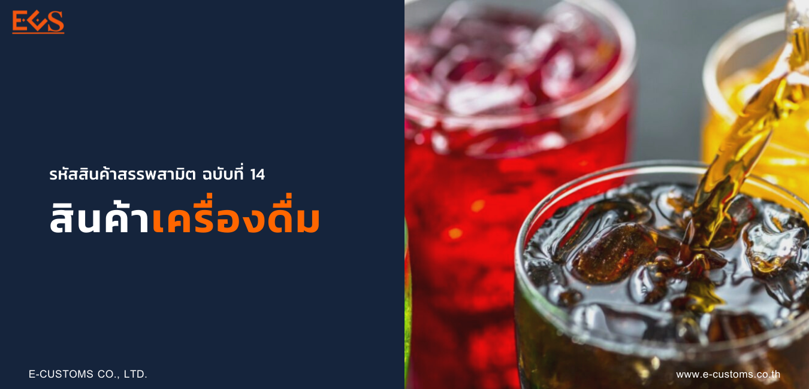

## กำหนดรหัสสินค้าสรรพสามิตสำหรับระบบแลกเปลี่ยนข้อมูลอิเล็กทรอนิกส์ (ELECTRONIC DATA INTERCHANGE) (ฉบับที่ 14) (สินค้าเครื่องดื่ม)

เพื่อให้รหัสสินค้าสรรพสามิตและอัตราภาษีสรรพสามิต สำหรับระบบแลกเปลี่ยนข้อมูลอิเล็กทรอนิกส์ (ELECTRONIC DATA INTERCHANGE : EDI) ชัดเจน ถูกต้อง และเป็นปัจจุบัน อธิบดีกรมสรรพสามิตจึงกำหนดรหัสสินค้าสรรพสามิต รายการสินค้าสรรพสามิต และอัตราภาษีสรรพสามิต สำหรับ*สินค้าเครื่องดื่ม* **ประเภทที่ 02.02 ประเภทที่ 02.03 ประเภทที่ 02.04 และผลิตภัณฑ์ที่ใช้เป็นเครื่องดื่มที่มีลักษณะผง เกล็ด หรือเครื่องดื่มเข้มข้นที่มีส่วนผสมของน้ำตาลและสามารถละลายน้ำได้** *แต่ไม่รวมถึงผลิตภัณฑ์เสริมอาหารและผลิตภัณฑ์นมที่อยู่ในรูปแบบผง ตามกฎหมายว่าด้วยอาหาร ใน(1) ของประเภทที่ 16.90*


 





 

 

<a class="badge badge-danger" href="./docs.pdf" target="_blank" id="download_files_new">Download</a>

 



> ที่มา : [กรมสรรพสามิต](http://edi.excise.go.th/system/upload/0015.pdf)