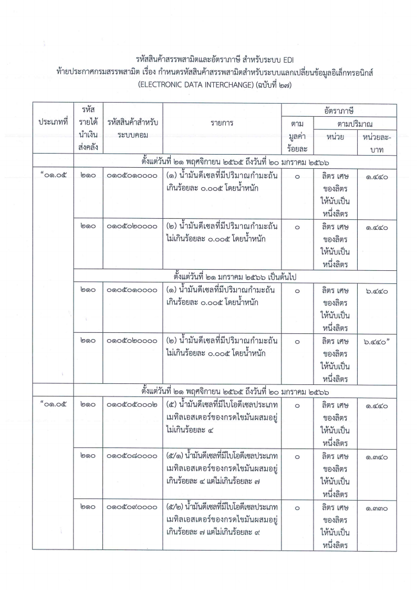
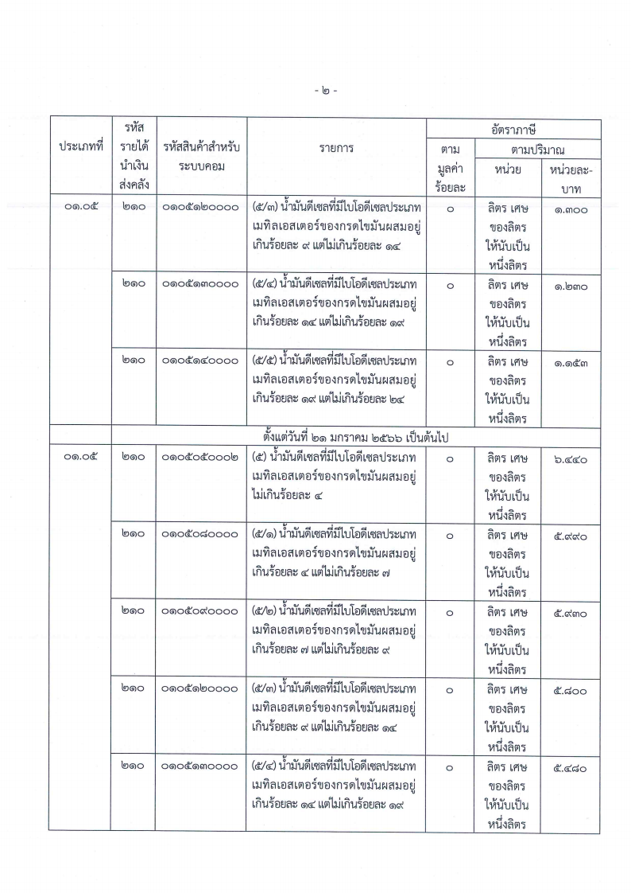
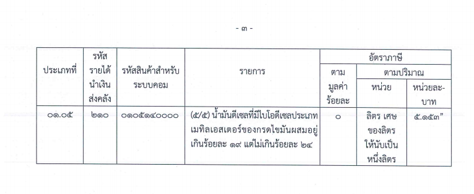

ประกาศกรมสรรพสามิต เรื่อง กำหนดรหัสสินค้าสรรพสามิต สำหรับระบบแลกเปลี่ยนข้อมูลอิเล็กทรอนิกส์ (ELECTRONIC DATA INTERCHANGE) (ฉบับที่ 27) (น้ำมันดีเซล) 

เพื่อให้รหัสสินค้าสรรพสามิตและอัตราภาษีสรรพสามิต  สำหรับระบบแลกเปลี่ยนข้อมูลอิเล็กทรอนิกส์ (ELECTRONIC DATA INTERCHANGE : EDI) ถูกต้องและเป็นปัจจุบัน อธิบดีกรมสรรพสามิตจึงกำหนดรหัสสินค้าสรรพสามิต รายการสินค้าสรรพสามิต และอัตราภาษีสรรพสามิต เฉพาะในส่วนของ*น้ำมันดีเซลที่มีปริมาณ กำมะถัน และน้ำมันดีเซลที่มีไบโอดีเซลประเภทเมทิลเอสเตอร์ของกรดไขมันผสมอยู่ ใน (1) (2) (5) (5/1) (5/2) (5/3) (5/4) และ (5/5) ของประเภทที่ 11.05 ไว้* 

ประกาศนี้ให้บังคับตั้งแต่*วันที่ 21 พฤศจิกายน พ.ศ. 2565 เป็นต้นไป* ทาง ECS ได้ทำการอัพเดทข้อมูลอัตราภาษีสรรพสามิต ตามประกาศดังกล่าวให้ผู้ใช้งานโดยอัตโนมัติแล้ว


 

 

<a class="badge badge-danger" href="./docs.pdf" target="_blank" id="download_files_new">Download</a>

 



> ที่มา : [กรมสรรพสามิต](https://lawelcs.excise.go.th/api/api/pdfviewer/4440)