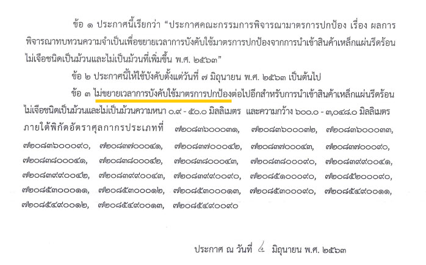

ประกาศคณะกรรมการฯ เรื่อง ผลการพิจารณาทบทวน ความจำเป็นเพื่อขยายเวลาการบังคับใช้มาตรการปกป้อง จากการนำเข้าสินค้าเหล็กแผ่นรีดร้อนไม่เจือชนิดเป็นม้วนและ ไม่เป็นม้วนที่เพิ่มขึ้น พ.ศ. 2563



ที่มา : [กองปกป้องและตอบโต้ทางการค้า](https://www.thaitr.go.th/th/search/SG1004)