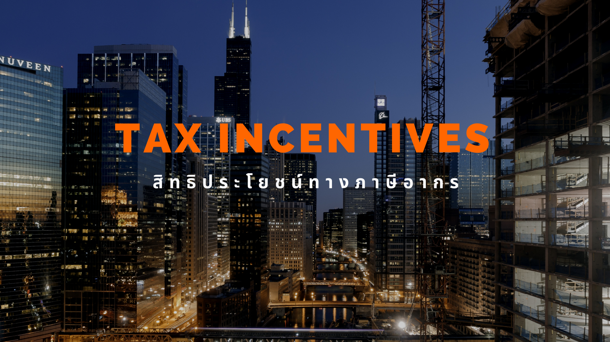

กรมศุลกากรเผยแพร่ ประกาศกรมศุลกากร ที่ 119/25661 เรื่อง *คู่มือการผ่านพิธีการศุลกากรทางอิเล็กทรอนิกส์ว่าด้วยกระบวนการทางศุลกากรสำหรับการใช้สิทธิประโยชน์ทางภาษีอากร (e-Tax Incentives)*





ดาวน์โหลดประกาศ

> ที่มา : [กรมศุลกากร](https://www.customs.go.th/cont_strc_download_with_docno_date.php?lang=th&top_menu=menu_homepage&current_id=14223132414d505f4a464a4e464b4b)
