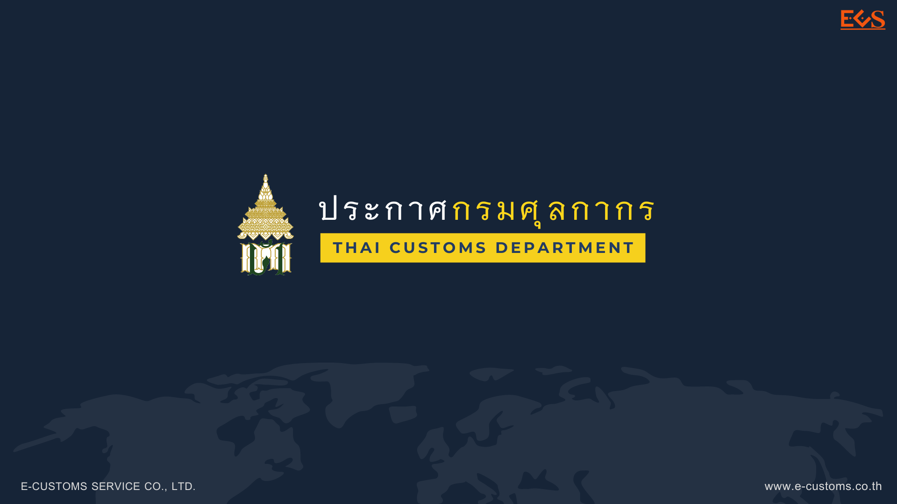

มีผลบังคับตั้งแต่*วันที่ 1 พฤษภาคม 2561* เป็นต้นไป





ดาวน์โหลดประกาศ

> ที่มา : [กรมศุลกากร](https://www.customs.go.th/cont_strc_download_with_docno_date.php?lang=th&top_menu=menu_homepage&current_id=14223132414d505f49464b49464b4c)