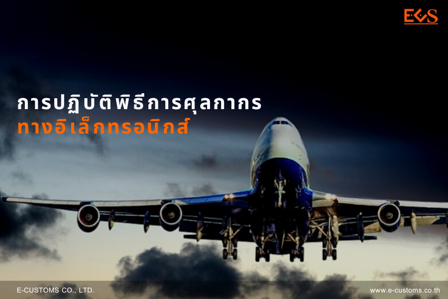

กรมศุลกากรเผยแพร่ ประกาศกรมศุลกากร ที่ 134/25661 เรื่อง *การปฏิบัติพิธีการศุลกากรทางอิเล็กทรอนิกส์*





ดาวน์โหลดประกาศ

> ที่มา : [กรมศุลกากร](https://www.customs.go.th/cont_strc_download_with_docno_date.php?lang=th&top_menu=menu_homepage&current_id=14223132414d505f49464b4c464a4e)
