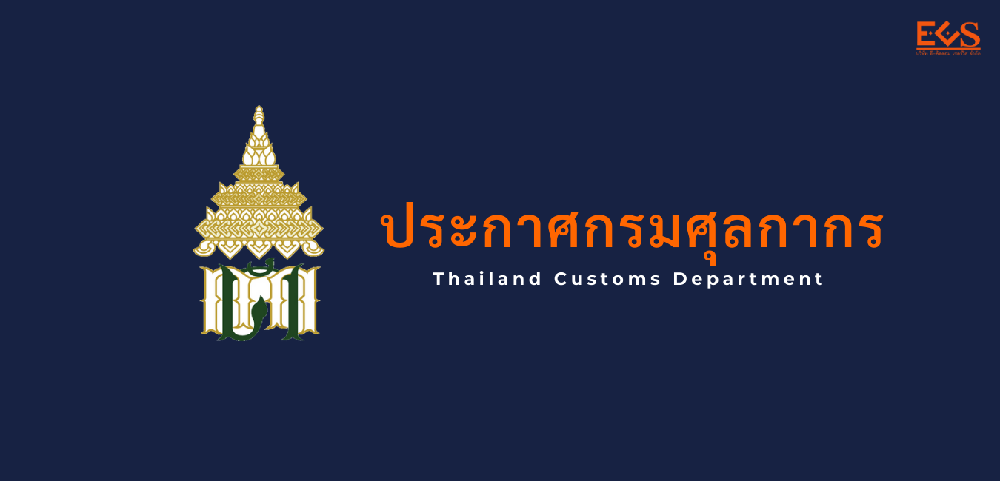
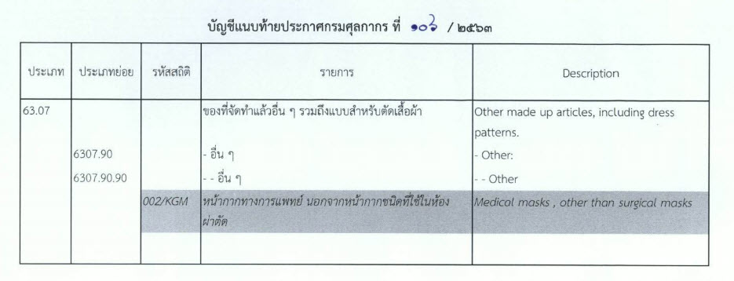

ประกาศกรมศุลกากรที่ 106/.2563 เรื่อง แก้ไขเพิ่มเติมรหัสสถิติสินค้า *ประเภทพิกัด 63.07 พิกัด 63079090 รหัสสถิติ 002* **หน้ากากทางการแพทย์ นอกจากหน้ากากชนิดที่ใช้ในห้องผ่าตัด**  *มีผลบังค้บตั้งแต่ 1 ก.ค. 2563 เป็นต้น*



 

<a class="badge badge-danger" href="./2563-106.pdf" target="_blank" id="download_files_new"> Download </a> 

> ที่มาบทความ : [กรมศุลกากร](http://th.customs.go.th/cont_strc_download_with_docno_date.php?lang=th&top_menu=menu_homepage&current_id=14232832414b505f46464b4c464b4b)
