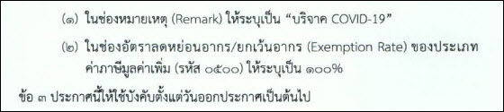

## ประกาศกรมศุลกากรที่ 109/.2563 เรื่อง   การปฏิบัติพิธีการศุลกากรใน*การยกเว้นภาษีมูลค่าเพิ่ม*สำหรับของที่นำเข้ามาใช้รักษา วินิจฉัย หรือ ป้องกันโรคติดเชื้อไวรัสโคโรนา 2019 เพื่อบริจาค* ในการจะยกเว้นภาษีมูลค่าเพิ่มตามประกาศดังกล่าว ต้องระบุข้อมูลในใบขนสินค้าขาเข้าดังนี้.  



 

<a class="badge badge-danger" href="./2563-109.pdf" target="_blank" id="download_files_new"> Download </a> 

> ที่มาบทความ : [กรมศุลกากร](http://th.customs.go.th/cont_strc_download_with_docno_date.php?lang=th&top_menu=menu_homepage&current_id=14232832414b505f46464b4d464b46)
