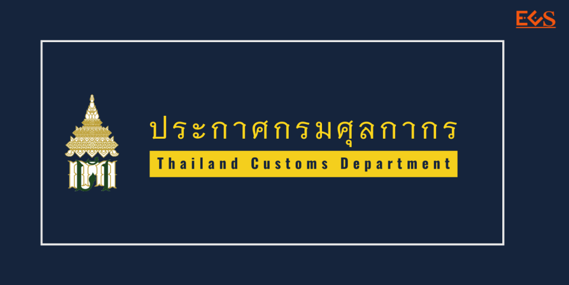

ประกาศกรมศุลกากรที่ 113/.2563 เรื่อง **การเชื่อมโยงข้อมูลใบอนุญาต/ใบรับรองอิเล็กทรอนิกส์**ร่วมกับ*สำนักงานมาตรฐานผลิตภัณฑ์อุตสาหกรรม*  
มีผลบังคับตั้งแต่วันที่ 27 สิงหาคม 2563 เป็นต้นไป







ดาวน์โหลดประกาศ

> ที่มา : [กรมศุลกากร](./2563-113.pdf)
