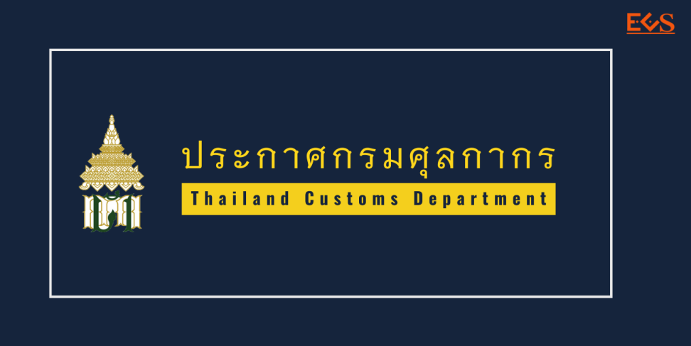
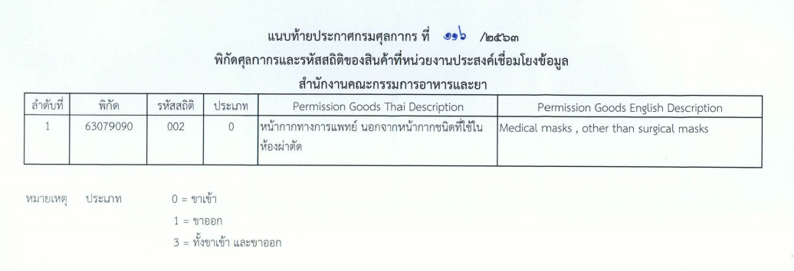

ประกาศกรมศุลกากรที่ 116/2563 เรื่อง **การเชื่อมโยงข้อมูลใบอนุญาต/ใบรับรองอิเล็กทรอนิกส์**ร่วมกับ*สำนักงานอาหารและยา* 
มีผลบังคับตั้งแต่วันที่ 1 สิงหาคม 2563 เป็นต้นไป







ดาวน์โหลดประกาศ

> ที่มา : กรมศุลกากร
