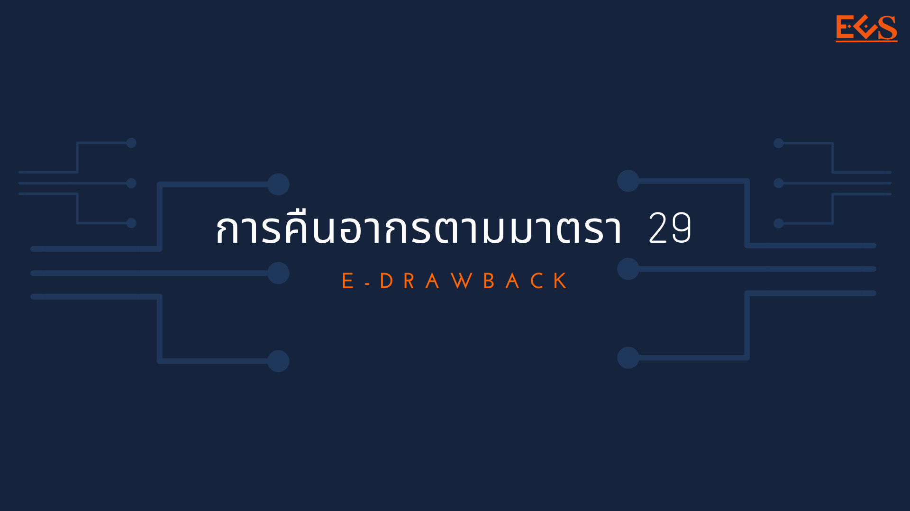



## *สรุปเบื้องต้น*

### การคืนอากรตามมาตรา 29 ด้วยระบบอิเล็กทรอนิกส์ (e-Drawback)

- กรมศุลกากรมีการพัฒนาระบบดังกล่าวในรูปแบบ web ต้องลงทะเบียนเพื่อเข้าใช้งานที่ NSW มีชื่อว่า e-Form  
- กรมศุลกากรยังไม่แจก schema ให้ผู้พัฒนา software โดยแจ้งว่าตามแผนอยากจะทดสอบให้ผุ้ประกอบการมาใช้ e-form เพื่อตรวจสอบความพร้อมและความถูกต้อง ให้เรียบร้อยก่อนเผยแพร่ให้ software house ต่อไป
- ผู้นำเข้า-ส่งออกหรือตัวแทน ที่สนใจเข้าใช้งานระบบดังกล่าว ต้องเข้าไปขอคำปรึกษาที่ส่วนคืนอากรเพื่อการส่งออก กองสิทธิประโยชน์ทางภาษีอากร (ตามบทเฉพาะกาล)
- ต้องดำเนินการปรับปรุงสูตรการผลิต (ยกเลิก OR) บัญชีวัตถุดิบและชื่อทางการค้า ให้เรียบร้อยก่อนใช้งานระบบ
- ในส่วนของการบันทึกข้อมูลในใบขนสินค้า จากการตรวจสอบพบเพียงจุดเดียว และต้องบันทึกเมื่อผู้ประกอบการได้เข้าระบบการคืนอากรตามรูปแบบใหม่เรียบร้อยแล้ว (ถ้ายังไม่เข้าระบบใหม่ ทำทุกอย่างเหมือนเดิม) มีรายละเอียดคือ รหัสวัตถุดิบที่ได้ยื่นบัญชีวัตถุดิบไว้แล้ว พร้อมลำดับที่ของชื่อทางการค้า (ถ้ามี) รหัสวัตถุดิบ/ลำดับชื่อทางการค้า (xxxxxx/000) ในช่อง **Customs Product Code (RTC Product Code)**
- เรื่องนี้เรารู้รายละเอียดพอ ๆ กับผู้ประกอบการ กรมศุลฯ ยังไม่มีแจ้งอะไรเพิ่มเติม ถ้าต้องการรายละเอียดเพิ่มเติมคนที่น่าจะตอบได้ดีที่สุดคือ ส่วนคืนอากรเพื่อการส่งออก กองสิทธิประโยชน์ทางภาษีอากร

### เอกสารที่เกี่ยวข้อง

- ประกาศกรมศุลกากรที่ 126/.2563 เรื่อง หลักเกณฑ์ วิธีการ และเงื่อนไขการปฏิบัติพิธีการศุลกากรใน**การคืนอากรตามมาตรา 29** แห่งพระราชบัญญัติศุลกากร พ.ศ. 2560 ด้วยระบบอิเล็กทรอนิกส์ (e-Drawback) [[**ดาวน์โหลด**]](https://ecs-support.github.io/KM/customs/post/announcement/customs/2563-126/) มีผลบังคับตั้งแต่**วันที่ 1 สิงหาคม 2563** เป็นต้นไป

- เอกสารประกอบการบรรยาย**โครงการพัฒนาระบบอิเล็กทรอนิกส์เต็มรูปแบบในการคืนอากรเพื่อการส่งออกตามมาตรา 29 (e-Drawback)** [[**ดาวน์โหลด**]](https://ecs-support.github.io/KM/customs/post/announcement/customs/2563-126/present_e-drawback.pdf)  ซึ่งกรมศุลกากรได้จัดขึ้น เมื่อ**วันอังคารที่ 22 ตุลาคม 2562**

บันทึกเมื่อ : 19 ส.ค. 2563



ประกาศกรมศุลกากรที่ 126/2563 เรื่อง *หลักเกณฑ์ วิธีการ และเงื่อนไขการปฏิบัติพิธีการศุลกากรในการคืนอากรตามมาตรา 29* แห่งพระราชบัญญัติศุลกากร พ.ศ. 2560 ด้วยระบบอิเล็กทรอนิกส์ (e-Drawback) มีผลบังคับ ตั้งแต่วันที่ 1 สิงหาคม 2563 เป็นต้นไป







ดาวน์โหลดประกาศ


## รายละเอียดเพิ่มเติม

- เอกสารประกอบการบรรยาย**โครงการพัฒนาระบบอิเล็กทรอนิกส์เต็มรูปแบบในการคืนอากรเพื่อการส่งออกตามมาตรา 29 (e-Drawback)** [[*ดาวน์โหลด*]](https://ecs-support.github.io/KM/customs/post/knowledge/e-drawback_present/)  ซึ่งกรมศุลกากรได้จัดขึ้น เมื่อ**วันอังคารที่ 22 ตุลาคม 2562**

> ที่มา : กรมศุลกากร
