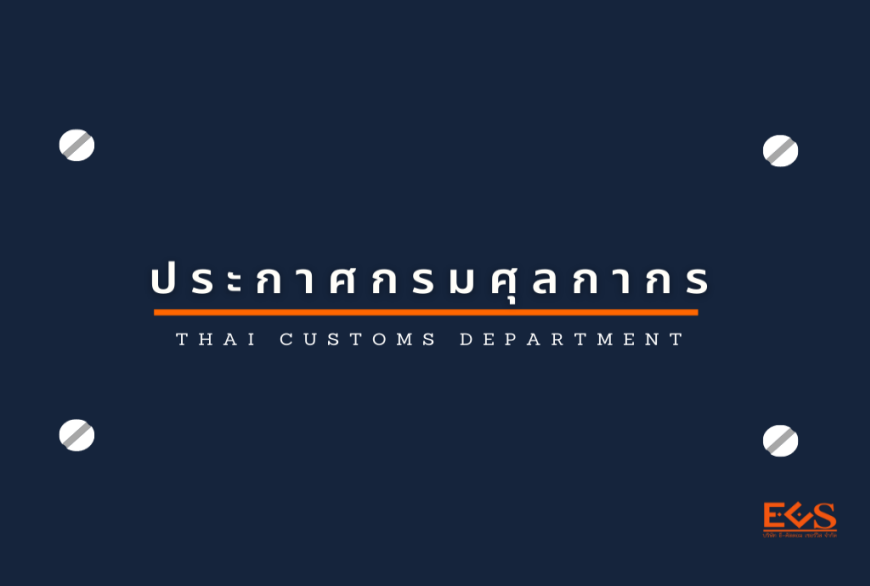



ประกาศกรมศุลกากรที่ 127/2563 เรื่อง **การเชื่อมโยงข้อมูลใบอนุญาต/ใบรับรองอิเล็กทรอนิกส์ร่วมกับ** *สำนักงานมาตรฐานผลิตภัณฑ์อุตสาหกรรม*
มีผลบังคับ ตั้งแต่วันที่ 17 สิงหาคม 2563 เป็นต้นไป







ดาวน์โหลดประกาศ

> ที่มา : กรมศุลกากร
