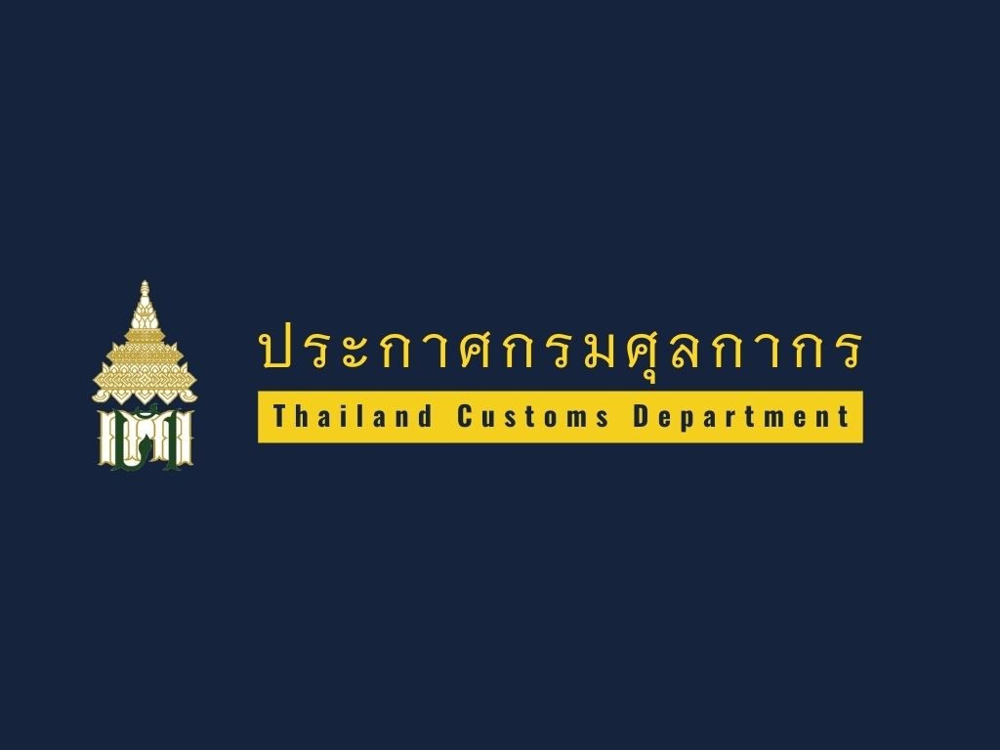
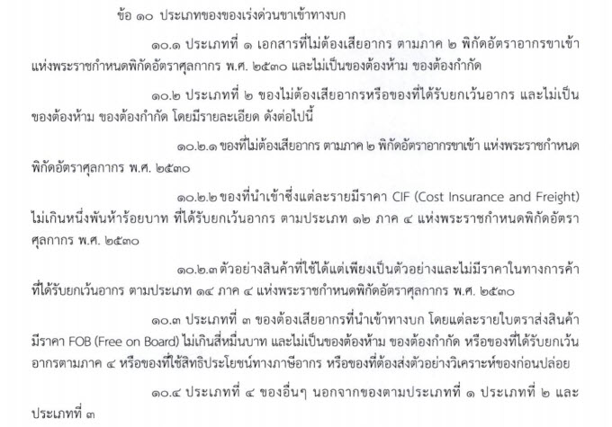
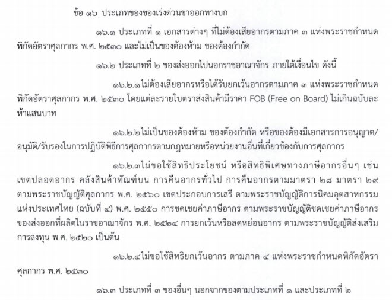

## ประกาศกรมศุลกากรที่ 130/2563 เรื่อง การปฏิบัติพิธีการศุลกากรว่าด้วยกระบวนการทางศุลกากรสำหรับของเร่งด่วนทางบก.   

มีผลบังคับตั้งแต่*วันที่ 10 สิงหาคม 2563* เป็นต้นไป

### ประเภทของเร่งด่วนขาเข้าทางบก

### ประเภทของเร่งด่วนขาออกทางบก



ดาวน์โหลดประกาศ

> ที่มา : [กรมศุลกากร](http://www.customs.go.th/cont_strc_download_with_docno_date.php?lang=th&top_menu=menu_homepage&current_id=14232832414b505f4a464b4b464b47)
