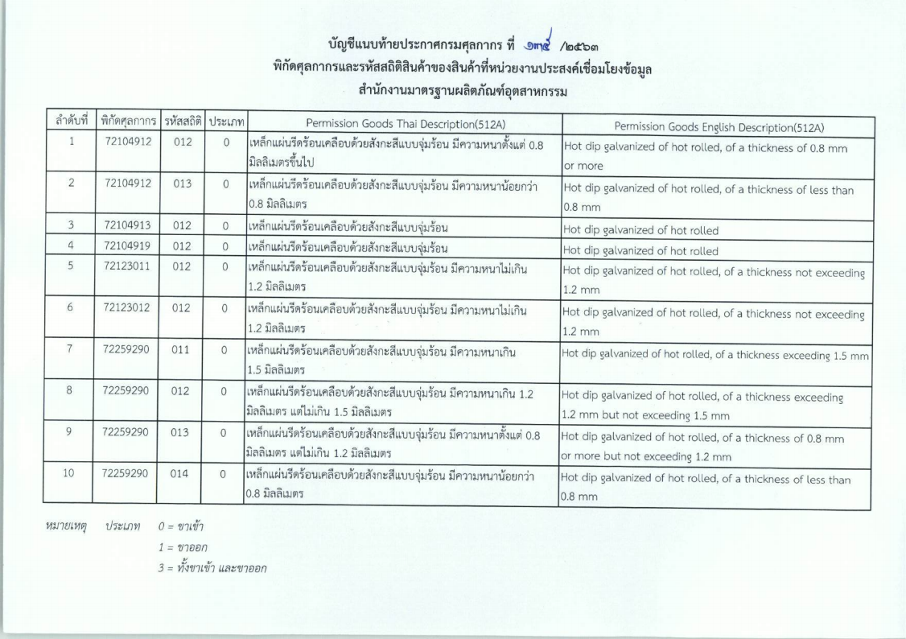

ประกาศกรมศุลกากรที่ 135/.2563 เรื่อง การเชื่อมโยงข้อมูลใบอนุญาต/ใบรับรองอิเล็กทรอนิกส์ร่วมกับ*สำนักงานมาตรฐานผลิตภัณฑ์อุตสาหกรรม* 
สำหรับสินค้า**_เหล็กแผ่นรีดร้อนเคลือบด้วยสังกะสีแบบจุ่มร้อน_** มีผลบังคับตั้งแต่*วันที่ 1 กันยายน 2563* เป็นต้นไป

## ประกาศฉบับเต็ม



ดาวน์โหลดประกาศ

> ที่มา : [กรมศุลกากร]()
