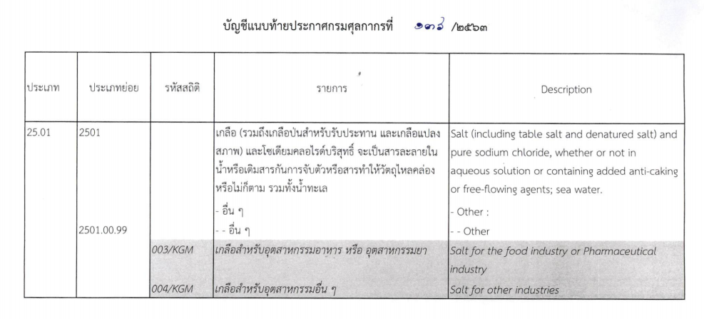

ประกาศกรมศุลกากรที่ 136/.2563 เรื่อง แก้ไขเพิ่มเติมรหัสสถิติสินค้า สำหรับสินค้า**ประเภท 25.01** *เกลือ (รวมถึงเกลือป่นสำหรับรับประทาน และเกลือแปลงสุขภาพ) และโซเดียมคลอไรด์บริสุทธิ์* จะเป็นสารละลายในน้ำหรือเติมสารกันการจับตัวหรือสารทำให้วัตถุไหลคล่องหรือไม่ก็ตาม รวมทั้งน้ำทะเล มีผลบังคับใช้ **_ตั้งแต่วันที่ 1 กันยายน 2563 เป็นต้นไป_**

### ประกาศฉบับเต็ม



ดาวน์โหลดประกาศ

> ที่มา : [กรมศุลกากร]()
