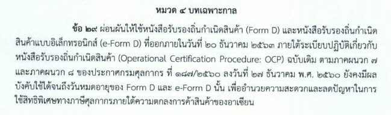

ประกาศกรมศุลกากรที่ 152/.2563 เรื่อง หลักเกณฑ์และพิธีการการยกเว้นอากรและลดอัตราอากรศุลกากรสำหรับของที่**มีถิ่นกำเนิดจากอาเซียน**(รายละเอียดตามเอกสารแนบ) มีผลบังคับใช้ **_ตั้งแต่วันที่ 20 กันยายน 2563 เป็นต้นไป_**



ดาวน์โหลดประกาศ

> ที่มา : [กรมศุลกากร]()
