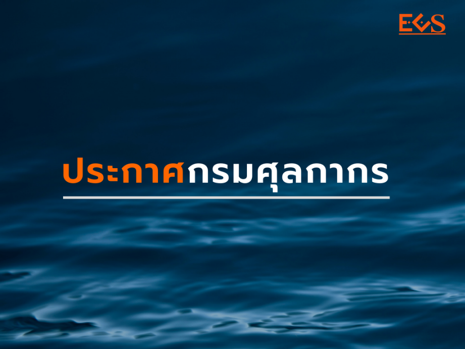

ประกาศกรมศุลกากรที่ 163/2563 เรื่อง พิธีการศุลกากรสำหรับการยกเว้นอากรของตาม*ประเภท 1 ภาค 4*  (สุทธินำกลับ)



ดาวน์โหลดประกาศ

> ที่มา : [กรมศุลกากร](http://www.customs.go.th/cont_strc_download_with_docno_date.php?lang=th&top_menu=menu_homepage&current_id=14232832414c505f47464a4f464b47)

